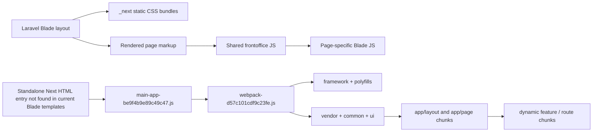

# Azubi Frontend Assets and Chunks Analysis

## 1. Executive Summary

`public/assets` is a hybrid asset tree rather than one coherent build output. The live Laravel frontoffice loads three Next-generated CSS bundles from `public/assets/_next/static/css` plus hand-linked scripts from `public/assets/js` and page patches from `public/assets/css`. No current Blade template loads the standalone Next JavaScript runtime directly, so the large `_next/static/chunks` set looks like a separate Next.js application snapshot deployed alongside, but not actively mounted by, the current Blade frontoffice.

Confirmed technologies are Next.js App Router + React + Webpack inside `public/assets/_next`, Tailwind-generated CSS in `d9109d77acd75b7b.css`, and Laravel Blade templates that manually reference static assets. The repository also contains a Vite/Laravel source configuration (`package.json:4-14`, `vite.config.js:4-12`), but the scanned frontoffice templates do not use `@vite`, so that Vite configuration is not the active runtime load path for these public assets.

The standalone Next bundle would start from `public/assets/_next/static/chunks/main-app-be9f4b9e89c49c47.js`, then hand off to `webpack-d57c101cdf9c23fe.js`, `framework-fb89c271e3453c53.js`, `vendor-ef0373f8482ee07a.js`, `common-6f13d6a0b944209a.js`, `ui-611c4b27eabc1ace.js`, and route chunks under `_next/static/chunks/app/...`. The live Blade frontoffice instead starts from `resources/views/frontoffice/layouts/app.blade.php:13-15` for CSS and `:39-42` for shared JavaScript, then adds page-specific scripts such as `consultation.js`, `career-pathway-decision.js`, `document-checklist.js`, `living-cost-calculator.js`, and `roi-calculator.js`.

Major risks are: a large standalone Next bundle set that appears orphaned from current Blade templates, extensive duplication across CSS/fonts/images, invalid or repeated stylesheet injection patterns in some Blade pages, several very large bundles and images, and a large amount of no-direct-reference residue including 20 `_next/image*.html` error artifacts.

## 2. Scope and Methodology

- Primary path inspected: `C:\Users\ASUS\Desktop\Projects\azubi\public\assets`
- Secondary read-only paths inspected only to trace references: `resources/views/frontoffice/**`, `package.json`, `vite.config.js`
- File types inspected: `.js`, `.css`, `.png`, `.jpg`, `.jpeg`, `.webp`, `.svg`, `.ico`, `.woff2`, `.html`, `.md`
- Commands and scripts used: `rg --files public/assets`, targeted `rg -n` searches, `Get-Content` reads, and inline Python for inventory, hashing, duplicate detection, reference matching, and sample image dimensions.
- Audit mode: read-only analysis. No application files were modified. The only generated file is this report.
- Limitations: no original Next.js source tree was found for the `_next` bundle set, no source maps were present, and “unused” status is based on repository-visible references rather than runtime traffic or server logs.

## 3. Project Asset Map

```text
public/assets
├── _next/                       # 784 files; standalone Next export artifacts, images, chunk runtime, and error HTMLs
│   ├── static/chunks/          # 121 JS chunks + explanation markdown
│   ├── static/css/             # 3 Next CSS bundles
│   ├── static/media/           # 7 font subsets
│   └── many image/media files  # route imagery, logos, avatars, content images
├── css/                        # 11 CSS files; custom/page CSS plus duplicate copies of Next CSS
├── js/                         # 15 JS files; Blade shared scripts and page-specific tools/interactions
├── images/                     # 77 custom images/icons/SVGs
├── fonts/                      # 7 font files duplicated from Next output
└── media/                      # 7 font files duplicated from Next output
```

| Category | Count | Exact Bytes | Approx Size |
|---|---|---|---|
| JavaScript | 136 | 17840845 | 17840845 B (17.01 MiB) |
| CSS | 14 | 889451 | 889451 B (868.60 KiB) |
| Images | 700 | 37862416 | 37862416 B (36.11 MiB) |
| Fonts | 21 | 656664 | 656664 B (641.27 KiB) |
| SVG and icons | 9 | 34811 | 34811 B (34.00 KiB) |
| Manifest or metadata files | 0 | 0 | 0 B |
| Source maps | 0 | 0 | 0 B |
| Other assets | 21 | 23064 | 23064 B (22.52 KiB) |

Top-level folder counts: `_next` 784, `images` 77, `js` 15, `css` 11, `fonts` 7, `media` 7.

## 4. Build System and Framework Detection

| Candidate | Confidence | Conclusion | Evidence | Relevant Files |
|---|---|---|---|---|
| Next.js App Router | High | Confirmed for the standalone bundle set in `public/assets/_next`. | `webpackChunk_N_E`, `_N_E`, route chunks under `_next/static/chunks/app/`, `usePathname`, router prefetch code. | `public/assets/_next/static/chunks/main-app-be9f4b9e89c49c47.js:17`; `.../webpack-d57c101cdf9c23fe.js`; `.../app/dashboard/layout-74d3d4f11a389f8c.js:3758-3770` |
| React | High | Confirmed inside the standalone Next bundle. | `useState`, `useEffect`, JSX-runtime imports, client component patterns. | `public/assets/_next/static/chunks/app/layout-be0768a6044e9cfa.js`; `.../app/page-5e4677dc9a81f55b.js` |
| Webpack | High | Confirmed as the chunk/bootstrap runtime for `_next/static/chunks`. | Chunk URL builder, script injector, and `ChunkLoadError` handling. | `public/assets/_next/static/chunks/webpack-d57c101cdf9c23fe.js:82-102`; `:193-206` |
| Tailwind CSS | High | Confirmed in the loaded Next CSS bundle and many exported class strings. | `--tw-*` variables and utility-driven selectors. | `public/assets/_next/static/css/d9109d77acd75b7b.css:226-251` |
| Laravel Blade static asset linking | High | Confirmed as the live frontoffice delivery mechanism. | Blade layout loads CSS/JS via `asset(...)`; no `_next/static/chunks` scripts are injected there. | `resources/views/frontoffice/layouts/app.blade.php:13-15`, `:39-42` |
| Vite / laravel-vite-plugin | Medium | Confirmed in repo source config, but not confirmed as the generator for the scanned `public/assets` tree. | `package.json` and `vite.config.js` define Vite inputs, but `resources/views/frontoffice` has no `@vite` usage. | `package.json:4-14`; `vite.config.js:4-12` |

Interpretation: `public/assets` combines at least two pipelines: a standalone Next.js App Router export/copy under `public/assets/_next`, and a Blade-driven static layer that directly loads `public/assets/js/*` and `public/assets/css/*` without going through Vite at runtime.

## 5. Application Startup Flow

- Live frontoffice flow (confirmed): Blade layout -> Next CSS bundles -> page HTML -> shared frontoffice JS -> page-specific JS.
- Standalone Next flow (confirmed at bundle level, but not confirmed as currently mounted by Blade): Next HTML entry -> `main-app` -> Webpack runtime -> framework/vendor/shared chunks -> route/layout chunks -> lazy feature modules.

- `resources/views/frontoffice/layouts/app.blade.php:13-15` loads `_next/static/css/081a0afca5a9bd20.css`, `d9109d77acd75b7b.css`, and `e2c84361ea1dce8b.css` globally.
- `resources/views/frontoffice/layouts/app.blade.php:39-42` loads shared frontoffice scripts: `navigation.js`, `accordion-fixes.js`, `visibility-fixes.js`, `form-dropdowns.js`.
- `main-app-be9f4b9e89c49c47.js:1-18` registers startup modules and sets `_N_E = e.O()`.
- `webpack-d57c101cdf9c23fe.js:82-102` maps chunk IDs to filenames, and `:182-206` prefixes them with `/_next/` and raises `ChunkLoadError` on failure.
- `app/dashboard/layout-74d3d4f11a389f8c.js:3758-3770` prefetches many downstream dashboard routes.



## 6. JavaScript Chunk Inventory

Table below focuses on the major bundles. Full file-by-file inventory is in Appendix 22.

| File | Size | Type | Purpose | Loaded By | Dependencies | Confidence |
|---|---|---|---|---|---|---|
| `public/assets/_next/static/chunks/main-app-be9f4b9e89c49c47.js` | 688 | Next app bootstrap | Standalone Next app entry | Standalone Next HTML entry (not found in current Blade templates) | webpack runtime + shared chunks | High |
| `public/assets/_next/static/chunks/webpack-d57c101cdf9c23fe.js` | 7122 | Webpack runtime | Chunk URL resolver and script injector | main-app | all async chunk IDs | High |
| `public/assets/_next/static/chunks/polyfills-42372ed130431b0a.js` | 208417 | Polyfills | Browser compatibility shims | Next HTML/main-app | framework/runtime | High |
| `public/assets/_next/static/chunks/framework-fb89c271e3453c53.js` | 1363060 | Framework/runtime | React + Next routing/prefetch internals | webpack runtime | vendor/common/ui + route chunks | High |
| `public/assets/_next/static/chunks/vendor-ef0373f8482ee07a.js` | 8175953 | Vendor | Third-party libraries | webpack runtime | shared + route chunks | High |
| `public/assets/_next/static/chunks/common-6f13d6a0b944209a.js` | 2422814 | Shared/common | Cross-route components/utilities | webpack runtime | route chunks | Medium |
| `public/assets/_next/static/chunks/ui-611c4b27eabc1ace.js` | 335888 | Shared/ui | Reusable UI primitives | webpack runtime | route chunks | Medium |
| `public/assets/_next/static/chunks/app/layout-be0768a6044e9cfa.js` | 53253 | Root layout | Providers, analytics gating, html lang management | Next runtime | shared chunks + route pages | High |
| `public/assets/_next/static/chunks/app/page-5e4677dc9a81f55b.js` | 56812 | Home route | Featured jobs and marketplace stats | Next runtime | shared chunks + Supabase client | High |
| `public/assets/_next/static/chunks/app/consultation/page-0234b9af93ca3b54.js` | 242964 | Consultation route | Animated sales page and Stripe checkout flow | Next runtime | shared chunks + Stripe/Supabase | High |
| `public/assets/_next/static/chunks/app/dashboard/layout-74d3d4f11a389f8c.js` | 207575 | Dashboard layout | Notifications, onboarding, route prefetch | Next runtime | dashboard pages | High |
| `public/assets/_next/static/chunks/app/dashboard/interview/page-62a8f10343ea2d32.js` | 178209 | Voice interview route | Voice AI session lifecycle and purchases | dashboard layout | vendor voice stack | High |
| `public/assets/js/frontoffice/navigation.js` | 3454 | Blade shared navigation | Mobile menu and desktop dropdown behavior | frontoffice layout | DOM only | High |
| `public/assets/js/frontoffice/accordion-fixes.js` | 5096 | Blade accessibility patch | Accordion state syncing | frontoffice layout | DOM only | High |
| `public/assets/js/frontoffice/visibility-fixes.js` | 3069 | Blade reveal patch | IntersectionObserver reveal fallback | frontoffice layout | DOM only | High |
| `public/assets/js/script.js` | 8932 | General frontoffice interactions | Menu, reveal, marquee, FAQ, smooth-scroll | contact/partner/trainee-rights pages | DOM only | High |
| `public/assets/js/consultation.js` | 6585 | Consultation page interactions | Hover cards, FAQ, testimonials carousel | consultation Blade page | DOM only | High |
| `public/assets/js/career-pathway-decision.js` | 22215 | Tool wizard | Client-side scoring and result rendering | career-pathway-decision Blade page | DOM only | High |
| `public/assets/js/document-checklist.js` | 21918 | Tool checklist generator | Checklist filtering/progress | document-checklist Blade page | DOM only | High |
| `public/assets/js/living-cost-calculator.js` | 19501 | Tool calculator | City cost calculator and affordability output | living-cost-calculator Blade page | DOM only | High |
| `public/assets/js/roi-calculator.js` | 5654 | Tool calculator | Training ROI computation | roi-calculator Blade page | DOM only | High |

## 7. Detailed JavaScript Behavior

### 7.1 Live Blade-Driven Frontoffice Scripts

- `public/assets/js/frontoffice/navigation.js` powers the mobile overlay menu and desktop dropdown panels with fade transitions and Escape handling.
- `public/assets/js/frontoffice/accordion-fixes.js` repairs exported accordion markup by setting inline `maxHeight`, `opacity`, and `aria-expanded` state.
- `public/assets/js/frontoffice/visibility-fixes.js` reveals nodes that were exported with inline `opacity:0` / transforms by using `IntersectionObserver` and `requestAnimationFrame`.
- `public/assets/js/frontoffice/form-dropdowns.js` converts hidden static combobox exports into native `<select>` elements and then wraps them with a custom dropdown UI.
- `public/assets/js/script.js` provides broader UX glue: menu control, scroll-trigger reveal, FAQ accordion, anchor smooth-scrolling, marquee duplication, and drag-scrolling on `#sectors-scroll`.
- Page-specific scripts such as `consultation.js`, `career-pathway-decision.js`, `document-checklist.js`, `living-cost-calculator.js`, `roi-calculator.js`, `requirements-tabs.js`, and `change-career.js` are all fully client-side, DOM-driven features.

### 7.2 Standalone Next Bundle Responsibilities

- Root layout: providers, cookie-consent-aware analytics, Clarity/DataFast loading, and HTML language switching (`public/assets/_next/static/chunks/app/layout-be0768a6044e9cfa.js`).
- Home route: featured jobs are fetched from Supabase and marketplace stats are fetched from `/api/stats/marketplace` (`.../app/page-5e4677dc9a81f55b.js:117-143`, `:822-825`).
- Consultation route: animated marketing UI plus checkout flow via `/api/consultation/checkout`, user/profile redirects, and Stripe messaging (`.../app/consultation/page-0234b9af93ca3b54.js:3978-3997`, `:4403-4429`).
- Dashboard layout: notifications, onboarding state, user/profile queries, and route prefetch (`.../app/dashboard/layout-74d3d4f11a389f8c.js`).
- Dashboard interview route: voice session bootstrap/end flows and purchase flows (`.../app/dashboard/interview/page-62a8f10343ea2d32.js:236-240`, `:644-689`, `:1441-1445`).
- Auth route: Supabase auth plus Turnstile bot protection (`.../app/auth/page-7dc3000c35d369b6.js:203-210`, `:269-271`, `:698-706`).

## 8. Dynamic Imports and Lazy Loading

- Code splitting is definitely present. The runtime’s `r.e()` helper in `webpack-d57c101cdf9c23fe.js:80-81` asynchronously resolves chunk groups, while `r.u()` in `:82-102` constructs chunk file names.
- Lazy module loading is visible through repeated `Promise.resolve().then(...)` calls in entry chunks such as `main-app-be9f4b9e89c49c47.js:5-12` and `app/layout-be0768a6044e9cfa.js:41-52`.
- Chunk URLs are constructed with the public path `/_next/` (`webpack-d57c101cdf9c23fe.js:182`).
- Failed chunk loading is explicitly handled through `ChunkLoadError` creation (`webpack-d57c101cdf9c23fe.js:201-206`).
- Next router prefetching is present in the standalone app, especially in the dashboard layout (`app/dashboard/layout-74d3d4f11a389f8c.js:3758-3770`).
- No service worker or Workbox artifact was found under `public/assets`.
- Hydration/client mounting is confirmed for the standalone Next app, but not for the live Blade frontoffice because the Blade templates do not load the Next chunk runtime.

## 9. Libraries and Third-Party Services

| Library or Service | Evidence | Used For | Files | Loading Method | Confidence |
|---|---|---|---|---|---|
| Next.js App Router | `webpackChunk_N_E`, `_N_E`, route chunks under `_next/static/chunks/app/` | App-router client runtime and route chunks | `public/assets/_next/static/chunks/webpack-d57c101cdf9c23fe.js:114`, `.../main-app-be9f4b9e89c49c47.js:17` | Bundled runtime | High |
| React | `useState`, `useEffect`, JSX runtime imports | UI rendering and hydration in standalone Next app | `public/assets/_next/static/chunks/app/layout-be0768a6044e9cfa.js`, `.../app/page-5e4677dc9a81f55b.js` | Bundled runtime | High |
| Webpack | Chunk filename resolver and `ChunkLoadError` handler | Chunk loading/runtime bootstrap | `public/assets/_next/static/chunks/webpack-d57c101cdf9c23fe.js:82-102`, `:193-206` | Bundled runtime | High |
| Tailwind CSS | `--tw-*` variables and utility-heavy selectors | Design tokens and utility styling | `public/assets/_next/static/css/d9109d77acd75b7b.css:226-251` | Statically bundled CSS | High |
| Inter font subsets | `@font-face` declarations with `font-display: swap` | Typography | `public/assets/_next/static/css/081a0afca5a9bd20.css:1-83` | Statically bundled CSS/fonts | High |
| Framer Motion | `whileInView`, `transition`, animated components | Entrance animations and interactive motion | `public/assets/_next/static/chunks/app/consultation/page-0234b9af93ca3b54.js` | Bundled route/shared JS | High |
| TanStack Query | `new QueryClient` provider | Client data caching | `public/assets/_next/static/chunks/app/layout-be0768a6044e9cfa.js:31-37` | Bundled shared provider | High |
| Supabase client | `createClientComponentClient` and `.from(...)` | Auth and data access | `public/assets/_next/static/chunks/app/page-5e4677dc9a81f55b.js:117-143` | Bundled shared + route JS | High |
| Stripe | `/api/consultation/checkout` and Stripe UI copy | Checkout and purchases | `public/assets/_next/static/chunks/app/consultation/page-0234b9af93ca3b54.js:3978-3986` | Route-level | High |
| Cloudflare Turnstile | `cf-turnstile-response` and Turnstile widget | Bot protection | `public/assets/_next/static/chunks/app/auth/page-7dc3000c35d369b6.js:203-210`, `:698-706` | Route-level + vendor | High |
| Google Analytics / DataFast / Clarity | External script loaders in root layout | Analytics and session replay | `public/assets/_next/static/chunks/app/layout-be0768a6044e9cfa.js:116-188` | External scripts afterInteractive | High |
| ElevenLabs + LiveKit | `/api/voice-ai/session/start` and vendor strings | Voice interview assistant | `public/assets/_next/static/chunks/app/dashboard/interview/page-62a8f10343ea2d32.js:236-240` | Route-level + vendor | High |

## 10. CSS Architecture and Design System

Two CSS layers are active: Next-generated global bundles loaded by the shared Blade layout (`081a0afca5a9bd20.css`, `d9109d77acd75b7b.css`, `e2c84361ea1dce8b.css`) and custom Blade CSS under `public/assets/css` (`base.css`, `style.css`, `header.css`, `footer.css`, `home.css`, `contact.css`, `custom.css`, `global-new-styles.css`).

- `public/assets/css/base.css:6-29` defines the custom palette, radii, shadows, and transition variables.
- `public/assets/_next/static/css/d9109d77acd75b7b.css:226-251` defines HSL tokens like `--primary`, `--secondary`, `--background`, `--border`, and `--ring`.
- `global-new-styles.css` acts as a patch stylesheet with consultation-card toggles, marquee helpers, slider thumb styling, and tool-specific checkbox/radio state styling.
- Responsive breakpoints are consistent: custom CSS uses 640px, 768px, 1024px, and 1280px; Next CSS adds a 1400px container max-width breakpoint.

| Token Area | Observed Values | Evidence |
|---|---|---|
| Colors (custom) | `#344F1F`, `#F4991A`, `#E5890F`, `#F2EAD3`, `#F9F5F0`, white/black` | `public/assets/css/base.css:6-18` |
| Colors (Next/Tailwind HSL) | `--background 36 43% 96%`, `--primary 32 90% 54%`, `--secondary 96 44% 22%` | `public/assets/_next/static/css/d9109d77acd75b7b.css:226-251` |
| Typography | Inter across both systems; fallback Arial subset helper | `public/assets/_next/static/css/081a0afca5a9bd20.css:1-83` |
| Spacing / containers | Custom `.container` max-width 1280px; Next `.container` max-width 1400px | `public/assets/css/base.css:81-95`; `public/assets/_next/static/css/d9109d77acd75b7b.css:391-398` |
| Radius | `0.5rem`, `1rem`, `1.5rem`, `2rem`, `9999px`; Next `--radius: 0.75rem` | `public/assets/css/base.css:20-24`; `public/assets/_next/static/css/d9109d77acd75b7b.css:245` |
| Shadows | `--shadow-sm` through `--shadow-xl` | `public/assets/css/base.css:25-28` |
| Breakpoints | `640px`, `768px`, `1024px`, `1280px`, `1400px` | Combined CSS scan |

Reduced-motion or theme support: no `prefers-reduced-motion` or dark-mode handling was found in the scanned assets. RTL support was also not evident.

## 11. Animation and Interaction System

| Behavior | Trigger | Target | Technique or Library | Timing | File | Confidence |
|---|---|---|---|---|---|---|
| Blade scroll reveal | IntersectionObserver entry | `.animate-on-scroll` and inline-hidden nodes | Native `IntersectionObserver` + CSS opacity/transform | `0.45s` to `0.6s` transitions | `public/assets/js/script.js`, `public/assets/js/frontoffice/visibility-fixes.js` | High |
| Blade FAQ accordion | Button click | FAQ items / content panels | Inline `maxHeight` and `opacity` manipulation | `0.2s` to `0.3s` easing | `accordion-fixes.js`, `contact-faq.js`, `change-career.js` | High |
| Blade mobile menu | Button click / Escape / overlay click | `#mobile-menu-overlay` | Inline opacity/display toggling | `0.3s` fade | `public/assets/js/frontoffice/navigation.js` | High |
| Blade marquee | Auto-start on page load; pause on hover | `.stories-marquee-track` | CSS keyframes + DOM cloning | `80s linear infinite` | `public/assets/css/style.css:1910-1923`; `public/assets/js/script.js` | High |
| Blade tool transitions | Wizard/tab/calculator state change | Tool result cards, FAQ chevrons, sliders | Class toggles and inline width/height changes | `0.3s` to `0.6s` | `career-pathway-decision.js`, `document-checklist.js`, `living-cost-calculator.js`, `roi-calculator.js` | High |
| Standalone Next marketing animations | On mount / while in view / hover | Cards, hero sections, consultation pricing UI | Framer Motion | Commonly `0.4s` to `0.5s`; some `1s` ease-out | `public/assets/_next/static/chunks/app/consultation/page-0234b9af93ca3b54.js` | High |
| Standalone route prefetch interactions | Dashboard boot/user check | Next routes | Next router prefetch | Startup-time prefetch | `public/assets/_next/static/chunks/app/dashboard/layout-74d3d4f11a389f8c.js:3758-3770` | High |

## 12. Images, Fonts, Icons, and SVGs

### 12.1 Images

- Total raster images scanned: 700 files.
- Most images live under `public/assets/_next`; only 77 custom images live under `public/assets/images`.
- Duplicate analysis found many custom `images/image_*.jpg` files that are byte-identical to named `_next` images (for example `images/image_2.jpg` = `_next/hero-avatar-1c9d9.jpeg`, and `images/image_54.jpg` = `_next/arbeitgeber-hero-backgroundaa3f.jpeg`).
- Modern formats are limited: 7 WebP files exist; no AVIF files were found.
- Named hero/background assets are commonly 1536x1024 JPEGs in `_next`, but the Blade templates usually hard-link a single static variant rather than a `srcset` family.
- `images/default-og.png` is unusually large for a social preview image at 2198812 B (2400x1260).

- `public/assets/images/default-og.png`: 2198812 B (2.10 MiB); width=2400, height=1260, format=PNG
- `public/assets/images/apple-touch-icon.png`: 19312 B (18.86 KiB); width=161, height=180, format=PNG
- `public/assets/images/favicon-192x192.png`: 15639 B (15.27 KiB); width=171, height=192, format=PNG
- `public/assets/images/favicon-512x512.png`: 102153 B (99.76 KiB); width=457, height=512, format=PNG
- `public/assets/_next/hero-background-germany-natural-autumne4b3.jpeg`: 194179 B (189.63 KiB); width=1536, height=1024, format=JPEG
- `public/assets/_next/ausbildung-video-cover-v2a712.jpeg`: 88958 B (86.87 KiB); width=1536, height=1024, format=JPEG
- `public/assets/_next/arbeitgeber-hero-backgroundaa3f.jpeg`: 115914 B (113.20 KiB); width=1536, height=1024, format=JPEG
- `public/assets/images/hero-avatar-1.webp`: 8996 B (8.79 KiB); width=256, height=256, format=WEBP
- `public/assets/images/image.svg`: 391 B; width=1024, height=1024, viewBox=0 0 1024 1024
- `public/assets/images/dots.svg`: 677 B; width=20, height=20

### 12.2 Fonts

- Font family detected: Inter, loaded as 7 unicode-range WOFF2 subsets plus an `Inter Fallback` local Arial helper.
- Load method: `@font-face` inside `public/assets/_next/static/css/081a0afca5a9bd20.css`, using relative `../media/*.woff2` URLs and `font-display: swap`.
- Duplicate font copies exist in three places: `public/assets/fonts`, `public/assets/media`, and `public/assets/_next/static/media`.

### 12.3 Icons and SVGs

- File-based SVGs are limited: flags (`images/flags/*.svg`), small decorative assets like `images/dots.svg`, and logo SVGs such as `_next/pikasso-logo-dark-1024x10246415.svg` and `_next/pikasso-logo-light-1024x1024a712.svg`.
- Inline SVG usage is common inside both Blade templates and Next chunks for arrows, chevrons, badges, and controls.
- Icon strategy is mixed: file-based logos, many inline icons, and no sprite sheet was found.

## 13. Asset Reference Map

- `resources/views/frontoffice/layouts/app.blade.php:13-15` loads the three Next CSS bundles globally.
- `resources/views/frontoffice/layouts/app.blade.php:39-42` loads shared frontoffice JS globally.
- No current frontoffice template loads `_next/static/chunks/*.js` directly.
- `consultation.blade.php:3858-3862` adds `assets/css/global-new-styles.css` and `assets/js/consultation.js`.
- `contact.blade.php:695-697` adds `assets/js/contact-faq.js` and `assets/js/script.js`.
- `career-pathway-decision.blade.php:824-828` adds `assets/css/global-new-styles.css`, a hidden config div with asset URLs and routes, and `assets/js/career-pathway-decision.js`.
- `document-checklist.blade.php:652-654`, `living-cost-calculator.blade.php:633-635`, and `roi-calculator.blade.php:568-569` add page CSS/JS directly in the body area rather than pushing styles to the head.
- The home page includes the same extra stylesheet twice in-line at `index.blade.php:1951` and `:3107`.

## 14. API, Routing, and Data Flow

| Method | Endpoint / Pattern | Feature | Bundle | Status |
|---|---|---|---|---|
| POST | `/api/auth/turnstile` | Turnstile verification | `public/assets/_next/static/chunks/app/auth/page-7dc3000c35d369b6.js:203-210` | Confirmed |
| POST | `/api/consultation/checkout` | Consultation checkout/session creation | `public/assets/_next/static/chunks/app/consultation/page-0234b9af93ca3b54.js:3978-3986` | Confirmed |
| GET | `/api/stats/marketplace` | Homepage marketplace stats | `public/assets/_next/static/chunks/app/page-5e4677dc9a81f55b.js:822-825` | Confirmed |
| POST | `/api/slack` | Contact/help/nursing assessment submissions | `public/assets/_next/static/chunks/app/contact/page-9293810d34d65411.js` | Confirmed |
| GET/POST | `/api/student/notifications*` | Dashboard notifications | `public/assets/_next/static/chunks/app/dashboard/layout-74d3d4f11a389f8c.js` | Confirmed |
| GET/POST | `/api/student/recommendations*` | Student dashboard recommendations | `public/assets/_next/static/chunks/app/dashboard/page-50feeb9c690e35c9.js` | Confirmed |
| POST | `/api/voice-ai/session/start` | Voice interview session bootstrap | `public/assets/_next/static/chunks/app/dashboard/interview/page-62a8f10343ea2d32.js:236-240` | Confirmed |
| POST | `/api/interview/voice/session/end` | Voice session completion/interruption tracking | `public/assets/_next/static/chunks/app/dashboard/interview/page-62a8f10343ea2d32.js:644-689` | Confirmed |
| POST | `/api/interview/voice/purchase` | Voice credit/package purchase | `public/assets/_next/static/chunks/app/dashboard/interview/page-62a8f10343ea2d32.js:1441-1445` | Confirmed |
| POST | `/api/partner` | Partner lead form | `public/assets/_next/static/chunks/app/partner-with-us/page-7d076dfee73b7678.js` | Confirmed |
| GET | `/api/german/recommendations` | German-learning dashboard recommendations | `public/assets/_next/static/chunks/app/dashboard/german/page-7b8912278713bf38.js` | Confirmed |

- The standalone Next route map is visible directly in chunk filenames under `public/assets/_next/static/chunks/app/`, including localized routes (`/de/...`), employer dashboard routes, auth routes, tool routes, docs, blog, company pages, and dynamic slug routes.
- Blade-side tool pages mostly use server-rendered routes and data attributes rather than client routers. Example: `career-pathway-decision.blade.php:825-827` passes `data-jobs-url` and `data-consultation-url` to its custom script.
- Supabase client queries are visible in several standalone Next pages, so part of the standalone app talks directly to Supabase from the browser rather than going only through Laravel endpoints.

## 15. Performance Observations

- Total JavaScript scanned: 136 files / 17840845 B.
- Total CSS scanned: 14 files / 889451 B.
- Total image bytes scanned: 37862416 B across 700 raster files.
- Largest JS bundles: vendor 8175953 B, common 2422814 B, framework 1363060 B.
- The heaviest stylesheet is `d9109d77acd75b7b.css` at 378501 B, and it exists twice.
- Asset duplication is a significant weight multiplier: duplicate CSS copies, triplicated fonts, and multiple duplicated images inflate the deployed tree without adding functionality.
- Because Blade does not currently load `_next/static/chunks`, the large standalone Next bundle is likely a deployment/storage cost rather than an active runtime cost for current frontoffice pages.

## 16. Security and Privacy Observations

- No obvious private secrets, tokens, passwords, cookies, or private keys were copied into this report.
- Public client-side integrations are visible in the standalone Next bundle: analytics loaders, bot-protection widget usage, Stripe-related UI, Supabase client usage, and voice-service libraries.
- Relative application endpoints such as `/api/auth/turnstile`, `/api/consultation/checkout`, `/api/student/notifications`, `/api/interview/voice/*`, and `/api/partner` are exposed in compiled code, which is normal for browser clients but still part of the public attack surface.
- External analytics scripts in the standalone Next layout are injected without visible integrity attributes.

## 17. Accessibility Observations

- Positive findings: many `aria-label`, `aria-expanded`, `role="tab"`, `role="tabpanel"`, and `focus-visible` patterns are present. Custom scripts also update `aria-expanded` in several accordions.
- Keyboard support exists in multiple places: Escape-to-close is implemented for menus and dropdowns; accordion buttons are real buttons in many pages; tab panels have role markup.
- Weaknesses: no explicit reduced-motion support was found, even though marquees, reveal animations, Framer Motion entrance effects, and hover transforms are common.
- Some Blade pages include hidden exported combobox markup that is later rewritten by `form-dropdowns.js`. If that script fails, the fallback/select experience could degrade unexpectedly.

## 18. Potentially Unused or Orphaned Assets

### 18.1 Confirmed or Highly Defensible

- 20 `_next/image*.html` files are confirmed error-content artifacts, not valid image/media assets.
- 45 duplicate groups are confirmed byte-identical duplicates.
- No direct repository reference was found for the current Next chunk runtime from Blade templates; therefore the whole `_next/static/chunks` set is at least not directly mounted by the current frontoffice templates.

### 18.2 Suspected Unused / Requires Source-of-Truth Check

- 631 assets had no direct reference match in the scanned repository text. Many of these are `_next` images and route chunks.
- Because the original Next source/export entry HTML is not present in the scanned frontoffice templates, some `_next` route chunks may belong to an older or separate deployment state rather than the current Laravel-rendered site.

## 19. Risks and Recommendations

| Severity | Finding | Evidence | Impact | Recommendation |
|---|---|---|---|---|
| High | Standalone Next.js chunk set is deployed but not referenced by current Laravel frontoffice templates. | No `_next/static/chunks` script references were found in `resources/views/frontoffice`; only CSS is loaded in `resources/views/frontoffice/layouts/app.blade.php:13-15` while 121 Next chunk files remain in `public/assets/_next/static/chunks`. | Stale or dead client code can ship unnoticed, increase deploy size, and mislead maintainers. | Either wire its HTML entry correctly or archive/remove the unused public bundle set. |
| High | Asset duplication is extensive. | 45 duplicate groups were found, including duplicate Next CSS copies, triplicated font subsets, and duplicated images across `images/` and `_next/`. | Unnecessary storage and inconsistent cache invalidation. | Choose one canonical public path per asset family and remove duplicates after reference verification. |
| High | Several Blade pages inject stylesheet links inside page body content, and the home page includes the same extra stylesheet more than once. | `index.blade.php:1951` and `:3107` both include `assets/css/global-new-styles.css`; tool pages like `roi-calculator.blade.php:568`, `living-cost-calculator.blade.php:633`, and `document-checklist.blade.php:652` emit `<link rel="stylesheet">` after `</main>`. | Invalid HTML placement and duplicate stylesheet evaluation can create fragile ordering. | Move all page CSS includes into `@push('styles')` so they land in `<head>` exactly once. |
| Medium | The standalone Next app would be heavy on first load if reactivated. | Top bundles are vendor 8175953 B, common 2422814 B, and framework 1363060 B. | Slow startup and parse/compile cost. | Audit client-only dependencies and split or lazy-load heavy features. |
| Medium | 20 `_next/image*.html` files are error artifacts rather than usable assets. | Each file contains error text such as `"url" parameter is valid but upstream response is invalid`. | Noise in the asset tree and possible accidental linking to broken content. | Remove these artifacts and regenerate the image export pipeline from source. |
| Medium | A large share of assets have no direct repository reference. | 631 of 901 files had no direct string reference match in scanned repository text. | Likely orphaned images and route chunks make the tree harder to reason about. | Compare the deployed tree against the authoritative source/export and prune stale files. |
| Medium | No source maps were found in `public/assets`. | 0 `.map` files were present. | Harder production debugging. | Keep non-public source maps in CI artifacts or protected storage. |
| Medium | Some images are oversized for static content. | `public/assets/images/default-og.png` is 2198812 B (2400x1260), and several `_next` PNGs are ~820937 B. | Heavier page weight and crawler/social-preview overhead. | Recompress large PNG/JPEG assets and prefer responsive variants. |
| Low | No reduced-motion support was detected despite multiple animated systems. | No `prefers-reduced-motion` match was found in scanned CSS/JS. | Motion-sensitive users may get unnecessary animation. | Add reduced-motion fallbacks in CSS and JS. |
| Low | External analytics scripts in the standalone Next layout do not show integrity attributes. | GA, DataFast, and Clarity are injected by script helpers in `public/assets/_next/static/chunks/app/layout-be0768a6044e9cfa.js`. | Lower supply-chain hardening. | Consider self-hosting or integrity controls where feasible. |
| Low | The project currently uses three parallel frontend delivery concepts: Vite source config, a standalone Next export, and direct Blade asset linking. | `package.json`, `vite.config.js`, frontoffice Blade templates, and `_next` runtime artifacts all coexist. | Developers can easily change the wrong layer or regenerate the wrong outputs. | Document one authoritative regeneration path for each asset family. |
| Informational | Public client-side service identifiers are visible in compiled code, but no obvious secret keys were copied into this report. | Analytics/Turnstile/Clarity/DataFast hooks are present in public JS; this is normal for public integrations. | Visible integration surface still matters. | Keep public identifiers documented separately from private secrets. |

## 20. How to Work With These Assets

- Global styling currently comes from `public/assets/_next/static/css/*.css` plus shared custom CSS such as `public/assets/css/base.css`, `style.css`, `header.css`, and `footer.css`.
- Page behavior in the live frontoffice is controlled by `public/assets/js/frontoffice/*.js` and the page-specific scripts under `public/assets/js/*.js`.
- Most Blade-page animations come from plain CSS transitions, `IntersectionObserver` helpers, and DOM class toggles. The standalone Next app uses Framer Motion for richer animations.
- To locate a feature inside the standalone Next bundle, start from the route filename under `_next/static/chunks/app/**/page-*.js`, then search for route strings, API endpoints, or unique UI copy.
- Files that should not be edited directly if you want a sustainable workflow: `public/assets/_next/static/chunks/*.js`, `public/assets/_next/static/css/*.css`, and duplicate font/media copies unless you first decide the canonical path.
- The `_next` assets should normally be regenerated from the original Next.js source project. That source project is not present in this repository snapshot.
- The repo’s Vite configuration appears to target `resources/css/app.css` and `resources/js/app.js`, but that path is not how the current frontoffice loads assets.

## 21. Open Questions and Unconfirmed Findings

- Where is the original Next.js source tree that generated `public/assets/_next`? It is not present under the current project root.
- Was the `_next` bundle set intentionally left in place for a future migration, or is it deployment residue from an older frontend?
- Are the duplicate `css/`, `fonts/`, `media/`, and `images/` copies intentionally serving fallback URLs, or are they accidental duplicates?
- Which of the 631 no-direct-reference assets are still required by production HTML responses outside this repository snapshot?

## 22. Appendix: Detailed Inventories and Reference Tables

### 22.1 Full Asset Inventory by Category

### JavaScript

| Relative Path | Type | Exact Size | Hashed / Versioned | Classification | Referenced By | Source Map | Active / Potentially Unused |
|---|---|---:|---|---|---|---|---|
| `_next/static/chunks/app/about/page-bc1e4c1b8ca27669.js` | `.js` | `220` | Yes | route/page chunk | public/assets/_next/static/chunks/CHUNKS_FILE_EXPLANATION.md | No | Referenced in repo text |
| `_next/static/chunks/app/after-ausbildung/page-b2f1d015d82610b7.js` | `.js` | `218` | Yes | route/page chunk | public/assets/_next/static/chunks/CHUNKS_FILE_EXPLANATION.md | No | Referenced in repo text |
| `_next/static/chunks/app/application/layout-01b6ac2ce268bc57.js` | `.js` | `207` | Yes | route layout chunk | public/assets/_next/static/chunks/CHUNKS_FILE_EXPLANATION.md | No | Referenced in repo text |
| `_next/static/chunks/app/application/page-661f21ae29db6332.js` | `.js` | `667` | Yes | route/page chunk | public/assets/_next/static/chunks/CHUNKS_FILE_EXPLANATION.md | No | Referenced in repo text |
| `_next/static/chunks/app/arbeitgeber/(auth)/auth/anmelden/page-425c2222057ef6f3.js` | `.js` | `22165` | Yes | route/page chunk | public/assets/_next/static/chunks/CHUNKS_FILE_EXPLANATION.md | No | Referenced in repo text |
| `_next/static/chunks/app/arbeitgeber/(auth)/auth/anmeldung/page-c8fe25d5cb19b51e.js` | `.js` | `26197` | Yes | route/page chunk | public/assets/_next/static/chunks/CHUNKS_FILE_EXPLANATION.md | No | Referenced in repo text |
| `_next/static/chunks/app/arbeitgeber/(dashboard)/bewerbungen/page-941a066ea0d549e2.js` | `.js` | `30438` | Yes | route/page chunk | public/assets/_next/static/chunks/CHUNKS_FILE_EXPLANATION.md | No | Referenced in repo text |
| `_next/static/chunks/app/arbeitgeber/(dashboard)/dashboard/page-2aaf94340a258384.js` | `.js` | `55471` | Yes | route/page chunk | public/assets/_next/static/chunks/CHUNKS_FILE_EXPLANATION.md | No | Referenced in repo text |
| `_next/static/chunks/app/arbeitgeber/(dashboard)/hilfe/page-8ea000065619b5b2.js` | `.js` | `27448` | Yes | route/page chunk | public/assets/_next/static/chunks/CHUNKS_FILE_EXPLANATION.md | No | Referenced in repo text |
| `_next/static/chunks/app/arbeitgeber/(dashboard)/jobs/neu/page-1d640e3d16b2f6e4.js` | `.js` | `60560` | Yes | route/page chunk | public/assets/_next/static/chunks/CHUNKS_FILE_EXPLANATION.md | No | Referenced in repo text |
| `_next/static/chunks/app/arbeitgeber/(dashboard)/kandidaten/page-f76d7e6c205f6f78.js` | `.js` | `94142` | Yes | route/page chunk | public/assets/_next/static/chunks/CHUNKS_FILE_EXPLANATION.md | No | Referenced in repo text |
| `_next/static/chunks/app/arbeitgeber/(dashboard)/layout-3fe44e2db2c0d2bd.js` | `.js` | `118199` | Yes | route layout chunk | public/assets/_next/static/chunks/CHUNKS_FILE_EXPLANATION.md | No | Referenced in repo text |
| `_next/static/chunks/app/arbeitgeber/(dashboard)/not-found-ec36785ea565e057.js` | `.js` | `207` | Yes | route error/not-found chunk | public/assets/_next/static/chunks/CHUNKS_FILE_EXPLANATION.md | No | Referenced in repo text |
| `_next/static/chunks/app/arbeitgeber/agb/page-08ab4f9be4727a4b.js` | `.js` | `92911` | Yes | route/page chunk | public/assets/_next/static/chunks/CHUNKS_FILE_EXPLANATION.md | No | Referenced in repo text |
| `_next/static/chunks/app/arbeitgeber/cookies/page-38c5fedb2cef0782.js` | `.js` | `96083` | Yes | route/page chunk | public/assets/_next/static/chunks/CHUNKS_FILE_EXPLANATION.md | No | Referenced in repo text |
| `_next/static/chunks/app/arbeitgeber/datenschutz/page-abdb15ad633ea1d2.js` | `.js` | `125693` | Yes | route/page chunk | public/assets/_next/static/chunks/CHUNKS_FILE_EXPLANATION.md | No | Referenced in repo text |
| `_next/static/chunks/app/arbeitgeber/disclaimer/page-b90c1d85b23ac612.js` | `.js` | `59186` | Yes | route/page chunk | public/assets/_next/static/chunks/CHUNKS_FILE_EXPLANATION.md | No | Referenced in repo text |
| `_next/static/chunks/app/arbeitgeber/impressum/page-6bf1b28eee801134.js` | `.js` | `32932` | Yes | route/page chunk | public/assets/_next/static/chunks/CHUNKS_FILE_EXPLANATION.md | No | Referenced in repo text |
| `_next/static/chunks/app/arbeitgeber/kontakt/page-51b1876f2af31ac5.js` | `.js` | `52961` | Yes | route/page chunk | public/assets/_next/static/chunks/CHUNKS_FILE_EXPLANATION.md | No | Referenced in repo text |
| `_next/static/chunks/app/arbeitgeber/layout-5073c2657164e50b.js` | `.js` | `26473` | Yes | route layout chunk | public/assets/_next/static/chunks/CHUNKS_FILE_EXPLANATION.md | No | Referenced in repo text |
| `_next/static/chunks/app/arbeitgeber/page-1a1bafc243f2b176.js` | `.js` | `173587` | Yes | route/page chunk | public/assets/_next/static/chunks/CHUNKS_FILE_EXPLANATION.md | No | Referenced in repo text |
| `_next/static/chunks/app/arbeitgeber/ueber-uns/page-896be20983a24393.js` | `.js` | `49442` | Yes | route/page chunk | public/assets/_next/static/chunks/CHUNKS_FILE_EXPLANATION.md | No | Referenced in repo text |
| `_next/static/chunks/app/arbeitgeber/widerruf/page-218d4b92fd9f3138.js` | `.js` | `40100` | Yes | route/page chunk | public/assets/_next/static/chunks/CHUNKS_FILE_EXPLANATION.md | No | Referenced in repo text |
| `_next/static/chunks/app/arbeitgeber/wie-es-funktioniert/page-c69956d2cc036580.js` | `.js` | `106911` | Yes | route/page chunk | public/assets/_next/static/chunks/CHUNKS_FILE_EXPLANATION.md | No | Referenced in repo text |
| `_next/static/chunks/app/ausbildung-basics/page-25d9b97d206b2e23.js` | `.js` | `220` | Yes | route/page chunk | public/assets/_next/static/chunks/CHUNKS_FILE_EXPLANATION.md | No | Referenced in repo text |
| `_next/static/chunks/app/ausbildung-faq/page-0dc996ddd2de359e.js` | `.js` | `23720` | Yes | route/page chunk | public/assets/_next/static/chunks/CHUNKS_FILE_EXPLANATION.md | No | Referenced in repo text |
| `_next/static/chunks/app/ausbildung-timeline/page-8f24fe6e58b79891.js` | `.js` | `220` | Yes | route/page chunk | public/assets/_next/static/chunks/CHUNKS_FILE_EXPLANATION.md | No | Referenced in repo text |
| `_next/static/chunks/app/auth/layout-a1a3dce8f13e6a7e.js` | `.js` | `1810` | Yes | route layout chunk | public/assets/_next/static/chunks/CHUNKS_FILE_EXPLANATION.md | No | Referenced in repo text |
| `_next/static/chunks/app/auth/page-7dc3000c35d369b6.js` | `.js` | `42239` | Yes | route/page chunk | public/assets/_next/static/chunks/CHUNKS_FILE_EXPLANATION.md | No | Referenced in repo text |
| `_next/static/chunks/app/blog/[slug]/page-6813d911a069cbff.js` | `.js` | `19643` | Yes | route/page chunk | public/assets/_next/static/chunks/CHUNKS_FILE_EXPLANATION.md | No | Referenced in repo text |
| `_next/static/chunks/app/blog/page-a34d355c63c6df0e.js` | `.js` | `218` | Yes | route/page chunk | public/assets/_next/static/chunks/CHUNKS_FILE_EXPLANATION.md | No | Referenced in repo text |
| `_next/static/chunks/app/changelog/page-35f4a0f6a5349d23.js` | `.js` | `15350` | Yes | route/page chunk | public/assets/_next/static/chunks/CHUNKS_FILE_EXPLANATION.md | No | Referenced in repo text |
| `_next/static/chunks/app/companies/page-3d3cf159f86d43f1.js` | `.js` | `6790` | Yes | route/page chunk | public/assets/_next/static/chunks/CHUNKS_FILE_EXPLANATION.md | No | Referenced in repo text |
| `_next/static/chunks/app/company/[slug]/page-06bd4e1e1e300c07.js` | `.js` | `8905` | Yes | route/page chunk | public/assets/_next/static/chunks/CHUNKS_FILE_EXPLANATION.md | No | Referenced in repo text |
| `_next/static/chunks/app/consultation/page-0234b9af93ca3b54.js` | `.js` | `242964` | Yes | route/page chunk | public/assets/_next/static/chunks/CHUNKS_FILE_EXPLANATION.md | No | Referenced in repo text |
| `_next/static/chunks/app/contact/page-9293810d34d65411.js` | `.js` | `61976` | Yes | route/page chunk | public/assets/_next/static/chunks/CHUNKS_FILE_EXPLANATION.md | No | Referenced in repo text |
| `_next/static/chunks/app/costs/page-5f4b5f646cd8157a.js` | `.js` | `517` | Yes | route/page chunk | public/assets/_next/static/chunks/CHUNKS_FILE_EXPLANATION.md | No | Referenced in repo text |
| `_next/static/chunks/app/cultural-integration/page-4e2403be77b7c995.js` | `.js` | `212` | Yes | route/page chunk | public/assets/_next/static/chunks/CHUNKS_FILE_EXPLANATION.md | No | Referenced in repo text |
| `_next/static/chunks/app/daily-life/page-9f1a8b470cb6b2f6.js` | `.js` | `220` | Yes | route/page chunk | public/assets/_next/static/chunks/CHUNKS_FILE_EXPLANATION.md | No | Referenced in repo text |
| `_next/static/chunks/app/dashboard/applications/page-25884cb316334fbf.js` | `.js` | `198025` | Yes | route/page chunk | public/assets/_next/static/chunks/CHUNKS_FILE_EXPLANATION.md | No | Referenced in repo text |
| `_next/static/chunks/app/dashboard/cv-builder/page-ad6fe0534a78629e.js` | `.js` | `98946` | Yes | route/page chunk | public/assets/_next/static/chunks/CHUNKS_FILE_EXPLANATION.md | No | Referenced in repo text |
| `_next/static/chunks/app/dashboard/german/page-7b8912278713bf38.js` | `.js` | `86289` | Yes | route/page chunk | public/assets/_next/static/chunks/CHUNKS_FILE_EXPLANATION.md | No | Referenced in repo text |
| `_next/static/chunks/app/dashboard/help/page-eac16b7fa56cb703.js` | `.js` | `55911` | Yes | route/page chunk | public/assets/_next/static/chunks/CHUNKS_FILE_EXPLANATION.md | No | Referenced in repo text |
| `_next/static/chunks/app/dashboard/interview/page-62a8f10343ea2d32.js` | `.js` | `178209` | Yes | route/page chunk | public/assets/_next/static/chunks/CHUNKS_FILE_EXPLANATION.md | No | Referenced in repo text |
| `_next/static/chunks/app/dashboard/layout-74d3d4f11a389f8c.js` | `.js` | `207575` | Yes | route layout chunk | public/assets/_next/static/chunks/CHUNKS_FILE_EXPLANATION.md | No | Referenced in repo text |
| `_next/static/chunks/app/dashboard/not-found-e87754dfae5a1eae.js` | `.js` | `207` | Yes | route error/not-found chunk | public/assets/_next/static/chunks/CHUNKS_FILE_EXPLANATION.md | No | Referenced in repo text |
| `_next/static/chunks/app/dashboard/page-50feeb9c690e35c9.js` | `.js` | `212188` | Yes | route/page chunk | public/assets/_next/static/chunks/CHUNKS_FILE_EXPLANATION.md | No | Referenced in repo text |
| `_next/static/chunks/app/dashboard/tools/cover-letter/page-843595646daafcac.js` | `.js` | `24372` | Yes | route/page chunk | public/assets/_next/static/chunks/CHUNKS_FILE_EXPLANATION.md | No | Referenced in repo text |
| `_next/static/chunks/app/dashboard/tools/eligibility/page-09f75c848cffd025.js` | `.js` | `2393` | Yes | route/page chunk | public/assets/_next/static/chunks/CHUNKS_FILE_EXPLANATION.md | No | Referenced in repo text |
| `_next/static/chunks/app/de/agb/page-c5ed0cb3452415a8.js` | `.js` | `41791` | Yes | route/page chunk | public/assets/_next/static/chunks/CHUNKS_FILE_EXPLANATION.md | No | Referenced in repo text |
| `_next/static/chunks/app/de/ausbildung-faq/page-6cf1826ba07c4989.js` | `.js` | `24553` | Yes | route/page chunk | public/assets/_next/static/chunks/CHUNKS_FILE_EXPLANATION.md | No | Referenced in repo text |
| `_next/static/chunks/app/de/ausbildung-in-deutschland/page-5c1cca8e54f57827.js` | `.js` | `220` | Yes | route/page chunk | public/assets/_next/static/chunks/CHUNKS_FILE_EXPLANATION.md | No | Referenced in repo text |
| `_next/static/chunks/app/de/berufstest/page-bfb239e85e7e7a9b.js` | `.js` | `27371` | Yes | route/page chunk | public/assets/_next/static/chunks/CHUNKS_FILE_EXPLANATION.md | No | Referenced in repo text |
| `_next/static/chunks/app/de/bewerbung/page-d05b4ce60a3cdb5f.js` | `.js` | `518` | Yes | route/page chunk | public/assets/_next/static/chunks/CHUNKS_FILE_EXPLANATION.md | No | Referenced in repo text |
| `_next/static/chunks/app/de/bewerbungsschreiben/page-8580ebabef4ff46a.js` | `.js` | `39499` | Yes | route/page chunk | public/assets/_next/static/chunks/CHUNKS_FILE_EXPLANATION.md | No | Referenced in repo text |
| `_next/static/chunks/app/de/blog/page-4135dd4801857837.js` | `.js` | `219` | Yes | route/page chunk | public/assets/_next/static/chunks/CHUNKS_FILE_EXPLANATION.md | No | Referenced in repo text |
| `_next/static/chunks/app/de/cookie-richtlinie/page-7e4d61fc3919e047.js` | `.js` | `34927` | Yes | route/page chunk | public/assets/_next/static/chunks/CHUNKS_FILE_EXPLANATION.md | No | Referenced in repo text |
| `_next/static/chunks/app/de/datenschutz/page-ef70943f27771b40.js` | `.js` | `43806` | Yes | route/page chunk | public/assets/_next/static/chunks/CHUNKS_FILE_EXPLANATION.md | No | Referenced in repo text |
| `_next/static/chunks/app/de/erfolgsgeschichten/page-80ad8ff988e54614.js` | `.js` | `405` | Yes | route/page chunk | public/assets/_next/static/chunks/CHUNKS_FILE_EXPLANATION.md | No | Referenced in repo text |
| `_next/static/chunks/app/de/gehalt/page-e3c01d63cd01d198.js` | `.js` | `55792` | Yes | route/page chunk | public/assets/_next/static/chunks/CHUNKS_FILE_EXPLANATION.md | No | Referenced in repo text |
| `_next/static/chunks/app/de/impressum/page-6375a061ce1f8e94.js` | `.js` | `25144` | Yes | route/page chunk | public/assets/_next/static/chunks/CHUNKS_FILE_EXPLANATION.md | No | Referenced in repo text |
| `_next/static/chunks/app/de/kontakt/page-f5a0d09c82cf920a.js` | `.js` | `35423` | Yes | route/page chunk | public/assets/_next/static/chunks/CHUNKS_FILE_EXPLANATION.md | No | Referenced in repo text |
| `_next/static/chunks/app/de/layout-581de9387c8c3b6a.js` | `.js` | `7214` | Yes | route layout chunk | public/assets/_next/static/chunks/CHUNKS_FILE_EXPLANATION.md | No | Referenced in repo text |
| `_next/static/chunks/app/de/lebenslauf-vorlagen/page-aa10deacbc22136a.js` | `.js` | `50565` | Yes | route/page chunk | public/assets/_next/static/chunks/CHUNKS_FILE_EXPLANATION.md | No | Referenced in repo text |
| `_next/static/chunks/app/de/motivationsschreiben/page-3bc8d2872e9ab497.js` | `.js` | `53888` | Yes | route/page chunk | public/assets/_next/static/chunks/CHUNKS_FILE_EXPLANATION.md | No | Referenced in repo text |
| `_next/static/chunks/app/de/page-ec4e48515b065bad.js` | `.js` | `184244` | Yes | route/page chunk | public/assets/_next/static/chunks/CHUNKS_FILE_EXPLANATION.md | No | Referenced in repo text |
| `_next/static/chunks/app/de/schuelerpraktikum/page-cfd9bb14011bf95a.js` | `.js` | `45150` | Yes | route/page chunk | public/assets/_next/static/chunks/CHUNKS_FILE_EXPLANATION.md | No | Referenced in repo text |
| `_next/static/chunks/app/de/stellenangebote/[...slug]/page-dc85b471f117e368.js` | `.js` | `518` | Yes | route/page chunk | public/assets/_next/static/chunks/CHUNKS_FILE_EXPLANATION.md | No | Referenced in repo text |
| `_next/static/chunks/app/de/stellenangebote/page-5e583d6f8fbb680c.js` | `.js` | `19674` | Yes | route/page chunk | public/assets/_next/static/chunks/CHUNKS_FILE_EXPLANATION.md | No | Referenced in repo text |
| `_next/static/chunks/app/de/tools/page-ffa6dd9b2b8969b8.js` | `.js` | `220` | Yes | route/page chunk | public/assets/_next/static/chunks/CHUNKS_FILE_EXPLANATION.md | No | Referenced in repo text |
| `_next/static/chunks/app/de/uber-uns/page-b977d3c0f8e558b7.js` | `.js` | `220` | Yes | route/page chunk | public/assets/_next/static/chunks/CHUNKS_FILE_EXPLANATION.md | No | Referenced in repo text |
| `_next/static/chunks/app/docs/arbeitgeber/page-9c258b0c4ec0c009.js` | `.js` | `220` | Yes | route/page chunk | public/assets/_next/static/chunks/CHUNKS_FILE_EXPLANATION.md | No | Referenced in repo text |
| `_next/static/chunks/app/docs/students/[category]/[article]/page-079180c8a90c418c.js` | `.js` | `220` | Yes | route/page chunk | public/assets/_next/static/chunks/CHUNKS_FILE_EXPLANATION.md | No | Referenced in repo text |
| `_next/static/chunks/app/docs/students/[category]/page-c1eca3697f334402.js` | `.js` | `219` | Yes | route/page chunk | public/assets/_next/static/chunks/CHUNKS_FILE_EXPLANATION.md | No | Referenced in repo text |
| `_next/static/chunks/app/docs/students/page-50dbcdb8e8e92969.js` | `.js` | `220` | Yes | route/page chunk | public/assets/_next/static/chunks/CHUNKS_FILE_EXPLANATION.md | No | Referenced in repo text |
| `_next/static/chunks/app/housing/page-e518b6538e7b53b7.js` | `.js` | `219` | Yes | route/page chunk | public/assets/_next/static/chunks/CHUNKS_FILE_EXPLANATION.md | No | Referenced in repo text |
| `_next/static/chunks/app/jobs/[...slug]/page-6eb2605ac7b80b96.js` | `.js` | `1167` | Yes | route/page chunk | public/assets/_next/static/chunks/CHUNKS_FILE_EXPLANATION.md | No | Referenced in repo text |
| `_next/static/chunks/app/jobs/page-ea1ab38dae936cce.js` | `.js` | `617` | Yes | route/page chunk | public/assets/_next/static/chunks/CHUNKS_FILE_EXPLANATION.md | No | Referenced in repo text |
| `_next/static/chunks/app/language/page-c68507d0a9f4c224.js` | `.js` | `517` | Yes | route/page chunk | public/assets/_next/static/chunks/CHUNKS_FILE_EXPLANATION.md | No | Referenced in repo text |
| `_next/static/chunks/app/layout-be0768a6044e9cfa.js` | `.js` | `53253` | Yes | route layout chunk | public/assets/_next/static/chunks/CHUNKS_FILE_EXPLANATION.md | No | Referenced in repo text |
| `_next/static/chunks/app/nursing/assessment/page-eb4058e4f8bc3e1e.js` | `.js` | `256190` | Yes | route/page chunk | public/assets/_next/static/chunks/CHUNKS_FILE_EXPLANATION.md | No | Referenced in repo text |
| `_next/static/chunks/app/nursing-germany/ausbildung-training/page-67c6c68b51f75c6f.js` | `.js` | `51955` | Yes | route/page chunk | public/assets/_next/static/chunks/CHUNKS_FILE_EXPLANATION.md | No | Referenced in repo text |
| `_next/static/chunks/app/nursing-germany/direct-placement/page-8f03d414e210bda1.js` | `.js` | `45149` | Yes | route/page chunk | public/assets/_next/static/chunks/CHUNKS_FILE_EXPLANATION.md | No | Referenced in repo text |
| `_next/static/chunks/app/nursing-germany/page-ac8170cdc731965e.js` | `.js` | `568` | Yes | route/page chunk | public/assets/_next/static/chunks/CHUNKS_FILE_EXPLANATION.md | No | Referenced in repo text |
| `_next/static/chunks/app/page-5e4677dc9a81f55b.js` | `.js` | `56812` | Yes | route/page chunk | public/assets/_next/static/chunks/CHUNKS_FILE_EXPLANATION.md | No | Referenced in repo text |
| `_next/static/chunks/app/partner-werden/page-2d3eb8c100078961.js` | `.js` | `76697` | Yes | route/page chunk | public/assets/_next/static/chunks/CHUNKS_FILE_EXPLANATION.md | No | Referenced in repo text |
| `_next/static/chunks/app/partner-with-us/page-7d076dfee73b7678.js` | `.js` | `73088` | Yes | route/page chunk | public/assets/_next/static/chunks/CHUNKS_FILE_EXPLANATION.md | No | Referenced in repo text |
| `_next/static/chunks/app/press/[slug]/page-73db370c14540fca.js` | `.js` | `510` | Yes | route/page chunk | public/assets/_next/static/chunks/CHUNKS_FILE_EXPLANATION.md | No | Referenced in repo text |
| `_next/static/chunks/app/press/page-b7d51843dee4d891.js` | `.js` | `4548` | Yes | route/page chunk | public/assets/_next/static/chunks/CHUNKS_FILE_EXPLANATION.md | No | Referenced in repo text |
| `_next/static/chunks/app/programs/[slug]/page-b14394c4e4c7ba6b.js` | `.js` | `85215` | Yes | route/page chunk | public/assets/_next/static/chunks/CHUNKS_FILE_EXPLANATION.md | No | Referenced in repo text |
| `_next/static/chunks/app/requirements/page-bcdd5e41dcbb341d.js` | `.js` | `220` | Yes | route/page chunk | public/assets/_next/static/chunks/CHUNKS_FILE_EXPLANATION.md | No | Referenced in repo text |
| `_next/static/chunks/app/sectors/[slug]/page-d8b43bf8cb3162cf.js` | `.js` | `911` | Yes | route/page chunk | public/assets/_next/static/chunks/CHUNKS_FILE_EXPLANATION.md | No | Referenced in repo text |
| `_next/static/chunks/app/sectors/page-5eb9071cf1864bfc.js` | `.js` | `8288` | Yes | route/page chunk | public/assets/_next/static/chunks/CHUNKS_FILE_EXPLANATION.md | No | Referenced in repo text |
| `_next/static/chunks/app/success-stories/page-20752847bd917824.js` | `.js` | `455` | Yes | route/page chunk | public/assets/_next/static/chunks/CHUNKS_FILE_EXPLANATION.md | No | Referenced in repo text |
| `_next/static/chunks/app/tools/application-timeline/page-268f1368e702d6af.js` | `.js` | `98995` | Yes | route/page chunk | public/assets/_next/static/chunks/CHUNKS_FILE_EXPLANATION.md | No | Referenced in repo text |
| `_next/static/chunks/app/tools/ausbildung-sector-comparison/page-456d4499180cefa6.js` | `.js` | `166373` | Yes | route/page chunk | public/assets/_next/static/chunks/CHUNKS_FILE_EXPLANATION.md | No | Referenced in repo text |
| `_next/static/chunks/app/tools/ausbildung-vs-university-comparison/page-bf495cfd41ccf1b9.js` | `.js` | `208417` | Yes | route/page chunk | public/assets/_next/static/chunks/CHUNKS_FILE_EXPLANATION.md | No | Referenced in repo text |
| `_next/static/chunks/app/tools/blocked-account-calculator/page-f26a814a34879dba.js` | `.js` | `37865` | Yes | route/page chunk | public/assets/_next/static/chunks/CHUNKS_FILE_EXPLANATION.md | No | Referenced in repo text |
| `_next/static/chunks/app/tools/career-pathway-decision/layout-f0e61749450cbfd5.js` | `.js` | `207` | Yes | route layout chunk | public/assets/_next/static/chunks/CHUNKS_FILE_EXPLANATION.md | No | Referenced in repo text |
| `_next/static/chunks/app/tools/career-pathway-decision/page-9c9515455db89215.js` | `.js` | `3279` | Yes | route/page chunk | public/assets/_next/static/chunks/CHUNKS_FILE_EXPLANATION.md | No | Referenced in repo text |
| `_next/static/chunks/app/tools/cover-letter/layout-00f4e99f185ecca3.js` | `.js` | `207` | Yes | route layout chunk | public/assets/_next/static/chunks/CHUNKS_FILE_EXPLANATION.md | No | Referenced in repo text |
| `_next/static/chunks/app/tools/cover-letter/page-65c07490b19f747e.js` | `.js` | `9944` | Yes | route/page chunk | public/assets/_next/static/chunks/CHUNKS_FILE_EXPLANATION.md | No | Referenced in repo text |
| `_next/static/chunks/app/tools/cv-comparison/page-a2650cace4f9b762.js` | `.js` | `124662` | Yes | route/page chunk | public/assets/_next/static/chunks/CHUNKS_FILE_EXPLANATION.md | No | Referenced in repo text |
| `_next/static/chunks/app/tools/document-checklist/page-486adddcd2134115.js` | `.js` | `101276` | Yes | route/page chunk | public/assets/_next/static/chunks/CHUNKS_FILE_EXPLANATION.md | No | Referenced in repo text |
| `_next/static/chunks/app/tools/eligibility-checker/layout-a921a6360cc7e8ee.js` | `.js` | `207` | Yes | route layout chunk | public/assets/_next/static/chunks/CHUNKS_FILE_EXPLANATION.md | No | Referenced in repo text |
| `_next/static/chunks/app/tools/eligibility-checker/page-09c94f7606f1217b.js` | `.js` | `11798` | Yes | route/page chunk | public/assets/_next/static/chunks/CHUNKS_FILE_EXPLANATION.md | No | Referenced in repo text |
| `_next/static/chunks/app/tools/language-proficiency-calculator/page-325fb16843403b5d.js` | `.js` | `52484` | Yes | route/page chunk | public/assets/_next/static/chunks/CHUNKS_FILE_EXPLANATION.md | No | Referenced in repo text |
| `_next/static/chunks/app/tools/living-cost-calculator/page-66b64f3419780a44.js` | `.js` | `74224` | Yes | route/page chunk | public/assets/_next/static/chunks/CHUNKS_FILE_EXPLANATION.md | No | Referenced in repo text |
| `_next/static/chunks/app/tools/page-bf93054689efb0b4.js` | `.js` | `23121` | Yes | route/page chunk | public/assets/_next/static/chunks/CHUNKS_FILE_EXPLANATION.md | No | Referenced in repo text |
| `_next/static/chunks/app/tools/pre-departure-checklist/page-cce7ac713b84bfc1.js` | `.js` | `57346` | Yes | route/page chunk | public/assets/_next/static/chunks/CHUNKS_FILE_EXPLANATION.md | No | Referenced in repo text |
| `_next/static/chunks/app/tools/roi-calculator/layout-b4bc9096b9fa6d79.js` | `.js` | `207` | Yes | route layout chunk | public/assets/_next/static/chunks/CHUNKS_FILE_EXPLANATION.md | No | Referenced in repo text |
| `_next/static/chunks/app/tools/roi-calculator/page-9ed1679b84ecb0c0.js` | `.js` | `27580` | Yes | route/page chunk | public/assets/_next/static/chunks/CHUNKS_FILE_EXPLANATION.md | No | Referenced in repo text |
| `_next/static/chunks/app/visa/page-2e89304749d0c329.js` | `.js` | `220` | Yes | route/page chunk | public/assets/_next/static/chunks/CHUNKS_FILE_EXPLANATION.md | No | Referenced in repo text |
| `_next/static/chunks/app/why-ausbildung/page-63c448a7965e753d.js` | `.js` | `218` | Yes | route/page chunk | public/assets/_next/static/chunks/CHUNKS_FILE_EXPLANATION.md | No | Referenced in repo text |
| `_next/static/chunks/common-6f13d6a0b944209a.js` | `.js` | `2422814` | Yes | shared/common | public/assets/_next/static/chunks/CHUNKS_FILE_EXPLANATION.md, public/assets/_next/static/chunks/webpack-d57c101cdf9c23fe.js | No | Referenced in repo text |
| `_next/static/chunks/framework-fb89c271e3453c53.js` | `.js` | `1363060` | Yes | framework/runtime | public/assets/_next/static/chunks/CHUNKS_FILE_EXPLANATION.md | No | Referenced in repo text |
| `_next/static/chunks/main-app-be9f4b9e89c49c47.js` | `.js` | `688` | Yes | app bootstrap | public/assets/_next/static/chunks/CHUNKS_FILE_EXPLANATION.md | No | Referenced in repo text |
| `_next/static/chunks/polyfills-42372ed130431b0a.js` | `.js` | `208451` | Yes | polyfills | public/assets/_next/static/chunks/CHUNKS_FILE_EXPLANATION.md | No | Referenced in repo text |
| `_next/static/chunks/ui-611c4b27eabc1ace.js` | `.js` | `335888` | Yes | shared/ui | public/assets/_next/static/chunks/CHUNKS_FILE_EXPLANATION.md, public/assets/_next/static/chunks/webpack-d57c101cdf9c23fe.js | No | Referenced in repo text |
| `_next/static/chunks/vendor-ef0373f8482ee07a.js` | `.js` | `8175953` | Yes | vendor | public/assets/_next/static/chunks/CHUNKS_FILE_EXPLANATION.md | No | Referenced in repo text |
| `_next/static/chunks/webpack-d57c101cdf9c23fe.js` | `.js` | `7114` | Yes | runtime/bootstrap | public/assets/_next/static/chunks/CHUNKS_FILE_EXPLANATION.md | No | Referenced in repo text |
| `js/career-pathway-decision.js` | `.js` | `22215` | No | page-specific Blade JS | resources/views/frontoffice/pages/tools/career-pathway-decision.blade.php | No | Referenced in repo text |
| `js/change-career.js` | `.js` | `8645` | No | page-specific Blade JS | resources/views/frontoffice/pages/Learn/change-career.blade.php | No | Referenced in repo text |
| `js/consultation.js` | `.js` | `6585` | No | page-specific Blade JS | resources/views/frontoffice/pages/consultation.blade.php | No | Referenced in repo text |
| `js/contact-faq.js` | `.js` | `883` | No | page-specific Blade JS | resources/views/frontoffice/pages/contact.blade.php | No | Referenced in repo text |
| `js/document-checklist.js` | `.js` | `21918` | No | page-specific Blade JS | .claude/settings.local.json, resources/views/frontoffice/pages/tools/document-checklist.blade.php | No | Referenced in repo text |
| `js/frontoffice/accordion-fixes.js` | `.js` | `5096` | No | shared Blade frontoffice JS | resources/views/frontoffice/layouts/app.blade.php | No | Referenced in repo text |
| `js/frontoffice/faq-interactive.js` | `.js` | `11862` | No | shared Blade frontoffice JS | public/assets/js/frontoffice/accordion-fixes.js, resources/views/frontoffice/pages/Learn/faq.blade.php | No | Referenced in repo text |
| `js/frontoffice/form-dropdowns.js` | `.js` | `18046` | No | shared Blade frontoffice JS | resources/views/frontoffice/layouts/app.blade.php | No | Referenced in repo text |
| `js/frontoffice/navigation.js` | `.js` | `3454` | No | shared Blade frontoffice JS | resources/views/frontoffice/layouts/app.blade.php | No | Referenced in repo text |
| `js/frontoffice/visibility-fixes.js` | `.js` | `3069` | No | shared Blade frontoffice JS | resources/views/frontoffice/layouts/app.blade.php | No | Referenced in repo text |
| `js/include.js` | `.js` | `1153` | No | page-specific Blade JS | none | No | No direct repo reference found |
| `js/living-cost-calculator.js` | `.js` | `19501` | No | page-specific Blade JS | resources/views/frontoffice/pages/tools/living-cost-calculator.blade.php | No | Referenced in repo text |
| `js/requirements-tabs.js` | `.js` | `1078` | No | page-specific Blade JS | resources/views/frontoffice/pages/Learn/requirements.blade.php | No | Referenced in repo text |
| `js/roi-calculator.js` | `.js` | `5654` | No | page-specific Blade JS | resources/views/frontoffice/pages/tools/roi-calculator.blade.php | No | Referenced in repo text |
| `js/script.js` | `.js` | `8932` | No | page-specific Blade JS | transform_housing.php, .claude/settings.json, public/assets/js/include.js (+4 more) | No | Referenced in repo text |

### CSS

| Relative Path | Type | Exact Size | Hashed / Versioned | Classification | Referenced By | Source Map | Active / Potentially Unused |
|---|---|---:|---|---|---|---|---|
| `_next/static/css/081a0afca5a9bd20.css` | `.css` | `2398` | Yes | Next CSS bundle | .claude/settings.json, resources/views/frontoffice/layouts/app.blade.php | No | Referenced in repo text |
| `_next/static/css/d9109d77acd75b7b.css` | `.css` | `378501` | Yes | Next CSS bundle | .claude/settings.json, resources/views/frontoffice/layouts/app.blade.php | No | Referenced in repo text |
| `_next/static/css/e2c84361ea1dce8b.css` | `.css` | `1814` | Yes | Next CSS bundle | .claude/settings.json, resources/views/frontoffice/layouts/app.blade.php | No | Referenced in repo text |
| `css/081a0afca5a9bd20.css` | `.css` | `2398` | Yes | duplicate Next CSS copy | .claude/settings.json, resources/views/frontoffice/layouts/app.blade.php | No | Referenced in repo text |
| `css/base.css` | `.css` | `7739` | No | custom/page CSS | .claude/settings.json | No | Referenced in repo text |
| `css/contact.css` | `.css` | `6983` | No | custom/page CSS | none | No | No direct repo reference found |
| `css/custom.css` | `.css` | `6981` | No | custom/page CSS | none | No | No direct repo reference found |
| `css/d9109d77acd75b7b.css` | `.css` | `378501` | Yes | duplicate Next CSS copy | .claude/settings.json, resources/views/frontoffice/layouts/app.blade.php | No | Referenced in repo text |
| `css/e2c84361ea1dce8b.css` | `.css` | `1814` | Yes | duplicate Next CSS copy | .claude/settings.json, resources/views/frontoffice/layouts/app.blade.php | No | Referenced in repo text |
| `css/footer.css` | `.css` | `2486` | No | custom/page CSS | .claude/settings.json | No | Referenced in repo text |
| `css/global-new-styles.css` | `.css` | `6313` | No | page patch CSS | resources/views/frontoffice/pages/consultation.blade.php, resources/views/frontoffice/pages/index.blade.php, resources/views/frontoffice/pages/tools/career-pathway-decision.blade.php (+3 more) | No | Referenced in repo text |
| `css/header.css` | `.css` | `12732` | No | custom/page CSS | public/assets/css/custom.css | No | Referenced in repo text |
| `css/home.css` | `.css` | `28994` | No | custom/page CSS | none | No | No direct repo reference found |
| `css/style.css` | `.css` | `51797` | No | custom/page CSS | public/assets/_next/static/chunks/framework-fb89c271e3453c53.js, public/assets/_next/static/chunks/vendor-ef0373f8482ee07a.js, public/assets/_next/static/chunks/app/nursing/assessment/page-eb4058e4f8bc3e1e.js | No | Referenced in repo text |

### Images

| Relative Path | Type | Exact Size | Hashed / Versioned | Classification | Referenced By | Source Map | Active / Potentially Unused |
|---|---|---:|---|---|---|---|---|
| `_next/-xEqDwnCVHNOrfXUoUuRrWcHByFu44fSeYNKG6GeP6I8cfe.jpeg` | `.jpeg` | `19652` | No | Next exported image/media | resources/views/frontoffice/pages/success-stories.blade.php | No | Referenced in repo text |
| `_next/04_2_LFS_Therapie_Wellness_Ausbildung_Ergotherapie-14200.png` | `.png` | `630566` | No | Next exported image/media | none | No | No direct repo reference found |
| `_next/0785e0d4c0b7d40c13baf670e1608c9cdb24a4c9ae50.jpeg` | `.jpeg` | `129975` | Yes | Next exported image/media | none | No | No direct repo reference found |
| `_next/0785e0d4c0b7d40c13baf670e1608c9cdb24a4c9b990.jpeg` | `.jpeg` | `129975` | Yes | Next exported image/media | none | No | No direct repo reference found |
| `_next/0ac603584d0c3f32_evangelisches_waldkrankenhaus_spandau-scra6f3.png` | `.png` | `145795` | Yes | Next exported image/media | none | No | No direct repo reference found |
| `_next/0BcTVfdEIoHDaZfIQEM4igUceF4KG5dc26MjPbxDeHQ6533.jpeg` | `.jpeg` | `16637` | No | Next exported image/media | resources/views/frontoffice/pages/success-stories.blade.php | No | Referenced in repo text |
| `_next/20190510_0009_komp-11455.jpeg` | `.jpeg` | `90598` | Yes | Next exported image/media | none | No | No direct repo reference found |
| `_next/20220712_0690_ausbildung_schueler_diversdabf.jpeg` | `.jpeg` | `36300` | Yes | Next exported image/media | none | No | No direct repo reference found |
| `_next/25_142c5.jpeg` | `.jpeg` | `71484` | No | Next exported image/media | none | No | No direct repo reference found |
| `_next/350x350m1fc77.jpeg` | `.jpeg` | `26988` | No | Next exported image/media | none | No | No direct repo reference found |
| `_next/38_SteA_Azubis_vs1fb1f.jpeg` | `.jpeg` | `104911` | No | Next exported image/media | none | No | No direct repo reference found |
| `_next/3da73a57-f00b-42a0-80d1-d6ad0.png` | `.png` | `109070` | Yes | Next exported image/media | none | No | No direct repo reference found |
| `_next/400x250m13ad3.jpeg` | `.jpeg` | `24553` | No | Next exported image/media | none | No | No direct repo reference found |
| `_next/450x350m1448a.jpeg` | `.jpeg` | `40098` | No | Next exported image/media | none | No | No direct repo reference found |
| `_next/4c16130c-4bbb-479e-8c42-ab1e97270a20620a.png` | `.png` | `25810` | Yes | Next exported image/media | none | No | No direct repo reference found |
| `_next/4e00558c-6a21-41e6-9473-060f0b91a76d20cc.jpeg` | `.jpeg` | `289148` | Yes | Next exported image/media | none | No | No direct repo reference found |
| `_next/500x350m12ab8.jpeg` | `.jpeg` | `44784` | No | Next exported image/media | none | No | No direct repo reference found |
| `_next/517519147c69-01_kaufland_aga24_16764dd80.png` | `.png` | `57352` | Yes | Next exported image/media | none | No | No direct repo reference found |
| `_next/550x250m14a4c.jpeg` | `.jpeg` | `38421` | No | Next exported image/media | none | No | No direct repo reference found |
| `_next/550x250m1a490.jpeg` | `.jpeg` | `33620` | No | Next exported image/media | none | No | No direct repo reference found |
| `_next/6e7e736f-5f25-4c0b-b085-57ea2.jpeg` | `.jpeg` | `92779` | Yes | Next exported image/media | none | No | No direct repo reference found |
| `_next/700x350m18e9d.jpeg` | `.jpeg` | `63665` | No | Next exported image/media | none | No | No direct repo reference found |
| `_next/784d87fa-d2e9-4042-b325-823872bcfe977d59.png` | `.png` | `46517` | Yes | Next exported image/media | none | No | No direct repo reference found |
| `_next/820_Header_Anerkennungsjahr_BeeSite_HPH2134.png` | `.png` | `230352` | No | Next exported image/media | none | No | No direct repo reference found |
| `_next/8c73d2502cbdbac93b02e8cc7392344d323d5e0e6cc2.jpeg` | `.jpeg` | `5869` | Yes | Next exported image/media | none | No | No direct repo reference found |
| `_next/8c73d2502cbdbac93b02e8cc7392344d323d5e0ea728.jpeg` | `.jpeg` | `5869` | Yes | Next exported image/media | none | No | No direct repo reference found |
| `_next/8IBXcPyh5jk-DvpV4U-Ez0zKcSHT5yi-IBY-KgkT_Ckbf2f.jpeg` | `.jpeg` | `18107` | No | Next exported image/media | resources/views/frontoffice/pages/success-stories.blade.php | No | Referenced in repo text |
| `_next/_DSC3907_Menschen_00_Backofen-MAF_JPPb_Hoch1a4a.jpeg` | `.jpeg` | `81829` | No | Next exported image/media | none | No | No direct repo reference found |
| `_next/_DSC3951_Menschen_00_Br%C3%B6tchen-Verkauf-Tablet_JOsh_Hoch.jpeg_; filename_=UTF-8''_DSC3951_Menschen_00_Br%25C3%25B6tchen-Verkauf-Tablet_JOsh_Hoch60ae.jpeg` | `.jpeg` | `95685` | No | Next exported image/media | none | No | No direct repo reference found |
| `_next/_DSC6016_Recruiting_00_Hochaf7a.jpeg` | `.jpeg` | `82348` | No | Next exported image/media | none | No | No direct repo reference found |
| `_next/_DSC7316_Recruiting_00_B%C3%A4ckerin-Urbrot_JPPb_Hoch.jpeg_; filename_=UTF-8''_DSC7316_Recruiting_00_B%25C3%25A4ckerin-Urbrot_JPPb_Hochb41b.jpeg` | `.jpeg` | `86397` | No | Next exported image/media | none | No | No direct repo reference found |
| `_next/adhesive-technologies-thumbnail-26b1.png` | `.png` | `820937` | No | Next exported image/media | none | No | No direct repo reference found |
| `_next/adidasfea5.jpeg` | `.jpeg` | `516` | No | Next exported image/media | none | No | No direct repo reference found |
| `_next/ai-technology-1754556328959-1544d.png` | `.png` | `358398` | Yes | Next exported image/media | none | No | No direct repo reference found |
| `_next/ai-technology-1754556328959-1b680.png` | `.png` | `510081` | Yes | Next exported image/media | none | No | No direct repo reference found |
| `_next/Alexandra_Bauer1cdb.jpeg` | `.jpeg` | `11645` | No | Next exported image/media | none | No | No direct repo reference found |
| `_next/allianz9f99.jpeg` | `.jpeg` | `3551` | No | Next exported image/media | none | No | No direct repo reference found |
| `_next/Anna_Weber_AOK_PLUS_v31fb6.jpeg` | `.jpeg` | `8142` | No | Next exported image/media | none | No | No direct repo reference found |
| `_next/Ansprechpartnerin-Maya-Lange-laechelt-in-die-Kameraa36c.png` | `.png` | `320415` | No | Next exported image/media | none | No | No direct repo reference found |
| `_next/application-assistant-launch1d1c.jpeg` | `.jpeg` | `65684` | No | Next exported image/media | none | No | No direct repo reference found |
| `_next/application-assistant-launchd917.jpeg` | `.jpeg` | `95165` | No | Next exported image/media | none | No | No direct repo reference found |
| `_next/application49f8.jpeg` | `.jpeg` | `54044` | No | Next exported image/media | resources/views/frontoffice/pages/Learn/ausbildung-timeline.blade.php | No | Referenced in repo text |
| `_next/arbeitgeber-hero-backgroundaa3f.jpeg` | `.jpeg` | `115914` | No | Next exported image/media | resources/views/frontoffice/pages/contact.blade.php, resources/views/frontoffice/pages/index.blade.php, resources/views/frontoffice/pages/partner-with-us.blade.php (+17 more) | No | Referenced in repo text |
| `_next/AshaLingaraju_Pikasso170a.jpeg` | `.jpeg` | `54341` | No | Next exported image/media | none | No | No direct repo reference found |
| `_next/ausbildung-card-background004b.jpeg` | `.jpeg` | `130259` | No | Next exported image/media | resources/views/frontoffice/pages/index.blade.php, resources/views/frontoffice/pages/Learn/ausbildung-germany.blade.php | No | Referenced in repo text |
| `_next/ausbildung-checkliste-j6cb397tpyj7nryd464.png` | `.png` | `121948` | No | Next exported image/media | none | No | No direct repo reference found |
| `_next/ausbildung-classroom2c85.jpeg` | `.jpeg` | `44735` | No | Next exported image/media | none | No | No direct repo reference found |
| `_next/ausbildung-titel1-kl-qpgvywradrraj9sfca5.jpeg` | `.jpeg` | `36813` | No | Next exported image/media | none | No | No direct repo reference found |
| `_next/ausbildung-titel1-m-zs51srg9sgjbxbs3a58.jpeg` | `.jpeg` | `15730` | No | Next exported image/media | none | No | No direct repo reference found |
| `_next/ausbildung-video-cover-v2a712.jpeg` | `.jpeg` | `88958` | No | Next exported image/media | resources/views/frontoffice/pages/index.blade.php, resources/views/frontoffice/pages/Learn/ausbildung-germany.blade.php | No | Referenced in repo text |
| `_next/avatar-16f2e.png` | `.png` | `392776` | No | Next exported image/media | none | No | No direct repo reference found |
| `_next/avatar-2598f.png` | `.png` | `306230` | No | Next exported image/media | none | No | No direct repo reference found |
| `_next/avatar-2e19a.jpeg` | `.jpeg` | `1739` | No | Next exported image/media | none | No | No direct repo reference found |
| `_next/avatar-3c7db.png` | `.png` | `357607` | No | Next exported image/media | none | No | No direct repo reference found |
| `_next/avatar-449dc.png` | `.png` | `341675` | No | Next exported image/media | none | No | No direct repo reference found |
| `_next/avatar-450b5.jpeg` | `.jpeg` | `1834` | No | Next exported image/media | none | No | No direct repo reference found |
| `_next/avatar-53326.png` | `.png` | `378148` | No | Next exported image/media | none | No | No direct repo reference found |
| `_next/avatar-5d204.jpeg` | `.jpeg` | `1610` | No | Next exported image/media | none | No | No direct repo reference found |
| `_next/Azubi_Online_1200x600_001_2__de106b.png` | `.png` | `297090` | No | Next exported image/media | none | No | No direct repo reference found |
| `_next/azubis-2-9ncdzgm8vb0mzqsb653.jpeg` | `.jpeg` | `59319` | No | Next exported image/media | none | No | No direct repo reference found |
| `_next/basf2fbc.jpeg` | `.jpeg` | `394` | No | Next exported image/media | none | No | No direct repo reference found |
| `_next/bavarian-alps-hero-autumn9804.jpeg` | `.jpeg` | `197713` | No | Next exported image/media | resources/views/frontoffice/pages/Learn/change-career.blade.php, resources/views/frontoffice/pages/Learn/visa.blade.php | No | Referenced in repo text |
| `_next/Bethesda_Krankenhaus_Bergedorf_Haupteingang_komp3285.jpeg` | `.jpeg` | `77463` | No | Next exported image/media | none | No | No direct repo reference found |
| `_next/Bethesda_Pflege_Team_mit_Jasco_R2N09797_komp0af2.jpeg` | `.jpeg` | `70435` | No | Next exported image/media | none | No | No direct repo reference found |
| `_next/black-forest-hero-autumnd6b2.jpeg` | `.jpeg` | `109121` | No | Next exported image/media | resources/views/frontoffice/pages/Learn/costs.blade.php, resources/views/frontoffice/pages/Learn/faq.blade.php | No | Referenced in repo text |
| `_next/bmwb654.jpeg` | `.jpeg` | `3037` | No | Next exported image/media | none | No | No direct repo reference found |
| `_next/bosch6c3a.jpeg` | `.jpeg` | `3273` | No | Next exported image/media | none | No | No direct repo reference found |
| `_next/BQQqDJSWJC0s9H3exCdLFED1EBCDza5bzccuZlmfDcQ03f8.jpeg` | `.jpeg` | `23182` | No | Next exported image/media | resources/views/frontoffice/pages/success-stories.blade.php | No | Referenced in repo text |
| `_next/brandenburg-gate-hero-autumn77fb.jpeg` | `.jpeg` | `139554` | No | Next exported image/media | resources/views/frontoffice/pages/partner-with-us.blade.php, resources/views/frontoffice/pages/Learn/ausbildung-basics.blade.php | No | Referenced in repo text |
| `_next/building-network1e85.jpeg` | `.jpeg` | `65315` | No | Next exported image/media | resources/views/frontoffice/pages/Learn/cultural-integration.blade.php | No | Referenced in repo text |
| `_next/caoKMDnevZvhBA2e5ay32_a7dafa4d018f4c75ba71d279bc55bd965e37.jpeg` | `.jpeg` | `35325` | No | Next exported image/media | none | No | No direct repo reference found |
| `_next/caoKMDnevZvhBA2e5ay32_a7dafa4d018f4c75ba71d279bc55bd966aaf.jpeg` | `.jpeg` | `35325` | No | Next exported image/media | none | No | No direct repo reference found |
| `_next/career-growthcf96.jpeg` | `.jpeg` | `41099` | No | Next exported image/media | resources/views/frontoffice/pages/Learn/after-ausbildung.blade.php | No | Referenced in repo text |
| `_next/cC82zE2OJQoP-wrd_klRtwfgDKMMSgtjmiOLQFnVpS8547b.jpeg` | `.jpeg` | `33239` | No | Next exported image/media | resources/views/frontoffice/pages/success-stories.blade.php | No | Referenced in repo text |
| `_next/cologne-cathedral-hero-autumn80a2.jpeg` | `.jpeg` | `216693` | No | Next exported image/media | resources/views/frontoffice/pages/Learn/application.blade.php | No | Referenced in repo text |
| `_next/consumer-brands-thumbnail-82b8.png` | `.png` | `820937` | No | Next exported image/media | none | No | No direct repo reference found |
| `_next/consumer-brands-thumbnail-bd5f.png` | `.png` | `820937` | No | Next exported image/media | none | No | No direct repo reference found |
| `_next/consumer-brands-thumbnail-c1fc.png` | `.png` | `820937` | No | Next exported image/media | none | No | No direct repo reference found |
| `_next/cost-free-mascot0b72.jpeg` | `.jpeg` | `36940` | No | Next exported image/media | none | No | No direct repo reference found |
| `_next/cost-free-mascot1ad9.jpeg` | `.jpeg` | `17219` | No | Next exported image/media | none | No | No direct repo reference found |
| `_next/courses-hero-2022-ae-009-audio-stundetin-nimmt-vocals-auf-music-life8979.jpeg` | `.jpeg` | `100097` | No | Next exported image/media | none | No | No direct repo reference found |
| `_next/courses-hero-2022-gp-007-programming-game-vive-controller-computer-reflexione9b0.jpeg` | `.jpeg` | `92844` | No | Next exported image/media | none | No | No direct repo reference found |
| `_next/csm_50004055_9259c0cc7ab40a.jpeg` | `.jpeg` | `14395` | No | Next exported image/media | none | No | No direct repo reference found |
| `_next/csm__MG_3403_Sandra_Scheunemann_b2fd6a22222ea4.jpeg` | `.jpeg` | `38408` | No | Next exported image/media | none | No | No direct repo reference found |
| `_next/csm_Anja_Poppe_2024_Quadrat_23893bcceb641f.jpeg` | `.jpeg` | `36606` | No | Next exported image/media | none | No | No direct repo reference found |
| `_next/csm_Bast_Karoline_15b18a6814c493.jpeg` | `.jpeg` | `10484` | No | Next exported image/media | none | No | No direct repo reference found |
| `_next/csm_DJI_0309a_15b4a8fc84c9d8.jpeg` | `.jpeg` | `257383` | No | Next exported image/media | none | No | No direct repo reference found |
| `_next/csm_Gruppe_01_e9b2b0590df65e.jpeg` | `.jpeg` | `44253` | No | Next exported image/media | none | No | No direct repo reference found |
| `_next/csm_Johanna_Plehn_2024_Quadrat_527abf5cd23540.jpeg` | `.jpeg` | `47439` | No | Next exported image/media | none | No | No direct repo reference found |
| `_next/csm_Johanna_Teufl_2024_Quadrat_377a6a5fff5a97.jpeg` | `.jpeg` | `30871` | No | Next exported image/media | none | No | No direct repo reference found |
| `_next/csm_Kita_Phorms_67c4cec9789383.jpeg` | `.jpeg` | `97085` | No | Next exported image/media | none | No | No direct repo reference found |
| `_next/csm_Kita_SIS_23076ed4ee0ebc.jpeg` | `.jpeg` | `126057` | No | Next exported image/media | none | No | No direct repo reference found |
| `_next/csm_mg-6255_f7e3f7d58c40f0.jpeg` | `.jpeg` | `537598` | No | Next exported image/media | none | No | No direct repo reference found |
| `_next/csm_Sarah_Depper_c79d3a7371f0f3.jpeg` | `.jpeg` | `65957` | No | Next exported image/media | none | No | No direct repo reference found |
| `_next/culture-shock-phasescfef.jpeg` | `.jpeg` | `100899` | No | Next exported image/media | resources/views/frontoffice/pages/Learn/cultural-integration.blade.php | No | Referenced in repo text |
| `_next/daily-schedule859b.jpeg` | `.jpeg` | `68821` | No | Next exported image/media | resources/views/frontoffice/pages/Learn/daily-life.blade.php | No | Referenced in repo text |
| `_next/departure5381.jpeg` | `.jpeg` | `31334` | No | Next exported image/media | resources/views/frontoffice/pages/Learn/ausbildung-timeline.blade.php | No | Referenced in repo text |
| `_next/deutsche-bankdbb4.jpeg` | `.jpeg` | `587` | No | Next exported image/media | none | No | No direct repo reference found |
| `_next/diversity15da3.jpeg` | `.jpeg` | `198515` | No | Next exported image/media | none | No | No direct repo reference found |
| `_next/diversity2aed8.jpeg` | `.jpeg` | `141927` | No | Next exported image/media | none | No | No direct repo reference found |
| `_next/diversity30680.jpeg` | `.jpeg` | `133085` | No | Next exported image/media | none | No | No direct repo reference found |
| `_next/diversity3b414.jpeg` | `.jpeg` | `166605` | No | Next exported image/media | none | No | No direct repo reference found |
| `_next/diversity41923.jpeg` | `.jpeg` | `161206` | No | Next exported image/media | none | No | No direct repo reference found |
| `_next/diversity52e8c.jpeg` | `.jpeg` | `196616` | No | Next exported image/media | none | No | No direct repo reference found |
| `_next/diversity61785.jpeg` | `.jpeg` | `164128` | No | Next exported image/media | none | No | No direct repo reference found |
| `_next/dual-training67f9.jpeg` | `.jpeg` | `52221` | No | Next exported image/media | resources/views/frontoffice/pages/Learn/ausbildung-basics.blade.php | No | Referenced in repo text |
| `_next/Duisburg240710893Duisport25a4.jpeg` | `.jpeg` | `543046` | No | Next exported image/media | none | No | No direct repo reference found |
| `_next/earn-while-learn6466.jpeg` | `.jpeg` | `72993` | No | Next exported image/media | resources/views/frontoffice/pages/Learn/why-ausbildung.blade.php | No | Referenced in repo text |
| `_next/entrepreneurshipd865.jpeg` | `.jpeg` | `38868` | No | Next exported image/media | resources/views/frontoffice/pages/Learn/after-ausbildung.blade.php | No | Referenced in repo text |
| `_next/Erfahrungsberichte%20Azubis,%20Azubis%20RGS%20Su%CC%88d.jpeg_; filename_=UTF-8''Erfahrungsberichte%2520Azubis%2C%2520Azubis%2520RGS%2520Su%25CC%2588d44f8.jpeg` | `.jpeg` | `28317` | No | Next exported image/media | none | No | No direct repo reference found |
| `_next/Erfahrungsberichte%20Azubis_Arbeitsplatz%20Lea.jpeg_; filename_=UTF-8''Erfahrungsberichte%2520Azubis_Arbeitsplatz%2520Lea0776.jpeg` | `.jpeg` | `47436` | No | Next exported image/media | none | No | No direct repo reference found |
| `_next/evdv-ausbildung-bewerbung56be.jpeg` | `.jpeg` | `39859` | No | Next exported image/media | none | No | No direct repo reference found |
| `_next/evdv-ausbildung-bewerbungf517.jpeg` | `.jpeg` | `47843` | No | Next exported image/media | none | No | No direct repo reference found |
| `_next/evdv-ausbildung-diakonieverein0e19.jpeg` | `.jpeg` | `68171` | No | Next exported image/media | none | No | No direct repo reference found |
| `_next/evdv-ausbildung-genia-bahlda58.jpeg` | `.jpeg` | `26034` | No | Next exported image/media | none | No | No direct repo reference found |
| `_next/evdv-ausbildung-pflegefachfrau-uebersicht23e8.jpeg` | `.jpeg` | `26501` | No | Next exported image/media | none | No | No direct repo reference found |
| `_next/evdv-ausbildung-pflegefachfrau8389.jpeg` | `.jpeg` | `55992` | No | Next exported image/media | none | No | No direct repo reference found |
| `_next/evdv-ausbildung-pflegefachkraft15bce.jpeg` | `.jpeg` | `51983` | No | Next exported image/media | none | No | No direct repo reference found |
| `_next/evdv-grafik-pflegeausbildung@2x-1024x5502a0d.png` | `.png` | `41530` | No | Next exported image/media | none | No | No direct repo reference found |
| `_next/evdv-grafik-pflegeausbildung@2x-1024x550a007.png` | `.png` | `55627` | No | Next exported image/media | none | No | No direct repo reference found |
| `_next/evdv-grafik-standorte@x28c93.png` | `.png` | `29428` | No | Next exported image/media | none | No | No direct repo reference found |
| `_next/evdv-studium-uebersicht2f64.jpeg` | `.jpeg` | `27288` | No | Next exported image/media | none | No | No direct repo reference found |
| `_next/EvK_Koeln_Kalk016c.jpeg` | `.jpeg` | `323756` | No | Next exported image/media | none | No | No direct repo reference found |
| `_next/f8d86317-03a8-4b78-96f7-9410cdb4026b287a.png` | `.png` | `41213` | Yes | Next exported image/media | none | No | No direct repo reference found |
| `_next/f997766b5545-01_kaufland_aga24_9118_16_09cc5a.png` | `.png` | `213355` | Yes | Next exported image/media | none | No | No direct repo reference found |
| `_next/Fachlagerist-in-Hafen-Karriereac1a.jpeg` | `.jpeg` | `341834` | No | Next exported image/media | none | No | No direct repo reference found |
| `_next/favicons0078.png` | `.png` | `1332` | No | Next exported image/media | none | No | No direct repo reference found |
| `_next/favicons00a6.png` | `.png` | `915` | No | Next exported image/media | none | No | No direct repo reference found |
| `_next/favicons00eb.png` | `.png` | `2599` | No | Next exported image/media | none | No | No direct repo reference found |
| `_next/favicons00f7.png` | `.png` | `1426` | No | Next exported image/media | none | No | No direct repo reference found |
| `_next/favicons0478.png` | `.png` | `855` | No | Next exported image/media | none | No | No direct repo reference found |
| `_next/favicons0637.png` | `.png` | `450` | No | Next exported image/media | none | No | No direct repo reference found |
| `_next/favicons083b.png` | `.png` | `293` | No | Next exported image/media | none | No | No direct repo reference found |
| `_next/favicons08c4.png` | `.png` | `215` | No | Next exported image/media | none | No | No direct repo reference found |
| `_next/favicons09de.png` | `.png` | `843` | No | Next exported image/media | none | No | No direct repo reference found |
| `_next/favicons0ab1.png` | `.png` | `617` | No | Next exported image/media | none | No | No direct repo reference found |
| `_next/favicons0ad1.png` | `.png` | `1252` | No | Next exported image/media | none | No | No direct repo reference found |
| `_next/favicons0ada.png` | `.png` | `1166` | No | Next exported image/media | none | No | No direct repo reference found |
| `_next/favicons0af5.png` | `.png` | `606` | No | Next exported image/media | none | No | No direct repo reference found |
| `_next/favicons0b56.png` | `.png` | `5563` | No | Next exported image/media | none | No | No direct repo reference found |
| `_next/favicons0c28.png` | `.png` | `163` | No | Next exported image/media | none | No | No direct repo reference found |
| `_next/favicons0c49.png` | `.png` | `552` | No | Next exported image/media | none | No | No direct repo reference found |
| `_next/favicons0c89.png` | `.png` | `1698` | No | Next exported image/media | none | No | No direct repo reference found |
| `_next/favicons0cc2.png` | `.png` | `1601` | No | Next exported image/media | none | No | No direct repo reference found |
| `_next/favicons0d4f.png` | `.png` | `1385` | No | Next exported image/media | none | No | No direct repo reference found |
| `_next/favicons0ea6.png` | `.png` | `324` | No | Next exported image/media | none | No | No direct repo reference found |
| `_next/favicons0f72.png` | `.png` | `1337` | No | Next exported image/media | none | No | No direct repo reference found |
| `_next/favicons0f81.jpeg` | `.jpeg` | `1573` | No | Next exported image/media | none | No | No direct repo reference found |
| `_next/favicons1098.png` | `.png` | `1978` | No | Next exported image/media | none | No | No direct repo reference found |
| `_next/favicons11a2.png` | `.png` | `1066` | No | Next exported image/media | none | No | No direct repo reference found |
| `_next/favicons1294.png` | `.png` | `470` | No | Next exported image/media | none | No | No direct repo reference found |
| `_next/favicons12fc.jpeg` | `.jpeg` | `1819` | No | Next exported image/media | none | No | No direct repo reference found |
| `_next/favicons1363.png` | `.png` | `686` | No | Next exported image/media | none | No | No direct repo reference found |
| `_next/favicons13a1.png` | `.png` | `436` | No | Next exported image/media | none | No | No direct repo reference found |
| `_next/favicons13fb.png` | `.png` | `2349` | No | Next exported image/media | none | No | No direct repo reference found |
| `_next/favicons1461.png` | `.png` | `611` | No | Next exported image/media | none | No | No direct repo reference found |
| `_next/favicons14b7.png` | `.png` | `961` | No | Next exported image/media | none | No | No direct repo reference found |
| `_next/favicons1566.png` | `.png` | `1884` | No | Next exported image/media | none | No | No direct repo reference found |
| `_next/favicons15e5.png` | `.png` | `856` | No | Next exported image/media | none | No | No direct repo reference found |
| `_next/favicons15f9.png` | `.png` | `1051` | No | Next exported image/media | none | No | No direct repo reference found |
| `_next/favicons1840.png` | `.png` | `193` | No | Next exported image/media | none | No | No direct repo reference found |
| `_next/favicons1a0e.png` | `.png` | `1712` | No | Next exported image/media | none | No | No direct repo reference found |
| `_next/favicons1a79.png` | `.png` | `967` | No | Next exported image/media | none | No | No direct repo reference found |
| `_next/favicons1aa7.png` | `.png` | `342` | No | Next exported image/media | none | No | No direct repo reference found |
| `_next/favicons1aed.png` | `.png` | `1785` | No | Next exported image/media | none | No | No direct repo reference found |
| `_next/favicons1b0b.png` | `.png` | `839` | No | Next exported image/media | none | No | No direct repo reference found |
| `_next/favicons1b7c.png` | `.png` | `284` | No | Next exported image/media | none | No | No direct repo reference found |
| `_next/favicons1ba5.png` | `.png` | `1766` | No | Next exported image/media | none | No | No direct repo reference found |
| `_next/favicons1e31.png` | `.png` | `844` | No | Next exported image/media | none | No | No direct repo reference found |
| `_next/favicons1e5e.png` | `.png` | `365` | No | Next exported image/media | none | No | No direct repo reference found |
| `_next/favicons1fd9.png` | `.png` | `230` | No | Next exported image/media | none | No | No direct repo reference found |
| `_next/favicons1fe7.png` | `.png` | `413` | No | Next exported image/media | none | No | No direct repo reference found |
| `_next/favicons21c0.png` | `.png` | `689` | No | Next exported image/media | none | No | No direct repo reference found |
| `_next/favicons2383.png` | `.png` | `1406` | No | Next exported image/media | none | No | No direct repo reference found |
| `_next/favicons2386.png` | `.png` | `1309` | No | Next exported image/media | none | No | No direct repo reference found |
| `_next/favicons2411.png` | `.png` | `302` | No | Next exported image/media | none | No | No direct repo reference found |
| `_next/favicons2625.png` | `.png` | `236` | No | Next exported image/media | none | No | No direct repo reference found |
| `_next/favicons264d.png` | `.png` | `298` | No | Next exported image/media | none | No | No direct repo reference found |
| `_next/favicons28ef.jpeg` | `.jpeg` | `727` | No | Next exported image/media | none | No | No direct repo reference found |
| `_next/favicons2978.png` | `.png` | `1002` | No | Next exported image/media | none | No | No direct repo reference found |
| `_next/favicons299a.png` | `.png` | `2535` | No | Next exported image/media | none | No | No direct repo reference found |
| `_next/favicons29af.png` | `.png` | `412` | No | Next exported image/media | none | No | No direct repo reference found |
| `_next/favicons29db.png` | `.png` | `316` | No | Next exported image/media | none | No | No direct repo reference found |
| `_next/favicons2a4a.png` | `.png` | `830` | No | Next exported image/media | none | No | No direct repo reference found |
| `_next/favicons2a68.png` | `.png` | `504` | No | Next exported image/media | none | No | No direct repo reference found |
| `_next/favicons2adf.png` | `.png` | `836` | No | Next exported image/media | none | No | No direct repo reference found |
| `_next/favicons2b70.jpeg` | `.jpeg` | `837` | No | Next exported image/media | none | No | No direct repo reference found |
| `_next/favicons2baa.jpeg` | `.jpeg` | `2515` | No | Next exported image/media | none | No | No direct repo reference found |
| `_next/favicons2c3c.png` | `.png` | `893` | No | Next exported image/media | none | No | No direct repo reference found |
| `_next/favicons2c73.png` | `.png` | `227` | No | Next exported image/media | none | No | No direct repo reference found |
| `_next/favicons2ce0.png` | `.png` | `1963` | No | Next exported image/media | none | No | No direct repo reference found |
| `_next/favicons2e2b.jpeg` | `.jpeg` | `3499` | No | Next exported image/media | none | No | No direct repo reference found |
| `_next/favicons2e4b.png` | `.png` | `224` | No | Next exported image/media | none | No | No direct repo reference found |
| `_next/favicons2fc3.png` | `.png` | `229` | No | Next exported image/media | none | No | No direct repo reference found |
| `_next/favicons33d0.png` | `.png` | `434` | No | Next exported image/media | none | No | No direct repo reference found |
| `_next/favicons349f.png` | `.png` | `944` | No | Next exported image/media | none | No | No direct repo reference found |
| `_next/favicons34fc.png` | `.png` | `191` | No | Next exported image/media | none | No | No direct repo reference found |
| `_next/favicons352c.png` | `.png` | `2018` | No | Next exported image/media | none | No | No direct repo reference found |
| `_next/favicons3567.png` | `.png` | `1121` | No | Next exported image/media | none | No | No direct repo reference found |
| `_next/favicons35ab.png` | `.png` | `887` | No | Next exported image/media | none | No | No direct repo reference found |
| `_next/favicons35cb.png` | `.png` | `1044` | No | Next exported image/media | none | No | No direct repo reference found |
| `_next/favicons3672.png` | `.png` | `688` | No | Next exported image/media | none | No | No direct repo reference found |
| `_next/favicons3673.png` | `.png` | `560` | No | Next exported image/media | none | No | No direct repo reference found |
| `_next/favicons3693.png` | `.png` | `645` | No | Next exported image/media | none | No | No direct repo reference found |
| `_next/favicons36b5.png` | `.png` | `2260` | No | Next exported image/media | none | No | No direct repo reference found |
| `_next/favicons37ae.jpeg` | `.jpeg` | `448` | No | Next exported image/media | none | No | No direct repo reference found |
| `_next/favicons37ee.jpeg` | `.jpeg` | `2565` | No | Next exported image/media | none | No | No direct repo reference found |
| `_next/favicons3817.png` | `.png` | `244` | No | Next exported image/media | none | No | No direct repo reference found |
| `_next/favicons3859.png` | `.png` | `107` | No | Next exported image/media | none | No | No direct repo reference found |
| `_next/favicons38e6.png` | `.png` | `521` | No | Next exported image/media | none | No | No direct repo reference found |
| `_next/favicons392b.png` | `.png` | `676` | No | Next exported image/media | none | No | No direct repo reference found |
| `_next/favicons3a01.png` | `.png` | `1943` | No | Next exported image/media | none | No | No direct repo reference found |
| `_next/favicons3a9e.jpeg` | `.jpeg` | `2017` | No | Next exported image/media | none | No | No direct repo reference found |
| `_next/favicons3ae2.png` | `.png` | `265` | No | Next exported image/media | none | No | No direct repo reference found |
| `_next/favicons3aeb.png` | `.png` | `557` | No | Next exported image/media | none | No | No direct repo reference found |
| `_next/favicons3b50.png` | `.png` | `1440` | No | Next exported image/media | none | No | No direct repo reference found |
| `_next/favicons3cda.png` | `.png` | `1007` | No | Next exported image/media | none | No | No direct repo reference found |
| `_next/favicons3f29.png` | `.png` | `1495` | No | Next exported image/media | none | No | No direct repo reference found |
| `_next/favicons415f.png` | `.png` | `2178` | No | Next exported image/media | none | No | No direct repo reference found |
| `_next/favicons41c3.png` | `.png` | `1269` | No | Next exported image/media | none | No | No direct repo reference found |
| `_next/favicons4294.png` | `.png` | `850` | No | Next exported image/media | none | No | No direct repo reference found |
| `_next/favicons42fa.png` | `.png` | `171` | No | Next exported image/media | none | No | No direct repo reference found |
| `_next/favicons4356.png` | `.png` | `551` | No | Next exported image/media | none | No | No direct repo reference found |
| `_next/favicons4449.png` | `.png` | `1334` | No | Next exported image/media | none | No | No direct repo reference found |
| `_next/favicons4530.png` | `.png` | `551` | No | Next exported image/media | none | No | No direct repo reference found |
| `_next/favicons45df.png` | `.png` | `3778` | No | Next exported image/media | none | No | No direct repo reference found |
| `_next/favicons46cd.png` | `.png` | `623` | No | Next exported image/media | none | No | No direct repo reference found |
| `_next/favicons47cf.png` | `.png` | `954` | No | Next exported image/media | none | No | No direct repo reference found |
| `_next/favicons481d.png` | `.png` | `1066` | No | Next exported image/media | none | No | No direct repo reference found |
| `_next/favicons48b6.png` | `.png` | `531` | No | Next exported image/media | none | No | No direct repo reference found |
| `_next/favicons48c2.png` | `.png` | `1446` | No | Next exported image/media | none | No | No direct repo reference found |
| `_next/favicons492a.png` | `.png` | `795` | No | Next exported image/media | none | No | No direct repo reference found |
| `_next/favicons493e.png` | `.png` | `1474` | No | Next exported image/media | none | No | No direct repo reference found |
| `_next/favicons49bb.png` | `.png` | `396` | No | Next exported image/media | none | No | No direct repo reference found |
| `_next/favicons4a09.png` | `.png` | `1396` | No | Next exported image/media | none | No | No direct repo reference found |
| `_next/favicons4ad3.png` | `.png` | `279` | No | Next exported image/media | none | No | No direct repo reference found |
| `_next/favicons4b4d.png` | `.png` | `1119` | No | Next exported image/media | none | No | No direct repo reference found |
| `_next/favicons4b60.png` | `.png` | `816` | No | Next exported image/media | none | No | No direct repo reference found |
| `_next/favicons4c42.png` | `.png` | `2911` | No | Next exported image/media | none | No | No direct repo reference found |
| `_next/favicons4c6c.png` | `.png` | `5022` | No | Next exported image/media | none | No | No direct repo reference found |
| `_next/favicons4c95.png` | `.png` | `260` | No | Next exported image/media | none | No | No direct repo reference found |
| `_next/favicons4e17.png` | `.png` | `352` | No | Next exported image/media | none | No | No direct repo reference found |
| `_next/favicons5028.png` | `.png` | `1616` | No | Next exported image/media | none | No | No direct repo reference found |
| `_next/favicons50ea.png` | `.png` | `529` | No | Next exported image/media | none | No | No direct repo reference found |
| `_next/favicons52a7.png` | `.png` | `884` | No | Next exported image/media | none | No | No direct repo reference found |
| `_next/favicons54a9.png` | `.png` | `1233` | No | Next exported image/media | none | No | No direct repo reference found |
| `_next/favicons5549.png` | `.png` | `622` | No | Next exported image/media | none | No | No direct repo reference found |
| `_next/favicons55df.png` | `.png` | `1079` | No | Next exported image/media | none | No | No direct repo reference found |
| `_next/favicons56fe.png` | `.png` | `880` | No | Next exported image/media | none | No | No direct repo reference found |
| `_next/favicons59a7.png` | `.png` | `1176` | No | Next exported image/media | none | No | No direct repo reference found |
| `_next/favicons5cc0.png` | `.png` | `802` | No | Next exported image/media | none | No | No direct repo reference found |
| `_next/favicons5e5e.jpeg` | `.jpeg` | `2044` | No | Next exported image/media | none | No | No direct repo reference found |
| `_next/favicons5f54.png` | `.png` | `371` | No | Next exported image/media | none | No | No direct repo reference found |
| `_next/favicons5f7c.png` | `.png` | `1440` | No | Next exported image/media | none | No | No direct repo reference found |
| `_next/favicons5fb3.png` | `.png` | `1272` | No | Next exported image/media | none | No | No direct repo reference found |
| `_next/favicons61f5.png` | `.png` | `388` | No | Next exported image/media | none | No | No direct repo reference found |
| `_next/favicons620e.png` | `.png` | `471` | No | Next exported image/media | none | No | No direct repo reference found |
| `_next/favicons6365.png` | `.png` | `662` | No | Next exported image/media | none | No | No direct repo reference found |
| `_next/favicons6376.png` | `.png` | `966` | No | Next exported image/media | none | No | No direct repo reference found |
| `_next/favicons6385.png` | `.png` | `352` | No | Next exported image/media | none | No | No direct repo reference found |
| `_next/favicons63cc.png` | `.png` | `419` | No | Next exported image/media | none | No | No direct repo reference found |
| `_next/favicons6470.png` | `.png` | `1257` | No | Next exported image/media | none | No | No direct repo reference found |
| `_next/favicons6570.png` | `.png` | `382` | No | Next exported image/media | none | No | No direct repo reference found |
| `_next/favicons660f.png` | `.png` | `854` | No | Next exported image/media | none | No | No direct repo reference found |
| `_next/favicons66aa.png` | `.png` | `798` | No | Next exported image/media | none | No | No direct repo reference found |
| `_next/favicons66f4.png` | `.png` | `473` | No | Next exported image/media | none | No | No direct repo reference found |
| `_next/favicons677e.png` | `.png` | `1405` | No | Next exported image/media | none | No | No direct repo reference found |
| `_next/favicons6848.png` | `.png` | `833` | No | Next exported image/media | none | No | No direct repo reference found |
| `_next/favicons68e5.png` | `.png` | `1040` | No | Next exported image/media | none | No | No direct repo reference found |
| `_next/favicons68ea.png` | `.png` | `4417` | No | Next exported image/media | none | No | No direct repo reference found |
| `_next/favicons69a7.png` | `.png` | `199` | No | Next exported image/media | none | No | No direct repo reference found |
| `_next/favicons69a8.png` | `.png` | `791` | No | Next exported image/media | none | No | No direct repo reference found |
| `_next/favicons6a2f.png` | `.png` | `293` | No | Next exported image/media | none | No | No direct repo reference found |
| `_next/favicons6b13.png` | `.png` | `895` | No | Next exported image/media | none | No | No direct repo reference found |
| `_next/favicons6b26.png` | `.png` | `739` | No | Next exported image/media | none | No | No direct repo reference found |
| `_next/favicons6c10.png` | `.png` | `252` | No | Next exported image/media | none | No | No direct repo reference found |
| `_next/favicons6d0e.png` | `.png` | `1958` | No | Next exported image/media | none | No | No direct repo reference found |
| `_next/favicons6f63.png` | `.png` | `1147` | No | Next exported image/media | none | No | No direct repo reference found |
| `_next/favicons722e.png` | `.png` | `305` | No | Next exported image/media | none | No | No direct repo reference found |
| `_next/favicons7280.png` | `.png` | `2490` | No | Next exported image/media | none | No | No direct repo reference found |
| `_next/favicons7362.png` | `.png` | `1809` | No | Next exported image/media | none | No | No direct repo reference found |
| `_next/favicons7374.jpeg` | `.jpeg` | `405` | No | Next exported image/media | none | No | No direct repo reference found |
| `_next/favicons76c6.png` | `.png` | `1477` | No | Next exported image/media | none | No | No direct repo reference found |
| `_next/favicons7710.png` | `.png` | `311` | No | Next exported image/media | none | No | No direct repo reference found |
| `_next/favicons7718.png` | `.png` | `511` | No | Next exported image/media | none | No | No direct repo reference found |
| `_next/favicons77b7.png` | `.png` | `582` | No | Next exported image/media | none | No | No direct repo reference found |
| `_next/favicons77e6.png` | `.png` | `578` | No | Next exported image/media | none | No | No direct repo reference found |
| `_next/favicons77e8.png` | `.png` | `412` | No | Next exported image/media | none | No | No direct repo reference found |
| `_next/favicons7942.png` | `.png` | `979` | No | Next exported image/media | none | No | No direct repo reference found |
| `_next/favicons7967.png` | `.png` | `2196` | No | Next exported image/media | none | No | No direct repo reference found |
| `_next/favicons7ae2.png` | `.png` | `1983` | No | Next exported image/media | none | No | No direct repo reference found |
| `_next/favicons7aea.png` | `.png` | `900` | No | Next exported image/media | none | No | No direct repo reference found |
| `_next/favicons7b1d.png` | `.png` | `3256` | No | Next exported image/media | none | No | No direct repo reference found |
| `_next/favicons7c49.png` | `.png` | `1119` | No | Next exported image/media | none | No | No direct repo reference found |
| `_next/favicons7e6e.png` | `.png` | `1451` | No | Next exported image/media | none | No | No direct repo reference found |
| `_next/favicons7ecb.png` | `.png` | `289` | No | Next exported image/media | none | No | No direct repo reference found |
| `_next/favicons7f60.png` | `.png` | `237` | No | Next exported image/media | none | No | No direct repo reference found |
| `_next/favicons7fb4.jpeg` | `.jpeg` | `2280` | No | Next exported image/media | none | No | No direct repo reference found |
| `_next/favicons7feb.png` | `.png` | `196` | No | Next exported image/media | none | No | No direct repo reference found |
| `_next/favicons8003.png` | `.png` | `1154` | No | Next exported image/media | none | No | No direct repo reference found |
| `_next/favicons81d5.png` | `.png` | `491` | No | Next exported image/media | none | No | No direct repo reference found |
| `_next/favicons8238.png` | `.png` | `1330` | No | Next exported image/media | none | No | No direct repo reference found |
| `_next/favicons836e.jpeg` | `.jpeg` | `442` | No | Next exported image/media | none | No | No direct repo reference found |
| `_next/favicons8406.png` | `.png` | `976` | No | Next exported image/media | none | No | No direct repo reference found |
| `_next/favicons84fd.png` | `.png` | `296` | No | Next exported image/media | none | No | No direct repo reference found |
| `_next/favicons85a5.png` | `.png` | `492` | No | Next exported image/media | none | No | No direct repo reference found |
| `_next/favicons85b7.png` | `.png` | `869` | No | Next exported image/media | none | No | No direct repo reference found |
| `_next/favicons85d4.png` | `.png` | `423` | No | Next exported image/media | none | No | No direct repo reference found |
| `_next/favicons860c.png` | `.png` | `2460` | No | Next exported image/media | none | No | No direct repo reference found |
| `_next/favicons8737.png` | `.png` | `1206` | No | Next exported image/media | none | No | No direct repo reference found |
| `_next/favicons87a9.png` | `.png` | `1637` | No | Next exported image/media | none | No | No direct repo reference found |
| `_next/favicons896a.png` | `.png` | `724` | No | Next exported image/media | none | No | No direct repo reference found |
| `_next/favicons8c31.png` | `.png` | `842` | No | Next exported image/media | none | No | No direct repo reference found |
| `_next/favicons8c7c.png` | `.png` | `2585` | No | Next exported image/media | none | No | No direct repo reference found |
| `_next/favicons8ce1.png` | `.png` | `838` | No | Next exported image/media | none | No | No direct repo reference found |
| `_next/favicons8d1b.jpeg` | `.jpeg` | `1280` | No | Next exported image/media | none | No | No direct repo reference found |
| `_next/favicons8d55.png` | `.png` | `878` | No | Next exported image/media | none | No | No direct repo reference found |
| `_next/favicons8d8f.png` | `.png` | `331` | No | Next exported image/media | none | No | No direct repo reference found |
| `_next/favicons8e1c.png` | `.png` | `422` | No | Next exported image/media | none | No | No direct repo reference found |
| `_next/favicons8f8f.png` | `.png` | `961` | No | Next exported image/media | none | No | No direct repo reference found |
| `_next/favicons8f9b.jpeg` | `.jpeg` | `2412` | No | Next exported image/media | none | No | No direct repo reference found |
| `_next/favicons8fca.png` | `.png` | `284` | No | Next exported image/media | none | No | No direct repo reference found |
| `_next/favicons8fd6.png` | `.png` | `2011` | No | Next exported image/media | none | No | No direct repo reference found |
| `_next/favicons9053.png` | `.png` | `854` | No | Next exported image/media | none | No | No direct repo reference found |
| `_next/favicons927d.png` | `.png` | `855` | No | Next exported image/media | none | No | No direct repo reference found |
| `_next/favicons9324.png` | `.png` | `706` | No | Next exported image/media | none | No | No direct repo reference found |
| `_next/favicons941a.png` | `.png` | `1193` | No | Next exported image/media | none | No | No direct repo reference found |
| `_next/favicons96e7.png` | `.png` | `1243` | No | Next exported image/media | none | No | No direct repo reference found |
| `_next/favicons970d.png` | `.png` | `392` | No | Next exported image/media | none | No | No direct repo reference found |
| `_next/favicons975f.png` | `.png` | `467` | No | Next exported image/media | none | No | No direct repo reference found |
| `_next/favicons979e.png` | `.png` | `2149` | No | Next exported image/media | none | No | No direct repo reference found |
| `_next/favicons97f3.png` | `.png` | `230` | No | Next exported image/media | none | No | No direct repo reference found |
| `_next/favicons98a6.png` | `.png` | `675` | No | Next exported image/media | none | No | No direct repo reference found |
| `_next/favicons9976.png` | `.png` | `1774` | No | Next exported image/media | none | No | No direct repo reference found |
| `_next/favicons99b0.png` | `.png` | `1354` | No | Next exported image/media | none | No | No direct repo reference found |
| `_next/favicons99c0.png` | `.png` | `817` | No | Next exported image/media | none | No | No direct repo reference found |
| `_next/favicons99e8.png` | `.png` | `1953` | No | Next exported image/media | none | No | No direct repo reference found |
| `_next/favicons9a29.jpeg` | `.jpeg` | `1317` | No | Next exported image/media | none | No | No direct repo reference found |
| `_next/favicons9afc.png` | `.png` | `366` | No | Next exported image/media | none | No | No direct repo reference found |
| `_next/favicons9c60.png` | `.png` | `2672` | No | Next exported image/media | none | No | No direct repo reference found |
| `_next/favicons9ca3.png` | `.png` | `404` | No | Next exported image/media | none | No | No direct repo reference found |
| `_next/favicons9ccb.png` | `.png` | `1517` | No | Next exported image/media | none | No | No direct repo reference found |
| `_next/favicons9d3e.png` | `.png` | `415` | No | Next exported image/media | none | No | No direct repo reference found |
| `_next/favicons9f4c.png` | `.png` | `1217` | No | Next exported image/media | none | No | No direct repo reference found |
| `_next/favicons9f76.png` | `.png` | `452` | No | Next exported image/media | none | No | No direct repo reference found |
| `_next/faviconsa02f.png` | `.png` | `2190` | No | Next exported image/media | none | No | No direct repo reference found |
| `_next/faviconsa2cd.png` | `.png` | `1207` | No | Next exported image/media | none | No | No direct repo reference found |
| `_next/faviconsa4e6.png` | `.png` | `739` | No | Next exported image/media | none | No | No direct repo reference found |
| `_next/faviconsa66b.png` | `.png` | `786` | No | Next exported image/media | none | No | No direct repo reference found |
| `_next/faviconsa6ff.png` | `.png` | `855` | No | Next exported image/media | none | No | No direct repo reference found |
| `_next/faviconsa72c.png` | `.png` | `1197` | No | Next exported image/media | none | No | No direct repo reference found |
| `_next/faviconsa82d.png` | `.png` | `3857` | No | Next exported image/media | none | No | No direct repo reference found |
| `_next/faviconsa86b.png` | `.png` | `877` | No | Next exported image/media | none | No | No direct repo reference found |
| `_next/faviconsa888.jpeg` | `.jpeg` | `1790` | No | Next exported image/media | none | No | No direct repo reference found |
| `_next/faviconsa8c8.png` | `.png` | `491` | No | Next exported image/media | none | No | No direct repo reference found |
| `_next/faviconsa98c.png` | `.png` | `968` | No | Next exported image/media | none | No | No direct repo reference found |
| `_next/faviconsa9ce.png` | `.png` | `739` | No | Next exported image/media | none | No | No direct repo reference found |
| `_next/faviconsaa00.png` | `.png` | `726` | No | Next exported image/media | none | No | No direct repo reference found |
| `_next/faviconsaac0.png` | `.png` | `512` | No | Next exported image/media | none | No | No direct repo reference found |
| `_next/faviconsab76.png` | `.png` | `424` | No | Next exported image/media | none | No | No direct repo reference found |
| `_next/faviconsab83.png` | `.png` | `1807` | No | Next exported image/media | none | No | No direct repo reference found |
| `_next/faviconsad65.jpeg` | `.jpeg` | `1594` | No | Next exported image/media | none | No | No direct repo reference found |
| `_next/faviconsaed5.png` | `.png` | `2458` | No | Next exported image/media | none | No | No direct repo reference found |
| `_next/faviconsaf5b.png` | `.png` | `1008` | No | Next exported image/media | none | No | No direct repo reference found |
| `_next/faviconsb021.png` | `.png` | `309` | No | Next exported image/media | none | No | No direct repo reference found |
| `_next/faviconsb0c4.png` | `.png` | `1565` | No | Next exported image/media | none | No | No direct repo reference found |
| `_next/faviconsb224.jpeg` | `.jpeg` | `2504` | No | Next exported image/media | none | No | No direct repo reference found |
| `_next/faviconsb254.png` | `.png` | `281` | No | Next exported image/media | none | No | No direct repo reference found |
| `_next/faviconsb2b3.png` | `.png` | `1100` | No | Next exported image/media | none | No | No direct repo reference found |
| `_next/faviconsb331.png` | `.png` | `617` | No | Next exported image/media | none | No | No direct repo reference found |
| `_next/faviconsb35e.png` | `.png` | `328` | No | Next exported image/media | none | No | No direct repo reference found |
| `_next/faviconsb43d.png` | `.png` | `2613` | No | Next exported image/media | none | No | No direct repo reference found |
| `_next/faviconsb46f.png` | `.png` | `525` | No | Next exported image/media | none | No | No direct repo reference found |
| `_next/faviconsb4d7.png` | `.png` | `1097` | No | Next exported image/media | none | No | No direct repo reference found |
| `_next/faviconsb559.png` | `.png` | `440` | No | Next exported image/media | none | No | No direct repo reference found |
| `_next/faviconsb6cc.png` | `.png` | `970` | No | Next exported image/media | none | No | No direct repo reference found |
| `_next/faviconsb740.png` | `.png` | `305` | No | Next exported image/media | none | No | No direct repo reference found |
| `_next/faviconsb7e9.png` | `.png` | `302` | No | Next exported image/media | none | No | No direct repo reference found |
| `_next/faviconsb825.png` | `.png` | `385` | No | Next exported image/media | none | No | No direct repo reference found |
| `_next/faviconsb8a5.png` | `.png` | `854` | No | Next exported image/media | none | No | No direct repo reference found |
| `_next/faviconsb923.png` | `.png` | `233` | No | Next exported image/media | none | No | No direct repo reference found |
| `_next/faviconsb988.png` | `.png` | `585` | No | Next exported image/media | none | No | No direct repo reference found |
| `_next/faviconsba5c.png` | `.png` | `311` | No | Next exported image/media | none | No | No direct repo reference found |
| `_next/faviconsbb4c.png` | `.png` | `1258` | No | Next exported image/media | none | No | No direct repo reference found |
| `_next/faviconsbbc0.png` | `.png` | `1827` | No | Next exported image/media | none | No | No direct repo reference found |
| `_next/faviconsbc1c.png` | `.png` | `624` | No | Next exported image/media | none | No | No direct repo reference found |
| `_next/faviconsbe09.jpeg` | `.jpeg` | `2285` | No | Next exported image/media | none | No | No direct repo reference found |
| `_next/faviconsbe1d.png` | `.png` | `338` | No | Next exported image/media | none | No | No direct repo reference found |
| `_next/faviconsbf1a.png` | `.png` | `662` | No | Next exported image/media | none | No | No direct repo reference found |
| `_next/faviconsbf2c.png` | `.png` | `1855` | No | Next exported image/media | none | No | No direct repo reference found |
| `_next/faviconsbf8f.png` | `.png` | `2748` | No | Next exported image/media | none | No | No direct repo reference found |
| `_next/faviconsbfd1.png` | `.png` | `2056` | No | Next exported image/media | none | No | No direct repo reference found |
| `_next/faviconsbff5.png` | `.png` | `837` | No | Next exported image/media | none | No | No direct repo reference found |
| `_next/faviconsc00a.png` | `.png` | `1621` | No | Next exported image/media | none | No | No direct repo reference found |
| `_next/faviconsc02f.png` | `.png` | `3557` | No | Next exported image/media | none | No | No direct repo reference found |
| `_next/faviconsc265.png` | `.png` | `1354` | No | Next exported image/media | none | No | No direct repo reference found |
| `_next/faviconsc289.png` | `.png` | `2941` | No | Next exported image/media | none | No | No direct repo reference found |
| `_next/faviconsc29a.png` | `.png` | `682` | No | Next exported image/media | none | No | No direct repo reference found |
| `_next/faviconsc2b9.png` | `.png` | `1790` | No | Next exported image/media | none | No | No direct repo reference found |
| `_next/faviconsc540.png` | `.png` | `755` | No | Next exported image/media | none | No | No direct repo reference found |
| `_next/faviconsc55a.jpeg` | `.jpeg` | `698` | No | Next exported image/media | none | No | No direct repo reference found |
| `_next/faviconsc5e0.png` | `.png` | `900` | No | Next exported image/media | none | No | No direct repo reference found |
| `_next/faviconsc626.jpeg` | `.jpeg` | `1544` | No | Next exported image/media | none | No | No direct repo reference found |
| `_next/faviconsc6f4.png` | `.png` | `1034` | No | Next exported image/media | none | No | No direct repo reference found |
| `_next/faviconsc72c.png` | `.png` | `1447` | No | Next exported image/media | none | No | No direct repo reference found |
| `_next/faviconsc750.png` | `.png` | `640` | No | Next exported image/media | none | No | No direct repo reference found |
| `_next/faviconsc79f.png` | `.png` | `593` | No | Next exported image/media | none | No | No direct repo reference found |
| `_next/faviconsc832.png` | `.png` | `2831` | No | Next exported image/media | none | No | No direct repo reference found |
| `_next/faviconsc8a7.png` | `.png` | `1187` | No | Next exported image/media | none | No | No direct repo reference found |
| `_next/faviconsc908.png` | `.png` | `644` | No | Next exported image/media | none | No | No direct repo reference found |
| `_next/faviconsc9e6.png` | `.png` | `2185` | No | Next exported image/media | none | No | No direct repo reference found |
| `_next/faviconscae3.png` | `.png` | `463` | No | Next exported image/media | none | No | No direct repo reference found |
| `_next/faviconscb21.png` | `.png` | `818` | No | Next exported image/media | none | No | No direct repo reference found |
| `_next/faviconscc57.png` | `.png` | `923` | No | Next exported image/media | none | No | No direct repo reference found |
| `_next/faviconscc6a.png` | `.png` | `685` | No | Next exported image/media | none | No | No direct repo reference found |
| `_next/faviconscd44.png` | `.png` | `1194` | No | Next exported image/media | none | No | No direct repo reference found |
| `_next/faviconscd47.png` | `.png` | `125` | No | Next exported image/media | none | No | No direct repo reference found |
| `_next/faviconscd65.png` | `.png` | `276` | No | Next exported image/media | none | No | No direct repo reference found |
| `_next/faviconscd89.png` | `.png` | `998` | No | Next exported image/media | none | No | No direct repo reference found |
| `_next/faviconscde3.png` | `.png` | `234` | No | Next exported image/media | none | No | No direct repo reference found |
| `_next/faviconsce6c.png` | `.png` | `276` | No | Next exported image/media | none | No | No direct repo reference found |
| `_next/faviconsced9.png` | `.png` | `264` | No | Next exported image/media | none | No | No direct repo reference found |
| `_next/faviconscf15.png` | `.png` | `1683` | No | Next exported image/media | none | No | No direct repo reference found |
| `_next/faviconsd0b8.png` | `.png` | `1057` | No | Next exported image/media | none | No | No direct repo reference found |
| `_next/faviconsd13a.png` | `.png` | `672` | No | Next exported image/media | none | No | No direct repo reference found |
| `_next/faviconsd1b2.png` | `.png` | `334` | No | Next exported image/media | none | No | No direct repo reference found |
| `_next/faviconsd1ee.png` | `.png` | `1662` | No | Next exported image/media | none | No | No direct repo reference found |
| `_next/faviconsd22b.png` | `.png` | `388` | No | Next exported image/media | none | No | No direct repo reference found |
| `_next/faviconsd23c.png` | `.png` | `2494` | No | Next exported image/media | none | No | No direct repo reference found |
| `_next/faviconsd33e.png` | `.png` | `1139` | No | Next exported image/media | none | No | No direct repo reference found |
| `_next/faviconsd36a.png` | `.png` | `1633` | No | Next exported image/media | none | No | No direct repo reference found |
| `_next/faviconsd3c1.png` | `.png` | `311` | No | Next exported image/media | none | No | No direct repo reference found |
| `_next/faviconsd407.png` | `.png` | `1191` | No | Next exported image/media | none | No | No direct repo reference found |
| `_next/faviconsd432.png` | `.png` | `1260` | No | Next exported image/media | none | No | No direct repo reference found |
| `_next/faviconsd453.png` | `.png` | `545` | No | Next exported image/media | none | No | No direct repo reference found |
| `_next/faviconsd491.png` | `.png` | `1078` | No | Next exported image/media | none | No | No direct repo reference found |
| `_next/faviconsd5ea.png` | `.png` | `346` | No | Next exported image/media | none | No | No direct repo reference found |
| `_next/faviconsd684.png` | `.png` | `486` | No | Next exported image/media | none | No | No direct repo reference found |
| `_next/faviconsd9a4.png` | `.png` | `261` | No | Next exported image/media | none | No | No direct repo reference found |
| `_next/faviconsd9b2.png` | `.png` | `1169` | No | Next exported image/media | none | No | No direct repo reference found |
| `_next/faviconsd9f3.png` | `.png` | `1585` | No | Next exported image/media | none | No | No direct repo reference found |
| `_next/faviconsdab4.png` | `.png` | `2063` | No | Next exported image/media | none | No | No direct repo reference found |
| `_next/faviconsdac5.png` | `.png` | `1024` | No | Next exported image/media | none | No | No direct repo reference found |
| `_next/faviconsdb3b.png` | `.png` | `1740` | No | Next exported image/media | none | No | No direct repo reference found |
| `_next/faviconsdbca.png` | `.png` | `437` | No | Next exported image/media | none | No | No direct repo reference found |
| `_next/faviconsdc8a.jpeg` | `.jpeg` | `1646` | No | Next exported image/media | none | No | No direct repo reference found |
| `_next/faviconsde31.jpeg` | `.jpeg` | `671` | No | Next exported image/media | none | No | No direct repo reference found |
| `_next/faviconsded6.png` | `.png` | `2797` | No | Next exported image/media | none | No | No direct repo reference found |
| `_next/faviconsdf97.png` | `.png` | `934` | No | Next exported image/media | none | No | No direct repo reference found |
| `_next/faviconse05a.png` | `.png` | `1208` | No | Next exported image/media | none | No | No direct repo reference found |
| `_next/faviconse19c.png` | `.png` | `2835` | No | Next exported image/media | none | No | No direct repo reference found |
| `_next/faviconse2c8.png` | `.png` | `1123` | No | Next exported image/media | none | No | No direct repo reference found |
| `_next/faviconse2dd.png` | `.png` | `687` | No | Next exported image/media | none | No | No direct repo reference found |
| `_next/faviconse423.png` | `.png` | `512` | No | Next exported image/media | none | No | No direct repo reference found |
| `_next/faviconse4b7.png` | `.png` | `2578` | No | Next exported image/media | none | No | No direct repo reference found |
| `_next/faviconse4f0.png` | `.png` | `246` | No | Next exported image/media | none | No | No direct repo reference found |
| `_next/faviconse4fc.png` | `.png` | `1036` | No | Next exported image/media | none | No | No direct repo reference found |
| `_next/faviconse697.png` | `.png` | `584` | No | Next exported image/media | none | No | No direct repo reference found |
| `_next/faviconse6e5.png` | `.png` | `682` | No | Next exported image/media | none | No | No direct repo reference found |
| `_next/faviconse6ed.png` | `.png` | `1675` | No | Next exported image/media | none | No | No direct repo reference found |
| `_next/faviconse746.png` | `.png` | `447` | No | Next exported image/media | none | No | No direct repo reference found |
| `_next/faviconse82f.png` | `.png` | `850` | No | Next exported image/media | none | No | No direct repo reference found |
| `_next/faviconse8be.png` | `.png` | `1608` | No | Next exported image/media | none | No | No direct repo reference found |
| `_next/faviconsea67.png` | `.png` | `1170` | No | Next exported image/media | none | No | No direct repo reference found |
| `_next/faviconseb26.png` | `.png` | `1332` | No | Next exported image/media | none | No | No direct repo reference found |
| `_next/faviconsebc7.png` | `.png` | `1264` | No | Next exported image/media | none | No | No direct repo reference found |
| `_next/faviconsecbd.png` | `.png` | `853` | No | Next exported image/media | none | No | No direct repo reference found |
| `_next/faviconsed9e.png` | `.png` | `591` | No | Next exported image/media | none | No | No direct repo reference found |
| `_next/faviconsedf6.png` | `.png` | `239` | No | Next exported image/media | none | No | No direct repo reference found |
| `_next/faviconsee5a.png` | `.png` | `1872` | No | Next exported image/media | none | No | No direct repo reference found |
| `_next/faviconsf001.png` | `.png` | `1925` | No | Next exported image/media | none | No | No direct repo reference found |
| `_next/faviconsf1f1.png` | `.png` | `567` | No | Next exported image/media | none | No | No direct repo reference found |
| `_next/faviconsf224.png` | `.png` | `2007` | No | Next exported image/media | none | No | No direct repo reference found |
| `_next/faviconsf25f.png` | `.png` | `1457` | No | Next exported image/media | none | No | No direct repo reference found |
| `_next/faviconsf2a9.png` | `.png` | `950` | No | Next exported image/media | none | No | No direct repo reference found |
| `_next/faviconsf586.png` | `.png` | `3135` | No | Next exported image/media | none | No | No direct repo reference found |
| `_next/faviconsf589.png` | `.png` | `516` | No | Next exported image/media | none | No | No direct repo reference found |
| `_next/faviconsf5d1.png` | `.png` | `302` | No | Next exported image/media | none | No | No direct repo reference found |
| `_next/faviconsf663.png` | `.png` | `966` | No | Next exported image/media | none | No | No direct repo reference found |
| `_next/faviconsf8b2.png` | `.png` | `1725` | No | Next exported image/media | none | No | No direct repo reference found |
| `_next/faviconsf960.png` | `.png` | `603` | No | Next exported image/media | none | No | No direct repo reference found |
| `_next/faviconsfa30.png` | `.png` | `372` | No | Next exported image/media | none | No | No direct repo reference found |
| `_next/faviconsfa70.png` | `.png` | `5891` | No | Next exported image/media | none | No | No direct repo reference found |
| `_next/faviconsfa9e.png` | `.png` | `2541` | No | Next exported image/media | none | No | No direct repo reference found |
| `_next/faviconsfb3d.png` | `.png` | `790` | No | Next exported image/media | none | No | No direct repo reference found |
| `_next/faviconsfc1f.png` | `.png` | `2175` | No | Next exported image/media | none | No | No direct repo reference found |
| `_next/faviconsfcf2.png` | `.png` | `924` | No | Next exported image/media | none | No | No direct repo reference found |
| `_next/fdZ3En8UhvgWDART-7MU8STZ8abVTRa-qK80X8SFflkce87.jpeg` | `.jpeg` | `21275` | No | Next exported image/media | resources/views/frontoffice/pages/success-stories.blade.php | No | Referenced in repo text |
| `_next/functions-thumbnail-3e1d.png` | `.png` | `820937` | No | Next exported image/media | none | No | No direct repo reference found |
| `_next/further-educationae61.jpeg` | `.jpeg` | `63959` | No | Next exported image/media | resources/views/frontoffice/pages/Learn/after-ausbildung.blade.php | No | Referenced in repo text |
| `_next/FYSofF1jcG6iwDNRhCb7Nl61N8lvSHl7rcdOlFhWY2gd649.jpeg` | `.jpeg` | `17381` | No | Next exported image/media | resources/views/frontoffice/pages/success-stories.blade.php | No | Referenced in repo text |
| `_next/hamburg-harbor-hero-autumn9127.jpeg` | `.jpeg` | `142950` | No | Next exported image/media | resources/views/frontoffice/pages/jobs.blade.php, resources/views/frontoffice/pages/Learn/after-ausbildung.blade.php, resources/views/frontoffice/pages/sectors/index.blade.php | No | Referenced in repo text |
| `_next/header_default4ab4.jpeg` | `.jpeg` | `100741` | No | Next exported image/media | none | No | No direct repo reference found |
| `_next/Headerbild-Kauffrau-im-Aussenhandel-1980x62498ca.jpeg` | `.jpeg` | `115776` | No | Next exported image/media | none | No | No direct repo reference found |
| `_next/healthcare-partnership-1754556287114-115a8.png` | `.png` | `480836` | Yes | Next exported image/media | none | No | No direct repo reference found |
| `_next/healthcare-partnership-1754556287114-1f83e.png` | `.png` | `278233` | Yes | Next exported image/media | none | No | No direct repo reference found |
| `_next/hebamme_mutter_kindba0b.jpeg` | `.jpeg` | `32972` | No | Next exported image/media | none | No | No direct repo reference found |
| `_next/heidelberg-castle-hero-autumn35bd.jpeg` | `.jpeg` | `132396` | No | Next exported image/media | resources/views/frontoffice/pages/about.blade.php, resources/views/frontoffice/pages/Learn/requirements.blade.php, resources/views/frontoffice/pages/Learn/why-ausbildung.blade.php | No | Referenced in repo text |
| `_next/hero-1752133913431-ee384e93babe.png` | `.png` | `564687` | Yes | Next exported image/media | none | No | No direct repo reference found |
| `_next/hero-avatar-1c9d9.jpeg` | `.jpeg` | `1906` | No | Next exported image/media | resources/views/frontoffice/pages/consultation.blade.php, resources/views/frontoffice/pages/index.blade.php, resources/views/frontoffice/pages/Learn/ausbildung-basics.blade.php (+1 more) | No | Referenced in repo text |
| `_next/hero-avatar-2235b.jpeg` | `.jpeg` | `2023` | No | Next exported image/media | resources/views/frontoffice/pages/consultation.blade.php, resources/views/frontoffice/pages/index.blade.php, resources/views/frontoffice/pages/Learn/ausbildung-basics.blade.php (+1 more) | No | Referenced in repo text |
| `_next/hero-avatar-33eed.jpeg` | `.jpeg` | `1974` | No | Next exported image/media | resources/views/frontoffice/pages/consultation.blade.php, resources/views/frontoffice/pages/index.blade.php, resources/views/frontoffice/pages/Learn/ausbildung-basics.blade.php (+1 more) | No | Referenced in repo text |
| `_next/hero-avatar-4ec14.jpeg` | `.jpeg` | `2171` | No | Next exported image/media | resources/views/frontoffice/pages/index.blade.php, resources/views/frontoffice/pages/Learn/ausbildung-basics.blade.php, resources/views/frontoffice/pages/Learn/ausbildung-germany.blade.php | No | Referenced in repo text |
| `_next/hero-avatar-58f5b.jpeg` | `.jpeg` | `2212` | No | Next exported image/media | resources/views/frontoffice/pages/index.blade.php, resources/views/frontoffice/pages/Learn/ausbildung-basics.blade.php, resources/views/frontoffice/pages/Learn/ausbildung-germany.blade.php | No | Referenced in repo text |
| `_next/hero-background-germany-natural-autumne4b3.jpeg` | `.jpeg` | `194179` | No | Next exported image/media | resources/views/frontoffice/pages/about.blade.php, resources/views/frontoffice/pages/consultation.blade.php, resources/views/frontoffice/pages/index.blade.php (+16 more) | No | Referenced in repo text |
| `_next/herobc74.jpeg` | `.jpeg` | `59755` | No | Next exported image/media | resources/views/frontoffice/pages/Learn/cultural-integration.blade.php | No | Referenced in repo text |
| `_next/heroc4bc.jpeg` | `.jpeg` | `39903` | No | Next exported image/media | resources/views/frontoffice/pages/Learn/ausbildung-timeline.blade.php | No | Referenced in repo text |
| `_next/housing-costs-mapac7a.jpeg` | `.jpeg` | `37298` | No | Next exported image/media | resources/views/frontoffice/pages/Learn/housing.blade.php | No | Referenced in repo text |
| `_next/housing-germany6e22.jpeg` | `.jpeg` | `57400` | No | Next exported image/media | resources/views/frontoffice/pages/Learn/housing.blade.php | No | Referenced in repo text |
| `_next/housing-rentald80e.jpeg` | `.jpeg` | `80960` | No | Next exported image/media | resources/views/frontoffice/pages/Learn/housing.blade.php | No | Referenced in repo text |
| `_next/IMG_0795_Svenja-Koch_komp2b28.jpeg` | `.jpeg` | `94434` | No | Next exported image/media | none | No | No direct repo reference found |
| `_next/IMG_20240925_085853-scaled570d.jpeg` | `.jpeg` | `581734` | No | Next exported image/media | none | No | No direct repo reference found |
| `_next/infobox-praktikum-2jmrskajc2swyzvfb53.jpeg` | `.jpeg` | `26827` | No | Next exported image/media | none | No | No direct repo reference found |
| `_next/infobox-stellenanzeige-koch-qh0rhrsn7hjqfnm51ba.png` | `.png` | `91577` | No | Next exported image/media | none | No | No direct repo reference found |
| `_next/integration-mascotb796.jpeg` | `.jpeg` | `35172` | No | Next exported image/media | none | No | No direct repo reference found |
| `_next/integration-mascotebda.jpeg` | `.jpeg` | `16351` | No | Next exported image/media | none | No | No direct repo reference found |
| `_next/international-students99a4.jpeg` | `.jpeg` | `56055` | No | Next exported image/media | resources/views/frontoffice/pages/Learn/ausbildung-basics.blade.php | No | Referenced in repo text |
| `_next/iyMxdVpHyHE79vDavMF0O_f5d8e7dafc104a11986c01e12d5c16ff472d.jpeg` | `.jpeg` | `50752` | No | Next exported image/media | none | No | No direct repo reference found |
| `_next/iyMxdVpHyHE79vDavMF0O_f5d8e7dafc104a11986c01e12d5c16ff9658.jpeg` | `.jpeg` | `50752` | No | Next exported image/media | none | No | No direct repo reference found |
| `_next/Jenny_Brandemann_officeBG_new_blurred-scaled29c6.jpeg` | `.jpeg` | `256564` | No | Next exported image/media | none | No | No direct repo reference found |
| `_next/Joba-Fachklinik_Preistraeger_2025c3c4.jpeg` | `.jpeg` | `5742` | No | Next exported image/media | none | No | No direct repo reference found |
| `_next/karriere-turm-kollegen-team-miteinander9d63.png` | `.png` | `299893` | No | Next exported image/media | none | No | No direct repo reference found |
| `_next/KfH_BITE_Stellenanzeigen_header_20250124_jekdim_012ce41.jpeg` | `.jpeg` | `48445` | No | Next exported image/media | none | No | No direct repo reference found |
| `_next/language-learning-1754556410488-13073.png` | `.png` | `390182` | Yes | Next exported image/media | none | No | No direct repo reference found |
| `_next/language-learning-1754556410488-17e78.png` | `.png` | `293009` | Yes | Next exported image/media | none | No | No direct repo reference found |
| `_next/legal-mascotea9a.jpeg` | `.jpeg` | `29671` | No | Next exported image/media | none | No | No direct repo reference found |
| `_next/legal-mascotf987.jpeg` | `.jpeg` | `14023` | No | Next exported image/media | none | No | No direct repo reference found |
| `_next/leisure-germany89ef.jpeg` | `.jpeg` | `26940` | No | Next exported image/media | resources/views/frontoffice/pages/Learn/daily-life.blade.php | No | Referenced in repo text |
| `_next/leisure-time3fe0.png` | `.png` | `442534` | No | Next exported image/media | resources/views/frontoffice/pages/Learn/ausbildung-basics.blade.php | No | Referenced in repo text |
| `_next/LeoJoseph_Pikasso1991.jpeg` | `.jpeg` | `28082` | No | Next exported image/media | none | No | No direct repo reference found |
| `_next/lhCMLs30hJRLqmREBHZejlsZg0FOUxF4a2uZTAA3dmEd119.jpeg` | `.jpeg` | `17729` | No | Next exported image/media | resources/views/frontoffice/pages/success-stories.blade.php | No | Referenced in repo text |
| `_next/logo-icon3eff.jpeg` | `.jpeg` | `1301` | No | Next exported image/media | none | No | No direct repo reference found |
| `_next/logo-icon5a60.jpeg` | `.jpeg` | `915` | No | Next exported image/media | none | No | No direct repo reference found |
| `_next/logo-icon5d22.png` | `.png` | `1039` | No | Next exported image/media | none | No | No direct repo reference found |
| `_next/logo-iconc183.png` | `.png` | `1783` | No | Next exported image/media | none | No | No direct repo reference found |
| `_next/logo-icone6f8.jpeg` | `.jpeg` | `7107` | No | Next exported image/media | resources/views/frontoffice/partials/footer.blade.php, resources/views/frontoffice/partials/header.blade.php | No | Referenced in repo text |
| `_next/lufthansacaad.jpeg` | `.jpeg` | `3474` | No | Next exported image/media | none | No | No direct repo reference found |
| `_next/mascot_celebrating_femaledd5e.jpeg` | `.jpeg` | `133032` | No | Next exported image/media | resources/views/frontoffice/pages/success-stories.blade.php | No | Referenced in repo text |
| `_next/mascot_documents_male3289.jpeg` | `.jpeg` | `14509` | No | Next exported image/media | resources/views/frontoffice/pages/consultation.blade.php | No | Referenced in repo text |
| `_next/mascot_documents_male64d7.jpeg` | `.jpeg` | `32151` | No | Next exported image/media | resources/views/frontoffice/pages/consultation.blade.php | No | Referenced in repo text |
| `_next/mascot_documents_maleebd2.jpeg` | `.jpeg` | `8042` | No | Next exported image/media | resources/views/frontoffice/pages/consultation.blade.php, resources/views/frontoffice/pages/sectors/index.blade.php | No | Referenced in repo text |
| `_next/mascot_documents_malef502.jpeg` | `.jpeg` | `79584` | No | Next exported image/media | resources/views/frontoffice/pages/sectors/index.blade.php | No | Referenced in repo text |
| `_next/mascot_engineering75c1.jpeg` | `.jpeg` | `39373` | No | Next exported image/media | resources/views/frontoffice/pages/index.blade.php, resources/views/frontoffice/pages/Learn/ausbildung-germany.blade.php, resources/views/frontoffice/pages/sectors/automotive.blade.php (+2 more) | No | Referenced in repo text |
| `_next/mascot_excited_female2376.jpeg` | `.jpeg` | `22878` | No | Next exported image/media | resources/views/frontoffice/pages/consultation.blade.php | No | Referenced in repo text |
| `_next/mascot_excited_female2395.jpeg` | `.jpeg` | `12849` | No | Next exported image/media | resources/views/frontoffice/pages/consultation.blade.php, resources/views/frontoffice/pages/sectors/index.blade.php | No | Referenced in repo text |
| `_next/mascot_graduate_female2fd4.jpeg` | `.jpeg` | `8073` | No | Next exported image/media | resources/views/frontoffice/pages/consultation.blade.php | No | Referenced in repo text |
| `_next/mascot_graduate_female6ffb.jpeg` | `.jpeg` | `14437` | No | Next exported image/media | resources/views/frontoffice/pages/consultation.blade.php | No | Referenced in repo text |
| `_next/mascot_graduate_female94ff.jpeg` | `.jpeg` | `31931` | No | Next exported image/media | resources/views/frontoffice/pages/consultation.blade.php, resources/views/frontoffice/pages/sectors/index.blade.php | No | Referenced in repo text |
| `_next/mascot_healthcaredcc0.jpeg` | `.jpeg` | `37723` | No | Next exported image/media | resources/views/frontoffice/pages/Learn/ausbildung-germany.blade.php, resources/views/frontoffice/pages/sectors/healthcare.blade.php, resources/views/frontoffice/pages/sectors/index.blade.php | No | Referenced in repo text |
| `_next/mascot_hospitality08bf.jpeg` | `.jpeg` | `39143` | No | Next exported image/media | resources/views/frontoffice/pages/index.blade.php, resources/views/frontoffice/pages/Learn/ausbildung-germany.blade.php, resources/views/frontoffice/pages/sectors/hospitality.blade.php (+1 more) | No | Referenced in repo text |
| `_next/mascot_itc3c5.jpeg` | `.jpeg` | `37900` | No | Next exported image/media | resources/views/frontoffice/pages/index.blade.php, resources/views/frontoffice/pages/Learn/ausbildung-germany.blade.php, resources/views/frontoffice/pages/sectors/index.blade.php (+2 more) | No | Referenced in repo text |
| `_next/mascot_logistics757f.jpeg` | `.jpeg` | `36972` | No | Next exported image/media | resources/views/frontoffice/pages/index.blade.php, resources/views/frontoffice/pages/Learn/ausbildung-germany.blade.php, resources/views/frontoffice/pages/sectors/index.blade.php (+1 more) | No | Referenced in repo text |
| `_next/mascot_pointing_male8bc3.jpeg` | `.jpeg` | `51555` | No | Next exported image/media | resources/views/frontoffice/pages/jobs.blade.php, resources/views/frontoffice/pages/Learn/after-ausbildung.blade.php, resources/views/frontoffice/pages/sectors/construction.blade.php | No | Referenced in repo text |
| `_next/mascot_pointing_maled885.jpeg` | `.jpeg` | `85361` | No | Next exported image/media | none | No | No direct repo reference found |
| `_next/mascot_pointing_malee75a.jpeg` | `.jpeg` | `15517` | No | Next exported image/media | resources/views/frontoffice/pages/success-stories.blade.php, resources/views/frontoffice/pages/Learn/application.blade.php, resources/views/frontoffice/pages/Learn/costs.blade.php (+6 more) | No | Referenced in repo text |
| `_next/mascot_sales9644.jpeg` | `.jpeg` | `35622` | No | Next exported image/media | resources/views/frontoffice/pages/index.blade.php, resources/views/frontoffice/pages/Learn/ausbildung-germany.blade.php, resources/views/frontoffice/pages/sectors/index.blade.php (+1 more) | No | Referenced in repo text |
| `_next/mascot_studying_male647e.jpeg` | `.jpeg` | `16407` | No | Next exported image/media | resources/views/frontoffice/pages/consultation.blade.php | No | Referenced in repo text |
| `_next/mascot_studying_malec6d7.jpeg` | `.jpeg` | `39146` | No | Next exported image/media | resources/views/frontoffice/pages/consultation.blade.php | No | Referenced in repo text |
| `_next/mascot_studying_malec9f9.jpeg` | `.jpeg` | `8864` | No | Next exported image/media | resources/views/frontoffice/pages/consultation.blade.php, resources/views/frontoffice/pages/contact.blade.php, resources/views/frontoffice/pages/sectors/index.blade.php | No | Referenced in repo text |
| `_next/mascot_thinking_female7a6f.jpeg` | `.jpeg` | `16799` | No | Next exported image/media | resources/views/frontoffice/pages/consultation.blade.php | No | Referenced in repo text |
| `_next/mascot_thinking_female7bb0.jpeg` | `.jpeg` | `38371` | No | Next exported image/media | resources/views/frontoffice/pages/consultation.blade.php | No | Referenced in repo text |
| `_next/mascot_thinking_female8891.jpeg` | `.jpeg` | `9228` | No | Next exported image/media | resources/views/frontoffice/pages/consultation.blade.php | No | Referenced in repo text |
| `_next/mascot_thinking_femaleb79e.jpeg` | `.jpeg` | `103184` | No | Next exported image/media | none | No | No direct repo reference found |
| `_next/mascot_thinking_femalee589.jpeg` | `.jpeg` | `103184` | No | Next exported image/media | resources/views/frontoffice/pages/about.blade.php, resources/views/frontoffice/pages/sectors/index.blade.php | No | Referenced in repo text |
| `_next/mascot_welcoming5375.jpeg` | `.jpeg` | `75293` | No | Next exported image/media | resources/views/frontoffice/pages/tools/eligibility-checker.blade.php | No | Referenced in repo text |
| `_next/mascot_welcominge50a.jpeg` | `.jpeg` | `75293` | No | Next exported image/media | resources/views/frontoffice/pages/contact.blade.php | No | Referenced in repo text |
| `_next/mascot_welcomingfad6.jpeg` | `.jpeg` | `34439` | No | Next exported image/media | resources/views/frontoffice/pages/sectors/index.blade.php, resources/views/frontoffice/pages/tools/career-pathway-decision.blade.php, resources/views/frontoffice/pages/tools/living-cost-calculator.blade.php (+1 more) | No | Referenced in repo text |
| `_next/mascot_young_oak_finalfa68.jpeg` | `.jpeg` | `81362` | No | Next exported image/media | none | No | No direct repo reference found |
| `_next/mercedesc467.jpeg` | `.jpeg` | `1448` | No | Next exported image/media | none | No | No direct repo reference found |
| `_next/neuschwanstein-hero-autumnd560.jpeg` | `.jpeg` | `124662` | No | Next exported image/media | none | No | No direct repo reference found |
| `_next/north-sea-coast-hero-autumndd79.jpeg` | `.jpeg` | `140110` | No | Next exported image/media | resources/views/frontoffice/pages/Learn/ausbildung-timeline.blade.php, resources/views/frontoffice/pages/Learn/programs.blade.php | No | Referenced in repo text |
| `_next/nursing-ausbildung-training-hero9e22.jpeg` | `.jpeg` | `50557` | No | Next exported image/media | none | No | No direct repo reference found |
| `_next/nursing-direct-placement-herocb93.jpeg` | `.jpeg` | `56148` | No | Next exported image/media | none | No | No direct repo reference found |
| `_next/pfeile-sub3532.png` | `.png` | `955` | No | Next exported image/media | none | No | No direct repo reference found |
| `_next/pikasso-team-adventuref2f5.jpeg` | `.jpeg` | `452314` | No | Next exported image/media | none | No | No direct repo reference found |
| `_next/pikasso-team-awards-228a2.jpeg` | `.jpeg` | `618980` | No | Next exported image/media | none | No | No direct repo reference found |
| `_next/pikasso-team-awards02f4.jpeg` | `.jpeg` | `630629` | No | Next exported image/media | none | No | No direct repo reference found |
| `_next/pikasso-team-celebration-cupsda01.jpeg` | `.jpeg` | `626596` | No | Next exported image/media | none | No | No direct repo reference found |
| `_next/pikasso-team-outdoor184c.jpeg` | `.jpeg` | `545271` | No | Next exported image/media | none | No | No direct repo reference found |
| `_next/pikasso-team-outing-poold4b0.jpeg` | `.jpeg` | `277310` | No | Next exported image/media | none | No | No direct repo reference found |
| `_next/pikasso-team-pizzac125.jpeg` | `.jpeg` | `225763` | No | Next exported image/media | none | No | No direct repo reference found |
| `_next/pikasso-team-professional9a58.jpeg` | `.jpeg` | `236111` | No | Next exported image/media | none | No | No direct repo reference found |
| `_next/pikasso-team-workingd6fc.jpeg` | `.jpeg` | `199685` | No | Next exported image/media | none | No | No direct repo reference found |
| `_next/platform-features-1754556370439-19fd9.png` | `.png` | `309313` | Yes | Next exported image/media | none | No | No direct repo reference found |
| `_next/platform-features-1754556370439-1d09b.png` | `.png` | `455228` | Yes | Next exported image/media | none | No | No direct repo reference found |
| `_next/platform-launch-1754556251119-14696.png` | `.png` | `268129` | Yes | Next exported image/media | none | No | No direct repo reference found |
| `_next/platform-launch-1754556251119-1a633.png` | `.png` | `173895` | Yes | Next exported image/media | none | No | No direct repo reference found |
| `_next/preparation1771.jpeg` | `.jpeg` | `88689` | No | Next exported image/media | resources/views/frontoffice/pages/Learn/ausbildung-timeline.blade.php | No | Referenced in repo text |
| `_next/qogent_logo759c.png` | `.png` | `11183` | No | Next exported image/media | none | No | No direct repo reference found |
| `_next/residency377a.jpeg` | `.jpeg` | `99328` | No | Next exported image/media | resources/views/frontoffice/pages/Learn/after-ausbildung.blade.php | No | Referenced in repo text |
| `_next/rhine-valley-hero-autumn77a4.jpeg` | `.jpeg` | `128483` | No | Next exported image/media | resources/views/frontoffice/pages/Learn/daily-life.blade.php, resources/views/frontoffice/pages/Learn/language.blade.php | No | Referenced in repo text |
| `_next/rothenburg-hero-autumna965.jpeg` | `.jpeg` | `143665` | No | Next exported image/media | resources/views/frontoffice/pages/tools.blade.php, resources/views/frontoffice/pages/Learn/cultural-integration.blade.php | No | Referenced in repo text |
| `_next/rRUWHWaypsNa9e8c.jpeg` | `.jpeg` | `45820` | No | Next exported image/media | none | No | No direct repo reference found |
| `_next/Sabrina-Jarvers032b.png` | `.png` | `213661` | No | Next exported image/media | none | No | No direct repo reference found |
| `_next/salary-growthe008.jpeg` | `.jpeg` | `70737` | No | Next exported image/media | resources/views/frontoffice/pages/Learn/after-ausbildung.blade.php | No | Referenced in repo text |
| `_next/sap876f.jpeg` | `.jpeg` | `4056` | No | Next exported image/media | none | No | No direct repo reference found |
| `_next/Sarah_2_redaaad.jpeg` | `.jpeg` | `22626` | No | Next exported image/media | none | No | No direct repo reference found |
| `_next/saxon-switzerland-hero-autumndb61.jpeg` | `.jpeg` | `180146` | No | Next exported image/media | resources/views/frontoffice/pages/Learn/housing.blade.php | No | Referenced in repo text |
| `_next/Schwester_Insa_Holtmann_web626a.jpeg` | `.jpeg` | `117757` | No | Next exported image/media | none | No | No direct repo reference found |
| `_next/Schwester_Insa_Holtmann_web8973.jpeg` | `.jpeg` | `96450` | No | Next exported image/media | none | No | No direct repo reference found |
| `_next/Siegel-EMAS_19d9e.jpeg` | `.jpeg` | `4565` | No | Next exported image/media | none | No | No direct repo reference found |
| `_next/Siegel-Europaaktive-Kommune_1dddf.jpeg` | `.jpeg` | `5617` | No | Next exported image/media | none | No | No direct repo reference found |
| `_next/Siegel-Mitglied-im-Erfolgsfaktor-Familie_1f0b6.jpeg` | `.jpeg` | `5256` | No | Next exported image/media | none | No | No direct repo reference found |
| `_next/siemens8efa.jpeg` | `.jpeg` | `3924` | No | Next exported image/media | none | No | No direct repo reference found |
| `_next/Sozialversicherungsfachangestellter0991.png` | `.png` | `24164` | No | Next exported image/media | none | No | No direct repo reference found |
| `_next/student-socialfe90.jpeg` | `.jpeg` | `65315` | No | Next exported image/media | resources/views/frontoffice/pages/Learn/daily-life.blade.php | No | Referenced in repo text |
| `_next/success-story-profile068e.jpeg` | `.jpeg` | `4899` | No | Next exported image/media | resources/views/frontoffice/pages/Learn/why-ausbildung.blade.php | No | Referenced in repo text |
| `_next/support-mascot142f.jpeg` | `.jpeg` | `9903` | No | Next exported image/media | resources/views/frontoffice/pages/consultation.blade.php | No | Referenced in repo text |
| `_next/support-mascot210b.jpeg` | `.jpeg` | `37796` | No | Next exported image/media | resources/views/frontoffice/pages/consultation.blade.php | No | Referenced in repo text |
| `_next/support-mascotcb8c.jpeg` | `.jpeg` | `17847` | No | Next exported image/media | resources/views/frontoffice/pages/consultation.blade.php | No | Referenced in repo text |
| `_next/telekom78f2.jpeg` | `.jpeg` | `3195` | No | Next exported image/media | none | No | No direct repo reference found |
| `_next/this-is-henkel-thumbnail-afbd.jpeg` | `.jpeg` | `37922` | No | Next exported image/media | none | No | No direct repo reference found |
| `_next/timeline-mascot8a33.jpeg` | `.jpeg` | `27070` | No | Next exported image/media | none | No | No direct repo reference found |
| `_next/timeline-mascot9f87.jpeg` | `.jpeg` | `13269` | No | Next exported image/media | none | No | No direct repo reference found |
| `_next/TopCompany2025_kununu01b2.png` | `.png` | `8603` | No | Next exported image/media | none | No | No direct repo reference found |
| `_next/training550a.jpeg` | `.jpeg` | `27484` | No | Next exported image/media | resources/views/frontoffice/pages/Learn/ausbildung-timeline.blade.php | No | Referenced in repo text |
| `_next/UAwbjRc-lZoWwur4NAzUSLcP6lqa5N99o-uZQMcv_mY6356.jpeg` | `.jpeg` | `19682` | No | Next exported image/media | resources/views/frontoffice/pages/success-stories.blade.php | No | Referenced in repo text |
| `_next/UdayYatnalli_Pikasso17ea.jpeg` | `.jpeg` | `53190` | No | Next exported image/media | none | No | No direct repo reference found |
| `_next/university-card-background-winter-v2d699.jpeg` | `.jpeg` | `125419` | No | Next exported image/media | resources/views/frontoffice/pages/index.blade.php, resources/views/frontoffice/pages/Learn/ausbildung-germany.blade.php | No | Referenced in repo text |
| `_next/university-comparisonc52a.jpeg` | `.jpeg` | `106448` | No | Next exported image/media | resources/views/frontoffice/pages/Learn/why-ausbildung.blade.php | No | Referenced in repo text |
| `_next/verification-mascot20c2.jpeg` | `.jpeg` | `33330` | No | Next exported image/media | none | No | No direct repo reference found |
| `_next/verification-mascot2231.jpeg` | `.jpeg` | `14874` | No | Next exported image/media | none | No | No direct repo reference found |
| `_next/vocational-schoolb9e6.png` | `.png` | `395402` | No | Next exported image/media | resources/views/frontoffice/pages/Learn/ausbildung-basics.blade.php | No | Referenced in repo text |
| `_next/Voice-Acting-Diplomae8df.jpeg` | `.jpeg` | `74123` | No | Next exported image/media | none | No | No direct repo reference found |
| `_next/volkswagen0d16.jpeg` | `.jpeg` | `2249` | No | Next exported image/media | none | No | No direct repo reference found |
| `_next/VpPnmWGMXiFYS8GvznecpZnq-mcSgYwoDqc3Ljp74-Qb07d.jpeg` | `.jpeg` | `26278` | No | Next exported image/media | resources/views/frontoffice/pages/success-stories.blade.php | No | Referenced in repo text |
| `_next/work-life-balancef493.png` | `.png` | `475749` | No | Next exported image/media | resources/views/frontoffice/pages/Learn/ausbildung-basics.blade.php | No | Referenced in repo text |
| `_next/workplace-culture4a92.jpeg` | `.jpeg` | `87291` | No | Next exported image/media | resources/views/frontoffice/pages/Learn/cultural-integration.blade.php | No | Referenced in repo text |
| `_next/XlsF2BkC7VT1n8kDKQHUB-XsLLokr9w44bMTi_PnroU90d8.jpeg` | `.jpeg` | `17201` | No | Next exported image/media | resources/views/frontoffice/pages/success-stories.blade.php | No | Referenced in repo text |
| `_next/YwqsAsXp-dyvzFm_yMzjcLC8YtvS31EcSzig1zMggW0950f.jpeg` | `.jpeg` | `25573` | No | Next exported image/media | resources/views/frontoffice/pages/success-stories.blade.php | No | Referenced in repo text |
| `images/apple-touch-icon.png` | `.png` | `19312` | No | custom image asset | none | No | No direct repo reference found |
| `images/default-og.png` | `.png` | `2198812` | No | custom image asset | transform_housing.php, public/assets/_next/static/chunks/common-6f13d6a0b944209a.js, resources/views/frontoffice/pages/about.blade.php (+21 more) | No | Referenced in repo text |
| `images/favicon-192x192.png` | `.png` | `15639` | No | custom image asset | none | No | No direct repo reference found |
| `images/favicon-512x512.png` | `.png` | `102153` | No | custom image asset | none | No | No direct repo reference found |
| `images/hero-avatar-1.webp` | `.webp` | `8996` | No | custom image asset | public/assets/_next/static/chunks/common-6f13d6a0b944209a.js, resources/views/frontoffice/pages/consultation.blade.php | No | Referenced in repo text |
| `images/hero-avatar-2.webp` | `.webp` | `8086` | No | custom image asset | public/assets/_next/static/chunks/common-6f13d6a0b944209a.js, resources/views/frontoffice/pages/consultation.blade.php | No | Referenced in repo text |
| `images/hero-avatar-3.webp` | `.webp` | `8730` | No | custom image asset | public/assets/_next/static/chunks/common-6f13d6a0b944209a.js, resources/views/frontoffice/pages/consultation.blade.php | No | Referenced in repo text |
| `images/hero-avatar-4.webp` | `.webp` | `9962` | No | custom image asset | public/assets/_next/static/chunks/common-6f13d6a0b944209a.js, resources/views/frontoffice/pages/consultation.blade.php | No | Referenced in repo text |
| `images/hero-avatar-5.webp` | `.webp` | `9712` | No | custom image asset | public/assets/_next/static/chunks/common-6f13d6a0b944209a.js | No | Referenced in repo text |
| `images/image.jpg` | `.jpg` | `1974` | No | custom image asset | resources/views/frontoffice/pages/Learn/ausbildung-basics.blade.php | No | Referenced in repo text |
| `images/image.webp` | `.webp` | `0` | No | custom image asset | none | No | No direct repo reference found |
| `images/image_1.jpg` | `.jpg` | `2212` | No | custom image asset | none | No | No direct repo reference found |
| `images/image_1.webp` | `.webp` | `0` | No | custom image asset | none | No | No direct repo reference found |
| `images/image_10.jpg` | `.jpg` | `37900` | No | custom image asset | none | No | No direct repo reference found |
| `images/image_11.jpg` | `.jpg` | `125419` | No | custom image asset | none | No | No direct repo reference found |
| `images/image_12.jpg` | `.jpg` | `130259` | No | custom image asset | none | No | No direct repo reference found |
| `images/image_13.jpg` | `.jpg` | `2171` | No | custom image asset | none | No | No direct repo reference found |
| `images/image_14.jpg` | `.jpg` | `7107` | No | custom image asset | none | No | No direct repo reference found |
| `images/image_15.jpg` | `.jpg` | `36972` | No | custom image asset | none | No | No direct repo reference found |
| `images/image_16.jpg` | `.jpg` | `35622` | No | custom image asset | none | No | No direct repo reference found |
| `images/image_17.jpg` | `.jpg` | `890` | No | custom image asset | none | No | No direct repo reference found |
| `images/image_18.jpg` | `.jpg` | `935` | No | custom image asset | none | No | No direct repo reference found |
| `images/image_19.jpg` | `.jpg` | `20216` | No | custom image asset | none | No | No direct repo reference found |
| `images/image_2.jpg` | `.jpg` | `1906` | No | custom image asset | none | No | No direct repo reference found |
| `images/image_20.jpg` | `.jpg` | `887` | No | custom image asset | none | No | No direct repo reference found |
| `images/image_21.jpg` | `.jpg` | `954` | No | custom image asset | none | No | No direct repo reference found |
| `images/image_22.jpg` | `.jpg` | `118425` | No | custom image asset | none | No | No direct repo reference found |
| `images/image_23.jpg` | `.jpg` | `8085` | No | custom image asset | none | No | No direct repo reference found |
| `images/image_24.jpg` | `.jpg` | `54582` | No | custom image asset | none | No | No direct repo reference found |
| `images/image_25.jpg` | `.jpg` | `194179` | No | custom image asset | none | No | No direct repo reference found |
| `images/image_26.jpg` | `.jpg` | `927` | No | custom image asset | none | No | No direct repo reference found |
| `images/image_27.jpg` | `.jpg` | `125419` | No | custom image asset | none | No | No direct repo reference found |
| `images/image_28.jpg` | `.jpg` | `9589` | No | custom image asset | none | No | No direct repo reference found |
| `images/image_29.jpg` | `.jpg` | `27330` | No | custom image asset | none | No | No direct repo reference found |
| `images/image_3.jpg` | `.jpg` | `37723` | No | custom image asset | none | No | No direct repo reference found |
| `images/image_30.jpg` | `.jpg` | `8233` | No | custom image asset | none | No | No direct repo reference found |
| `images/image_31.jpg` | `.jpg` | `10179` | No | custom image asset | none | No | No direct repo reference found |
| `images/image_32.jpg` | `.jpg` | `10319` | No | custom image asset | none | No | No direct repo reference found |
| `images/image_33.jpg` | `.jpg` | `22175` | No | custom image asset | none | No | No direct repo reference found |
| `images/image_34.jpg` | `.jpg` | `9220` | No | custom image asset | none | No | No direct repo reference found |
| `images/image_35.jpg` | `.jpg` | `9767` | No | custom image asset | none | No | No direct repo reference found |
| `images/image_36.jpg` | `.jpg` | `24377` | No | custom image asset | none | No | No direct repo reference found |
| `images/image_37.jpg` | `.jpg` | `28616` | No | custom image asset | none | No | No direct repo reference found |
| `images/image_38.jpg` | `.jpg` | `32981` | No | custom image asset | none | No | No direct repo reference found |
| `images/image_39.jpg` | `.jpg` | `9588` | No | custom image asset | none | No | No direct repo reference found |
| `images/image_4.jpg` | `.jpg` | `39373` | No | custom image asset | none | No | No direct repo reference found |
| `images/image_40.jpg` | `.jpg` | `29043` | No | custom image asset | none | No | No direct repo reference found |
| `images/image_41.jpg` | `.jpg` | `30160` | No | custom image asset | none | No | No direct repo reference found |
| `images/image_42.jpg` | `.jpg` | `32990` | No | custom image asset | none | No | No direct repo reference found |
| `images/image_43.jpg` | `.jpg` | `23800` | No | custom image asset | none | No | No direct repo reference found |
| `images/image_44.jpg` | `.jpg` | `58509` | No | custom image asset | none | No | No direct repo reference found |
| `images/image_45.jpg` | `.jpg` | `48349` | No | custom image asset | none | No | No direct repo reference found |
| `images/image_46.jpg` | `.jpg` | `50785` | No | custom image asset | none | No | No direct repo reference found |
| `images/image_47.jpg` | `.jpg` | `60350` | No | custom image asset | none | No | No direct repo reference found |
| `images/image_48.jpg` | `.jpg` | `62482` | No | custom image asset | none | No | No direct repo reference found |
| `images/image_49.jpg` | `.jpg` | `66688` | No | custom image asset | none | No | No direct repo reference found |
| `images/image_5.jpg` | `.jpg` | `194179` | No | custom image asset | none | No | No direct repo reference found |
| `images/image_50.jpg` | `.jpg` | `56591` | No | custom image asset | none | No | No direct repo reference found |
| `images/image_51.jpg` | `.jpg` | `64185` | No | custom image asset | none | No | No direct repo reference found |
| `images/image_52.jpg` | `.jpg` | `51458` | No | custom image asset | none | No | No direct repo reference found |
| `images/image_53.jpg` | `.jpg` | `99632` | No | custom image asset | none | No | No direct repo reference found |
| `images/image_54.jpg` | `.jpg` | `115914` | No | custom image asset | none | No | No direct repo reference found |
| `images/image_55.jpg` | `.jpg` | `88958` | No | custom image asset | none | No | No direct repo reference found |
| `images/image_56.jpg` | `.jpg` | `41724` | No | custom image asset | none | No | No direct repo reference found |
| `images/image_57.jpg` | `.jpg` | `130259` | No | custom image asset | none | No | No direct repo reference found |
| `images/image_58.jpg` | `.jpg` | `34469` | No | custom image asset | none | No | No direct repo reference found |
| `images/image_6.jpg` | `.jpg` | `115914` | No | custom image asset | none | No | No direct repo reference found |
| `images/image_7.jpg` | `.jpg` | `2023` | No | custom image asset | none | No | No direct repo reference found |
| `images/image_8.jpg` | `.jpg` | `88958` | No | custom image asset | none | No | No direct repo reference found |
| `images/image_9.jpg` | `.jpg` | `39143` | No | custom image asset | none | No | No direct repo reference found |

### Fonts

| Relative Path | Type | Exact Size | Hashed / Versioned | Classification | Referenced By | Source Map | Active / Potentially Unused |
|---|---|---:|---|---|---|---|---|
| `_next/static/media/19cfc7226ec3afaa-s.woff2` | `.woff2` | `19044` | Yes | font/media asset | public/assets/css/081a0afca5a9bd20.css, public/assets/_next/static/css/081a0afca5a9bd20.css | No | Referenced in repo text |
| `_next/static/media/21350d82a1f187e9-s.woff2` | `.woff2` | `18744` | Yes | font/media asset | public/assets/css/081a0afca5a9bd20.css, public/assets/_next/static/css/081a0afca5a9bd20.css | No | Referenced in repo text |
| `_next/static/media/8e9860b6e62d6359-s.woff2` | `.woff2` | `85272` | Yes | font/media asset | public/assets/css/081a0afca5a9bd20.css, public/assets/_next/static/css/081a0afca5a9bd20.css | No | Referenced in repo text |
| `_next/static/media/ba9851c3c22cd980-s.woff2` | `.woff2` | `25844` | Yes | font/media asset | public/assets/css/081a0afca5a9bd20.css, public/assets/_next/static/css/081a0afca5a9bd20.css | No | Referenced in repo text |
| `_next/static/media/c5fe6dc8356a8c31-s.woff2` | `.woff2` | `11272` | Yes | font/media asset | public/assets/css/081a0afca5a9bd20.css, public/assets/_next/static/css/081a0afca5a9bd20.css | No | Referenced in repo text |
| `_next/static/media/df0a9ae256c0569c-s.woff2` | `.woff2` | `10280` | Yes | font/media asset | public/assets/css/081a0afca5a9bd20.css, public/assets/_next/static/css/081a0afca5a9bd20.css | No | Referenced in repo text |
| `_next/static/media/e4af272ccee01ff0-s.p.woff2` | `.woff2` | `48432` | Yes | font/media asset | public/assets/css/081a0afca5a9bd20.css, public/assets/_next/static/css/081a0afca5a9bd20.css | No | Referenced in repo text |
| `fonts/19cfc7226ec3afaa-s.woff2` | `.woff2` | `19044` | Yes | font/media asset | public/assets/css/081a0afca5a9bd20.css, public/assets/_next/static/css/081a0afca5a9bd20.css | No | Referenced in repo text |
| `fonts/21350d82a1f187e9-s.woff2` | `.woff2` | `18744` | Yes | font/media asset | public/assets/css/081a0afca5a9bd20.css, public/assets/_next/static/css/081a0afca5a9bd20.css | No | Referenced in repo text |
| `fonts/8e9860b6e62d6359-s.woff2` | `.woff2` | `85272` | Yes | font/media asset | public/assets/css/081a0afca5a9bd20.css, public/assets/_next/static/css/081a0afca5a9bd20.css | No | Referenced in repo text |
| `fonts/ba9851c3c22cd980-s.woff2` | `.woff2` | `25844` | Yes | font/media asset | public/assets/css/081a0afca5a9bd20.css, public/assets/_next/static/css/081a0afca5a9bd20.css | No | Referenced in repo text |
| `fonts/c5fe6dc8356a8c31-s.woff2` | `.woff2` | `11272` | Yes | font/media asset | public/assets/css/081a0afca5a9bd20.css, public/assets/_next/static/css/081a0afca5a9bd20.css | No | Referenced in repo text |
| `fonts/df0a9ae256c0569c-s.woff2` | `.woff2` | `10280` | Yes | font/media asset | public/assets/css/081a0afca5a9bd20.css, public/assets/_next/static/css/081a0afca5a9bd20.css | No | Referenced in repo text |
| `fonts/e4af272ccee01ff0-s.p.woff2` | `.woff2` | `48432` | Yes | font/media asset | public/assets/css/081a0afca5a9bd20.css, public/assets/_next/static/css/081a0afca5a9bd20.css | No | Referenced in repo text |
| `media/19cfc7226ec3afaa-s.woff2` | `.woff2` | `19044` | Yes | font/media asset | public/assets/css/081a0afca5a9bd20.css, public/assets/_next/static/css/081a0afca5a9bd20.css | No | Referenced in repo text |
| `media/21350d82a1f187e9-s.woff2` | `.woff2` | `18744` | Yes | font/media asset | public/assets/css/081a0afca5a9bd20.css, public/assets/_next/static/css/081a0afca5a9bd20.css | No | Referenced in repo text |
| `media/8e9860b6e62d6359-s.woff2` | `.woff2` | `85272` | Yes | font/media asset | public/assets/css/081a0afca5a9bd20.css, public/assets/_next/static/css/081a0afca5a9bd20.css | No | Referenced in repo text |
| `media/ba9851c3c22cd980-s.woff2` | `.woff2` | `25844` | Yes | font/media asset | public/assets/css/081a0afca5a9bd20.css, public/assets/_next/static/css/081a0afca5a9bd20.css | No | Referenced in repo text |
| `media/c5fe6dc8356a8c31-s.woff2` | `.woff2` | `11272` | Yes | font/media asset | public/assets/css/081a0afca5a9bd20.css, public/assets/_next/static/css/081a0afca5a9bd20.css | No | Referenced in repo text |
| `media/df0a9ae256c0569c-s.woff2` | `.woff2` | `10280` | Yes | font/media asset | public/assets/css/081a0afca5a9bd20.css, public/assets/_next/static/css/081a0afca5a9bd20.css | No | Referenced in repo text |
| `media/e4af272ccee01ff0-s.p.woff2` | `.woff2` | `48432` | Yes | font/media asset | public/assets/css/081a0afca5a9bd20.css, public/assets/_next/static/css/081a0afca5a9bd20.css | No | Referenced in repo text |

### SVG and icons

| Relative Path | Type | Exact Size | Hashed / Versioned | Classification | Referenced By | Source Map | Active / Potentially Unused |
|---|---|---:|---|---|---|---|---|
| `_next/pikasso-logo-dark-1024x10246415.svg` | `.svg` | `391` | No | Next exported image/media | none | No | No direct repo reference found |
| `_next/pikasso-logo-light-1024x1024a712.svg` | `.svg` | `391` | No | Next exported image/media | none | No | No direct repo reference found |
| `images/dots.svg` | `.svg` | `677` | No | custom image asset | public/assets/css/d9109d77acd75b7b.css, public/assets/_next/static/chunks/common-6f13d6a0b944209a.js, public/assets/_next/static/css/d9109d77acd75b7b.css | No | Referenced in repo text |
| `images/favicon.ico` | `.ico` | `30246` | No | custom image asset | .claude/settings.json, resources/views/frontoffice/layouts/app.blade.php | No | Referenced in repo text |
| `images/flags/de.svg` | `.svg` | `341` | No | custom image asset | public/assets/_next/static/chunks/common-6f13d6a0b944209a.js | No | Referenced in repo text |
| `images/flags/fr.svg` | `.svg` | `341` | No | custom image asset | none | No | No direct repo reference found |
| `images/flags/us.svg` | `.svg` | `1642` | No | custom image asset | public/assets/_next/static/chunks/common-6f13d6a0b944209a.js | No | Referenced in repo text |
| `images/image.svg` | `.svg` | `391` | No | custom image asset | none | No | No direct repo reference found |
| `images/image_1.svg` | `.svg` | `391` | No | custom image asset | none | No | No direct repo reference found |

### Manifest or metadata files

| Relative Path | Type | Exact Size | Hashed / Versioned | Classification | Referenced By | Source Map | Active / Potentially Unused |
|---|---|---:|---|---|---|---|---|

### Source maps

| Relative Path | Type | Exact Size | Hashed / Versioned | Classification | Referenced By | Source Map | Active / Potentially Unused |
|---|---|---:|---|---|---|---|---|

### Other assets

| Relative Path | Type | Exact Size | Hashed / Versioned | Classification | Referenced By | Source Map | Active / Potentially Unused |
|---|---|---:|---|---|---|---|---|
| `_next/image045f.html` | `.html` | `58` | No | Next image error artifact | none | No | No direct repo reference found |
| `_next/image0db3.html` | `.html` | `58` | No | Next image error artifact | none | No | No direct repo reference found |
| `_next/image117a.html` | `.html` | `58` | No | Next image error artifact | none | No | No direct repo reference found |
| `_next/image1809.html` | `.html` | `58` | No | Next image error artifact | none | No | No direct repo reference found |
| `_next/image19a0.html` | `.html` | `58` | No | Next image error artifact | none | No | No direct repo reference found |
| `_next/image351d.html` | `.html` | `58` | No | Next image error artifact | none | No | No direct repo reference found |
| `_next/image398d.html` | `.html` | `58` | No | Next image error artifact | none | No | No direct repo reference found |
| `_next/image43db.html` | `.html` | `58` | No | Next image error artifact | none | No | No direct repo reference found |
| `_next/image51bd.html` | `.html` | `58` | No | Next image error artifact | none | No | No direct repo reference found |
| `_next/image7968.html` | `.html` | `58` | No | Next image error artifact | none | No | No direct repo reference found |
| `_next/image7d03.html` | `.html` | `58` | No | Next image error artifact | none | No | No direct repo reference found |
| `_next/image8262.html` | `.html` | `58` | No | Next image error artifact | none | No | No direct repo reference found |
| `_next/image882a.html` | `.html` | `58` | No | Next image error artifact | none | No | No direct repo reference found |
| `_next/image8ff6.html` | `.html` | `58` | No | Next image error artifact | none | No | No direct repo reference found |
| `_next/image9bf5.html` | `.html` | `58` | No | Next image error artifact | none | No | No direct repo reference found |
| `_next/imageb1a3.html` | `.html` | `58` | No | Next image error artifact | none | No | No direct repo reference found |
| `_next/imageecc9.html` | `.html` | `58` | No | Next image error artifact | none | No | No direct repo reference found |
| `_next/imagef41c.html` | `.html` | `58` | No | Next image error artifact | none | No | No direct repo reference found |
| `_next/imagefba9.html` | `.html` | `58` | No | Next image error artifact | none | No | No direct repo reference found |
| `_next/imagefbdf.html` | `.html` | `44` | No | Next image error artifact | none | No | No direct repo reference found |
| `_next/static/chunks/CHUNKS_FILE_EXPLANATION.md` | `.md` | `21918` | No | Next exported image/media | none | No | No direct repo reference found |

### 22.2 Largest Files

| Rank | Relative Path | Exact Size | Category | Classification |
|---:|---|---:|---|---|
| 1 | `_next/static/chunks/vendor-ef0373f8482ee07a.js` | `8175953` | JavaScript | vendor |
| 2 | `_next/static/chunks/common-6f13d6a0b944209a.js` | `2422814` | JavaScript | shared/common |
| 3 | `images/default-og.png` | `2198812` | Images | custom image asset |
| 4 | `_next/static/chunks/framework-fb89c271e3453c53.js` | `1363060` | JavaScript | framework/runtime |
| 5 | `_next/functions-thumbnail-3e1d.png` | `820937` | Images | Next exported image/media |
| 6 | `_next/consumer-brands-thumbnail-c1fc.png` | `820937` | Images | Next exported image/media |
| 7 | `_next/consumer-brands-thumbnail-bd5f.png` | `820937` | Images | Next exported image/media |
| 8 | `_next/consumer-brands-thumbnail-82b8.png` | `820937` | Images | Next exported image/media |
| 9 | `_next/adhesive-technologies-thumbnail-26b1.png` | `820937` | Images | Next exported image/media |
| 10 | `_next/pikasso-team-awards02f4.jpeg` | `630629` | Images | Next exported image/media |
| 11 | `_next/04_2_LFS_Therapie_Wellness_Ausbildung_Ergotherapie-14200.png` | `630566` | Images | Next exported image/media |
| 12 | `_next/pikasso-team-celebration-cupsda01.jpeg` | `626596` | Images | Next exported image/media |
| 13 | `_next/pikasso-team-awards-228a2.jpeg` | `618980` | Images | Next exported image/media |
| 14 | `_next/IMG_20240925_085853-scaled570d.jpeg` | `581734` | Images | Next exported image/media |
| 15 | `_next/hero-1752133913431-ee384e93babe.png` | `564687` | Images | Next exported image/media |
| 16 | `_next/pikasso-team-outdoor184c.jpeg` | `545271` | Images | Next exported image/media |
| 17 | `_next/Duisburg240710893Duisport25a4.jpeg` | `543046` | Images | Next exported image/media |
| 18 | `_next/csm_mg-6255_f7e3f7d58c40f0.jpeg` | `537598` | Images | Next exported image/media |
| 19 | `_next/ai-technology-1754556328959-1b680.png` | `510081` | Images | Next exported image/media |
| 20 | `_next/healthcare-partnership-1754556287114-115a8.png` | `480836` | Images | Next exported image/media |
| 21 | `_next/work-life-balancef493.png` | `475749` | Images | Next exported image/media |
| 22 | `_next/platform-features-1754556370439-1d09b.png` | `455228` | Images | Next exported image/media |
| 23 | `_next/pikasso-team-adventuref2f5.jpeg` | `452314` | Images | Next exported image/media |
| 24 | `_next/leisure-time3fe0.png` | `442534` | Images | Next exported image/media |
| 25 | `_next/vocational-schoolb9e6.png` | `395402` | Images | Next exported image/media |
| 26 | `_next/avatar-16f2e.png` | `392776` | Images | Next exported image/media |
| 27 | `_next/language-learning-1754556410488-13073.png` | `390182` | Images | Next exported image/media |
| 28 | `css/d9109d77acd75b7b.css` | `378501` | CSS | duplicate Next CSS copy |
| 29 | `_next/static/css/d9109d77acd75b7b.css` | `378501` | CSS | Next CSS bundle |
| 30 | `_next/avatar-53326.png` | `378148` | Images | Next exported image/media |
| 31 | `_next/ai-technology-1754556328959-1544d.png` | `358398` | Images | Next exported image/media |
| 32 | `_next/avatar-3c7db.png` | `357607` | Images | Next exported image/media |
| 33 | `_next/Fachlagerist-in-Hafen-Karriereac1a.jpeg` | `341834` | Images | Next exported image/media |
| 34 | `_next/avatar-449dc.png` | `341675` | Images | Next exported image/media |
| 35 | `_next/static/chunks/ui-611c4b27eabc1ace.js` | `335888` | JavaScript | shared/ui |
| 36 | `_next/EvK_Koeln_Kalk016c.jpeg` | `323756` | Images | Next exported image/media |
| 37 | `_next/Ansprechpartnerin-Maya-Lange-laechelt-in-die-Kameraa36c.png` | `320415` | Images | Next exported image/media |
| 38 | `_next/platform-features-1754556370439-19fd9.png` | `309313` | Images | Next exported image/media |
| 39 | `_next/avatar-2598f.png` | `306230` | Images | Next exported image/media |
| 40 | `_next/karriere-turm-kollegen-team-miteinander9d63.png` | `299893` | Images | Next exported image/media |
| 41 | `_next/Azubi_Online_1200x600_001_2__de106b.png` | `297090` | Images | Next exported image/media |
| 42 | `_next/language-learning-1754556410488-17e78.png` | `293009` | Images | Next exported image/media |
| 43 | `_next/4e00558c-6a21-41e6-9473-060f0b91a76d20cc.jpeg` | `289148` | Images | Next exported image/media |
| 44 | `_next/healthcare-partnership-1754556287114-1f83e.png` | `278233` | Images | Next exported image/media |
| 45 | `_next/pikasso-team-outing-poold4b0.jpeg` | `277310` | Images | Next exported image/media |
| 46 | `_next/platform-launch-1754556251119-14696.png` | `268129` | Images | Next exported image/media |
| 47 | `_next/csm_DJI_0309a_15b4a8fc84c9d8.jpeg` | `257383` | Images | Next exported image/media |
| 48 | `_next/Jenny_Brandemann_officeBG_new_blurred-scaled29c6.jpeg` | `256564` | Images | Next exported image/media |
| 49 | `_next/static/chunks/app/nursing/assessment/page-eb4058e4f8bc3e1e.js` | `256190` | JavaScript | route/page chunk |
| 50 | `_next/static/chunks/app/consultation/page-0234b9af93ca3b54.js` | `242964` | JavaScript | route/page chunk |
| 51 | `_next/pikasso-team-professional9a58.jpeg` | `236111` | Images | Next exported image/media |
| 52 | `_next/820_Header_Anerkennungsjahr_BeeSite_HPH2134.png` | `230352` | Images | Next exported image/media |
| 53 | `_next/pikasso-team-pizzac125.jpeg` | `225763` | Images | Next exported image/media |
| 54 | `_next/cologne-cathedral-hero-autumn80a2.jpeg` | `216693` | Images | Next exported image/media |
| 55 | `_next/Sabrina-Jarvers032b.png` | `213661` | Images | Next exported image/media |
| 56 | `_next/f997766b5545-01_kaufland_aga24_9118_16_09cc5a.png` | `213355` | Images | Next exported image/media |
| 57 | `_next/static/chunks/app/dashboard/page-50feeb9c690e35c9.js` | `212188` | JavaScript | route/page chunk |
| 58 | `_next/static/chunks/polyfills-42372ed130431b0a.js` | `208451` | JavaScript | polyfills |
| 59 | `_next/static/chunks/app/tools/ausbildung-vs-university-comparison/page-bf495cfd41ccf1b9.js` | `208417` | JavaScript | route/page chunk |
| 60 | `_next/static/chunks/app/dashboard/layout-74d3d4f11a389f8c.js` | `207575` | JavaScript | route layout chunk |
| 61 | `_next/pikasso-team-workingd6fc.jpeg` | `199685` | Images | Next exported image/media |
| 62 | `_next/diversity15da3.jpeg` | `198515` | Images | Next exported image/media |
| 63 | `_next/static/chunks/app/dashboard/applications/page-25884cb316334fbf.js` | `198025` | JavaScript | route/page chunk |
| 64 | `_next/bavarian-alps-hero-autumn9804.jpeg` | `197713` | Images | Next exported image/media |
| 65 | `_next/diversity52e8c.jpeg` | `196616` | Images | Next exported image/media |
| 66 | `images/image_5.jpg` | `194179` | Images | custom image asset |
| 67 | `images/image_25.jpg` | `194179` | Images | custom image asset |
| 68 | `_next/hero-background-germany-natural-autumne4b3.jpeg` | `194179` | Images | Next exported image/media |
| 69 | `_next/static/chunks/app/de/page-ec4e48515b065bad.js` | `184244` | JavaScript | route/page chunk |
| 70 | `_next/saxon-switzerland-hero-autumndb61.jpeg` | `180146` | Images | Next exported image/media |
| 71 | `_next/static/chunks/app/dashboard/interview/page-62a8f10343ea2d32.js` | `178209` | JavaScript | route/page chunk |
| 72 | `_next/platform-launch-1754556251119-1a633.png` | `173895` | Images | Next exported image/media |
| 73 | `_next/static/chunks/app/arbeitgeber/page-1a1bafc243f2b176.js` | `173587` | JavaScript | route/page chunk |
| 74 | `_next/diversity3b414.jpeg` | `166605` | Images | Next exported image/media |
| 75 | `_next/static/chunks/app/tools/ausbildung-sector-comparison/page-456d4499180cefa6.js` | `166373` | JavaScript | route/page chunk |
| 76 | `_next/diversity61785.jpeg` | `164128` | Images | Next exported image/media |
| 77 | `_next/diversity41923.jpeg` | `161206` | Images | Next exported image/media |
| 78 | `_next/0ac603584d0c3f32_evangelisches_waldkrankenhaus_spandau-scra6f3.png` | `145795` | Images | Next exported image/media |
| 79 | `_next/rothenburg-hero-autumna965.jpeg` | `143665` | Images | Next exported image/media |
| 80 | `_next/hamburg-harbor-hero-autumn9127.jpeg` | `142950` | Images | Next exported image/media |

### 22.3 Important Selectors and UI Targets

| Selector or Pattern | Purpose | Source |
|---|---|---|
| `body`, `main`, `.container` | Global layout shell and width constraints | `public/assets/css/base.css`, `public/assets/_next/static/css/d9109d77acd75b7b.css` |
| `.animate-on-scroll`, `.visible` | Blade reveal animation system | `public/assets/css/style.css`, `public/assets/js/frontoffice/visibility-fixes.js` |
| `.stories-marquee`, `.stories-marquee-track` | Auto-scrolling testimonial/story strip | `public/assets/css/style.css`, `public/assets/js/script.js` |
| `.faq-item`, `.faq-answer`, `.faq-question` | FAQ accordion styling and state targets | `public/assets/css/global-new-styles.css`, `public/assets/js/contact-faq.js` |
| `.mobile-menu-overlay`, `.nav-dropdown`, `.dropdown-menu` | Frontoffice header/mobile navigation behavior | `public/assets/js/frontoffice/navigation.js` |
| `.consultation-card`, `.pricing-card`, `.testimonial-card` | Consultation landing-page patches | `public/assets/css/global-new-styles.css`, `public/assets/js/consultation.js` |
| `.career-pathway-*` selectors | Client-side wizard/tool rendering surface | `public/assets/css/global-new-styles.css`, `public/assets/js/career-pathway-decision.js` |
| `.radix-accordion-*` / `[data-state]` patterns | Exported UI patching for accordions | `public/assets/js/frontoffice/accordion-fixes.js` |
| `.group`, `.peer`, `.data-[state=*]`, `.sm:*`, `.lg:*` | Utility-class based standalone Next styling | `public/assets/_next/static/css/d9109d77acd75b7b.css` |

### 22.4 Standalone Next Route Chunk Paths

| Route Chunk Path | Classification | Size |
|---|---|---|
| `about/page-bc1e4c1b8ca27669.js` | route/page chunk | 220 B |
| `after-ausbildung/page-b2f1d015d82610b7.js` | route/page chunk | 218 B |
| `application/layout-01b6ac2ce268bc57.js` | route layout chunk | 207 B |
| `application/page-661f21ae29db6332.js` | route/page chunk | 667 B |
| `arbeitgeber/(auth)/auth/anmelden/page-425c2222057ef6f3.js` | route/page chunk | 22165 B (21.65 KiB) |
| `arbeitgeber/(auth)/auth/anmeldung/page-c8fe25d5cb19b51e.js` | route/page chunk | 26197 B (25.58 KiB) |
| `arbeitgeber/(dashboard)/bewerbungen/page-941a066ea0d549e2.js` | route/page chunk | 30438 B (29.72 KiB) |
| `arbeitgeber/(dashboard)/dashboard/page-2aaf94340a258384.js` | route/page chunk | 55471 B (54.17 KiB) |
| `arbeitgeber/(dashboard)/hilfe/page-8ea000065619b5b2.js` | route/page chunk | 27448 B (26.80 KiB) |
| `arbeitgeber/(dashboard)/jobs/neu/page-1d640e3d16b2f6e4.js` | route/page chunk | 60560 B (59.14 KiB) |
| `arbeitgeber/(dashboard)/kandidaten/page-f76d7e6c205f6f78.js` | route/page chunk | 94142 B (91.94 KiB) |
| `arbeitgeber/(dashboard)/layout-3fe44e2db2c0d2bd.js` | route layout chunk | 118199 B (115.43 KiB) |
| `arbeitgeber/(dashboard)/not-found-ec36785ea565e057.js` | route error/not-found chunk | 207 B |
| `arbeitgeber/agb/page-08ab4f9be4727a4b.js` | route/page chunk | 92911 B (90.73 KiB) |
| `arbeitgeber/cookies/page-38c5fedb2cef0782.js` | route/page chunk | 96083 B (93.83 KiB) |
| `arbeitgeber/datenschutz/page-abdb15ad633ea1d2.js` | route/page chunk | 125693 B (122.75 KiB) |
| `arbeitgeber/disclaimer/page-b90c1d85b23ac612.js` | route/page chunk | 59186 B (57.80 KiB) |
| `arbeitgeber/impressum/page-6bf1b28eee801134.js` | route/page chunk | 32932 B (32.16 KiB) |
| `arbeitgeber/kontakt/page-51b1876f2af31ac5.js` | route/page chunk | 52961 B (51.72 KiB) |
| `arbeitgeber/layout-5073c2657164e50b.js` | route layout chunk | 26473 B (25.85 KiB) |
| `arbeitgeber/page-1a1bafc243f2b176.js` | route/page chunk | 173587 B (169.52 KiB) |
| `arbeitgeber/ueber-uns/page-896be20983a24393.js` | route/page chunk | 49442 B (48.28 KiB) |
| `arbeitgeber/widerruf/page-218d4b92fd9f3138.js` | route/page chunk | 40100 B (39.16 KiB) |
| `arbeitgeber/wie-es-funktioniert/page-c69956d2cc036580.js` | route/page chunk | 106911 B (104.41 KiB) |
| `ausbildung-basics/page-25d9b97d206b2e23.js` | route/page chunk | 220 B |
| `ausbildung-faq/page-0dc996ddd2de359e.js` | route/page chunk | 23720 B (23.16 KiB) |
| `ausbildung-timeline/page-8f24fe6e58b79891.js` | route/page chunk | 220 B |
| `auth/layout-a1a3dce8f13e6a7e.js` | route layout chunk | 1810 B (1.77 KiB) |
| `auth/page-7dc3000c35d369b6.js` | route/page chunk | 42239 B (41.25 KiB) |
| `blog/[slug]/page-6813d911a069cbff.js` | route/page chunk | 19643 B (19.18 KiB) |
| `blog/page-a34d355c63c6df0e.js` | route/page chunk | 218 B |
| `changelog/page-35f4a0f6a5349d23.js` | route/page chunk | 15350 B (14.99 KiB) |
| `companies/page-3d3cf159f86d43f1.js` | route/page chunk | 6790 B (6.63 KiB) |
| `company/[slug]/page-06bd4e1e1e300c07.js` | route/page chunk | 8905 B (8.70 KiB) |
| `consultation/page-0234b9af93ca3b54.js` | route/page chunk | 242964 B (237.27 KiB) |
| `contact/page-9293810d34d65411.js` | route/page chunk | 61976 B (60.52 KiB) |
| `costs/page-5f4b5f646cd8157a.js` | route/page chunk | 517 B |
| `cultural-integration/page-4e2403be77b7c995.js` | route/page chunk | 212 B |
| `daily-life/page-9f1a8b470cb6b2f6.js` | route/page chunk | 220 B |
| `dashboard/applications/page-25884cb316334fbf.js` | route/page chunk | 198025 B (193.38 KiB) |
| `dashboard/cv-builder/page-ad6fe0534a78629e.js` | route/page chunk | 98946 B (96.63 KiB) |
| `dashboard/german/page-7b8912278713bf38.js` | route/page chunk | 86289 B (84.27 KiB) |
| `dashboard/help/page-eac16b7fa56cb703.js` | route/page chunk | 55911 B (54.60 KiB) |
| `dashboard/interview/page-62a8f10343ea2d32.js` | route/page chunk | 178209 B (174.03 KiB) |
| `dashboard/layout-74d3d4f11a389f8c.js` | route layout chunk | 207575 B (202.71 KiB) |
| `dashboard/not-found-e87754dfae5a1eae.js` | route error/not-found chunk | 207 B |
| `dashboard/page-50feeb9c690e35c9.js` | route/page chunk | 212188 B (207.21 KiB) |
| `dashboard/tools/cover-letter/page-843595646daafcac.js` | route/page chunk | 24372 B (23.80 KiB) |
| `dashboard/tools/eligibility/page-09f75c848cffd025.js` | route/page chunk | 2393 B (2.34 KiB) |
| `de/agb/page-c5ed0cb3452415a8.js` | route/page chunk | 41791 B (40.81 KiB) |
| `de/ausbildung-faq/page-6cf1826ba07c4989.js` | route/page chunk | 24553 B (23.98 KiB) |
| `de/ausbildung-in-deutschland/page-5c1cca8e54f57827.js` | route/page chunk | 220 B |
| `de/berufstest/page-bfb239e85e7e7a9b.js` | route/page chunk | 27371 B (26.73 KiB) |
| `de/bewerbung/page-d05b4ce60a3cdb5f.js` | route/page chunk | 518 B |
| `de/bewerbungsschreiben/page-8580ebabef4ff46a.js` | route/page chunk | 39499 B (38.57 KiB) |
| `de/blog/page-4135dd4801857837.js` | route/page chunk | 219 B |
| `de/cookie-richtlinie/page-7e4d61fc3919e047.js` | route/page chunk | 34927 B (34.11 KiB) |
| `de/datenschutz/page-ef70943f27771b40.js` | route/page chunk | 43806 B (42.78 KiB) |
| `de/erfolgsgeschichten/page-80ad8ff988e54614.js` | route/page chunk | 405 B |
| `de/gehalt/page-e3c01d63cd01d198.js` | route/page chunk | 55792 B (54.48 KiB) |
| `de/impressum/page-6375a061ce1f8e94.js` | route/page chunk | 25144 B (24.55 KiB) |
| `de/kontakt/page-f5a0d09c82cf920a.js` | route/page chunk | 35423 B (34.59 KiB) |
| `de/layout-581de9387c8c3b6a.js` | route layout chunk | 7214 B (7.04 KiB) |
| `de/lebenslauf-vorlagen/page-aa10deacbc22136a.js` | route/page chunk | 50565 B (49.38 KiB) |
| `de/motivationsschreiben/page-3bc8d2872e9ab497.js` | route/page chunk | 53888 B (52.62 KiB) |
| `de/page-ec4e48515b065bad.js` | route/page chunk | 184244 B (179.93 KiB) |
| `de/schuelerpraktikum/page-cfd9bb14011bf95a.js` | route/page chunk | 45150 B (44.09 KiB) |
| `de/stellenangebote/[...slug]/page-dc85b471f117e368.js` | route/page chunk | 518 B |
| `de/stellenangebote/page-5e583d6f8fbb680c.js` | route/page chunk | 19674 B (19.21 KiB) |
| `de/tools/page-ffa6dd9b2b8969b8.js` | route/page chunk | 220 B |
| `de/uber-uns/page-b977d3c0f8e558b7.js` | route/page chunk | 220 B |
| `docs/arbeitgeber/page-9c258b0c4ec0c009.js` | route/page chunk | 220 B |
| `docs/students/[category]/[article]/page-079180c8a90c418c.js` | route/page chunk | 220 B |
| `docs/students/[category]/page-c1eca3697f334402.js` | route/page chunk | 219 B |
| `docs/students/page-50dbcdb8e8e92969.js` | route/page chunk | 220 B |
| `housing/page-e518b6538e7b53b7.js` | route/page chunk | 219 B |
| `jobs/[...slug]/page-6eb2605ac7b80b96.js` | route/page chunk | 1167 B (1.14 KiB) |
| `jobs/page-ea1ab38dae936cce.js` | route/page chunk | 617 B |
| `language/page-c68507d0a9f4c224.js` | route/page chunk | 517 B |
| `layout-be0768a6044e9cfa.js` | route layout chunk | 53253 B (52.00 KiB) |
| `nursing/assessment/page-eb4058e4f8bc3e1e.js` | route/page chunk | 256190 B (250.19 KiB) |
| `nursing-germany/ausbildung-training/page-67c6c68b51f75c6f.js` | route/page chunk | 51955 B (50.74 KiB) |
| `nursing-germany/direct-placement/page-8f03d414e210bda1.js` | route/page chunk | 45149 B (44.09 KiB) |
| `nursing-germany/page-ac8170cdc731965e.js` | route/page chunk | 568 B |
| `page-5e4677dc9a81f55b.js` | route/page chunk | 56812 B (55.48 KiB) |
| `partner-werden/page-2d3eb8c100078961.js` | route/page chunk | 76697 B (74.90 KiB) |
| `partner-with-us/page-7d076dfee73b7678.js` | route/page chunk | 73088 B (71.38 KiB) |
| `press/[slug]/page-73db370c14540fca.js` | route/page chunk | 510 B |
| `press/page-b7d51843dee4d891.js` | route/page chunk | 4548 B (4.44 KiB) |
| `programs/[slug]/page-b14394c4e4c7ba6b.js` | route/page chunk | 85215 B (83.22 KiB) |
| `requirements/page-bcdd5e41dcbb341d.js` | route/page chunk | 220 B |
| `sectors/[slug]/page-d8b43bf8cb3162cf.js` | route/page chunk | 911 B |
| `sectors/page-5eb9071cf1864bfc.js` | route/page chunk | 8288 B (8.09 KiB) |
| `success-stories/page-20752847bd917824.js` | route/page chunk | 455 B |
| `tools/application-timeline/page-268f1368e702d6af.js` | route/page chunk | 98995 B (96.67 KiB) |
| `tools/ausbildung-sector-comparison/page-456d4499180cefa6.js` | route/page chunk | 166373 B (162.47 KiB) |
| `tools/ausbildung-vs-university-comparison/page-bf495cfd41ccf1b9.js` | route/page chunk | 208417 B (203.53 KiB) |
| `tools/blocked-account-calculator/page-f26a814a34879dba.js` | route/page chunk | 37865 B (36.98 KiB) |
| `tools/career-pathway-decision/layout-f0e61749450cbfd5.js` | route layout chunk | 207 B |
| `tools/career-pathway-decision/page-9c9515455db89215.js` | route/page chunk | 3279 B (3.20 KiB) |
| `tools/cover-letter/layout-00f4e99f185ecca3.js` | route layout chunk | 207 B |
| `tools/cover-letter/page-65c07490b19f747e.js` | route/page chunk | 9944 B (9.71 KiB) |
| `tools/cv-comparison/page-a2650cace4f9b762.js` | route/page chunk | 124662 B (121.74 KiB) |
| `tools/document-checklist/page-486adddcd2134115.js` | route/page chunk | 101276 B (98.90 KiB) |
| `tools/eligibility-checker/layout-a921a6360cc7e8ee.js` | route layout chunk | 207 B |
| `tools/eligibility-checker/page-09c94f7606f1217b.js` | route/page chunk | 11798 B (11.52 KiB) |
| `tools/language-proficiency-calculator/page-325fb16843403b5d.js` | route/page chunk | 52484 B (51.25 KiB) |
| `tools/living-cost-calculator/page-66b64f3419780a44.js` | route/page chunk | 74224 B (72.48 KiB) |
| `tools/page-bf93054689efb0b4.js` | route/page chunk | 23121 B (22.58 KiB) |
| `tools/pre-departure-checklist/page-cce7ac713b84bfc1.js` | route/page chunk | 57346 B (56.00 KiB) |
| `tools/roi-calculator/layout-b4bc9096b9fa6d79.js` | route layout chunk | 207 B |
| `tools/roi-calculator/page-9ed1679b84ecb0c0.js` | route/page chunk | 27580 B (26.93 KiB) |
| `visa/page-2e89304749d0c329.js` | route/page chunk | 220 B |
| `why-ausbildung/page-63c448a7965e753d.js` | route/page chunk | 218 B |

### 22.5 API and Route Strings

| Method | Endpoint / Pattern | Feature | Bundle | Status |
|---|---|---|---|---|
| POST | `/api/auth/turnstile` | Turnstile verification | `public/assets/_next/static/chunks/app/auth/page-7dc3000c35d369b6.js:203-210` | Confirmed |
| POST | `/api/consultation/checkout` | Consultation checkout/session creation | `public/assets/_next/static/chunks/app/consultation/page-0234b9af93ca3b54.js:3978-3986` | Confirmed |
| GET | `/api/stats/marketplace` | Homepage marketplace stats | `public/assets/_next/static/chunks/app/page-5e4677dc9a81f55b.js:822-825` | Confirmed |
| POST | `/api/slack` | Contact/help/nursing assessment submissions | `public/assets/_next/static/chunks/app/contact/page-9293810d34d65411.js` | Confirmed |
| GET/POST | `/api/student/notifications*` | Dashboard notifications | `public/assets/_next/static/chunks/app/dashboard/layout-74d3d4f11a389f8c.js` | Confirmed |
| GET/POST | `/api/student/recommendations*` | Student dashboard recommendations | `public/assets/_next/static/chunks/app/dashboard/page-50feeb9c690e35c9.js` | Confirmed |
| POST | `/api/voice-ai/session/start` | Voice interview session bootstrap | `public/assets/_next/static/chunks/app/dashboard/interview/page-62a8f10343ea2d32.js:236-240` | Confirmed |
| POST | `/api/interview/voice/session/end` | Voice session completion/interruption tracking | `public/assets/_next/static/chunks/app/dashboard/interview/page-62a8f10343ea2d32.js:644-689` | Confirmed |
| POST | `/api/interview/voice/purchase` | Voice credit/package purchase | `public/assets/_next/static/chunks/app/dashboard/interview/page-62a8f10343ea2d32.js:1441-1445` | Confirmed |
| POST | `/api/partner` | Partner lead form | `public/assets/_next/static/chunks/app/partner-with-us/page-7d076dfee73b7678.js` | Confirmed |
| GET | `/api/german/recommendations` | German-learning dashboard recommendations | `public/assets/_next/static/chunks/app/dashboard/german/page-7b8912278713bf38.js` | Confirmed |

### 22.6 CSS Variables

| Variable | Source Family |
|---|---|
| `--black` | Custom CSS |
| `--border` | Custom CSS |
| `--border-orange` | Custom CSS |
| `--cream` | Custom CSS |
| `--font` | Custom CSS |
| `--green` | Custom CSS |
| `--orange` | Custom CSS |
| `--orange-hover` | Custom CSS |
| `--radius-full` | Custom CSS |
| `--radius-lg` | Custom CSS |
| `--radius-md` | Custom CSS |
| `--radius-sm` | Custom CSS |
| `--radius-xl` | Custom CSS |
| `--shadow-lg` | Custom CSS |
| `--shadow-md` | Custom CSS |
| `--shadow-sm` | Custom CSS |
| `--shadow-xl` | Custom CSS |
| `--text` | Custom CSS |
| `--text-light` | Custom CSS |
| `--text-muted` | Custom CSS |
| `--transition` | Custom CSS |
| `--warm` | Custom CSS |
| `--white` | Custom CSS |
| `--accent` | Standalone Next CSS |
| `--accent-foreground` | Standalone Next CSS |
| `--background` | Standalone Next CSS |
| `--card` | Standalone Next CSS |
| `--card-foreground` | Standalone Next CSS |
| `--chart-1` | Standalone Next CSS |
| `--chart-2` | Standalone Next CSS |
| `--chart-3` | Standalone Next CSS |
| `--chart-4` | Standalone Next CSS |
| `--chart-5` | Standalone Next CSS |
| `--destructive` | Standalone Next CSS |
| `--destructive-foreground` | Standalone Next CSS |
| `--foreground` | Standalone Next CSS |
| `--input` | Standalone Next CSS |
| `--muted` | Standalone Next CSS |
| `--muted-foreground` | Standalone Next CSS |
| `--popover` | Standalone Next CSS |
| `--popover-foreground` | Standalone Next CSS |
| `--primary` | Standalone Next CSS |
| `--primary-foreground` | Standalone Next CSS |
| `--radius` | Standalone Next CSS |
| `--ring` | Standalone Next CSS |
| `--secondary` | Standalone Next CSS |
| `--secondary-foreground` | Standalone Next CSS |
| `--shadow-color` | Standalone Next CSS |
| `--tw-backdrop-blur` | Standalone Next CSS |
| `--tw-backdrop-brightness` | Standalone Next CSS |
| `--tw-backdrop-contrast` | Standalone Next CSS |
| `--tw-backdrop-grayscale` | Standalone Next CSS |
| `--tw-backdrop-hue-rotate` | Standalone Next CSS |
| `--tw-backdrop-invert` | Standalone Next CSS |
| `--tw-backdrop-opacity` | Standalone Next CSS |
| `--tw-backdrop-saturate` | Standalone Next CSS |
| `--tw-backdrop-sepia` | Standalone Next CSS |
| `--tw-bg-opacity` | Standalone Next CSS |
| `--tw-blur` | Standalone Next CSS |
| `--tw-border-opacity` | Standalone Next CSS |
| `--tw-border-spacing-x` | Standalone Next CSS |
| `--tw-border-spacing-y` | Standalone Next CSS |
| `--tw-brightness` | Standalone Next CSS |
| `--tw-content` | Standalone Next CSS |
| `--tw-contrast` | Standalone Next CSS |
| `--tw-divide-opacity` | Standalone Next CSS |
| `--tw-divide-y-reverse` | Standalone Next CSS |
| `--tw-drop-shadow` | Standalone Next CSS |
| `--tw-enter-opacity` | Standalone Next CSS |
| `--tw-enter-rotate` | Standalone Next CSS |
| `--tw-enter-scale` | Standalone Next CSS |
| `--tw-enter-translate-x` | Standalone Next CSS |
| `--tw-enter-translate-y` | Standalone Next CSS |
| `--tw-exit-opacity` | Standalone Next CSS |
| `--tw-exit-rotate` | Standalone Next CSS |
| `--tw-exit-scale` | Standalone Next CSS |
| `--tw-exit-translate-x` | Standalone Next CSS |
| `--tw-exit-translate-y` | Standalone Next CSS |
| `--tw-gradient-from` | Standalone Next CSS |
| `--tw-gradient-from-position` | Standalone Next CSS |
| `--tw-gradient-stops` | Standalone Next CSS |
| `--tw-gradient-to` | Standalone Next CSS |
| `--tw-gradient-to-position` | Standalone Next CSS |
| `--tw-gradient-via-position` | Standalone Next CSS |
| `--tw-grayscale` | Standalone Next CSS |
| `--tw-hue-rotate` | Standalone Next CSS |
| `--tw-invert` | Standalone Next CSS |
| `--tw-numeric-figure` | Standalone Next CSS |
| `--tw-numeric-fraction` | Standalone Next CSS |
| `--tw-numeric-spacing` | Standalone Next CSS |
| `--tw-ordinal` | Standalone Next CSS |
| `--tw-pan-x` | Standalone Next CSS |
| `--tw-pan-y` | Standalone Next CSS |
| `--tw-pinch-zoom` | Standalone Next CSS |
| `--tw-prose-body` | Standalone Next CSS |
| `--tw-prose-bold` | Standalone Next CSS |
| `--tw-prose-bullets` | Standalone Next CSS |
| `--tw-prose-captions` | Standalone Next CSS |
| `--tw-prose-code` | Standalone Next CSS |
| `--tw-prose-counters` | Standalone Next CSS |
| `--tw-prose-headings` | Standalone Next CSS |
| `--tw-prose-hr` | Standalone Next CSS |
| `--tw-prose-invert-body` | Standalone Next CSS |
| `--tw-prose-invert-bold` | Standalone Next CSS |
| `--tw-prose-invert-bullets` | Standalone Next CSS |
| `--tw-prose-invert-captions` | Standalone Next CSS |
| `--tw-prose-invert-code` | Standalone Next CSS |
| `--tw-prose-invert-counters` | Standalone Next CSS |
| `--tw-prose-invert-headings` | Standalone Next CSS |
| `--tw-prose-invert-hr` | Standalone Next CSS |
| `--tw-prose-invert-kbd` | Standalone Next CSS |
| `--tw-prose-invert-kbd-shadows` | Standalone Next CSS |
| `--tw-prose-invert-lead` | Standalone Next CSS |
| `--tw-prose-invert-links` | Standalone Next CSS |
| `--tw-prose-invert-pre-bg` | Standalone Next CSS |
| `--tw-prose-invert-pre-code` | Standalone Next CSS |
| `--tw-prose-invert-quote-borders` | Standalone Next CSS |
| `--tw-prose-invert-quotes` | Standalone Next CSS |
| `--tw-prose-invert-td-borders` | Standalone Next CSS |
| `--tw-prose-invert-th-borders` | Standalone Next CSS |
| `--tw-prose-kbd` | Standalone Next CSS |
| `--tw-prose-kbd-shadows` | Standalone Next CSS |
| `--tw-prose-lead` | Standalone Next CSS |
| `--tw-prose-links` | Standalone Next CSS |
| `--tw-prose-pre-bg` | Standalone Next CSS |
| `--tw-prose-pre-code` | Standalone Next CSS |
| `--tw-prose-quote-borders` | Standalone Next CSS |
| `--tw-prose-quotes` | Standalone Next CSS |
| `--tw-prose-td-borders` | Standalone Next CSS |
| `--tw-prose-th-borders` | Standalone Next CSS |
| `--tw-ring-color` | Standalone Next CSS |
| `--tw-ring-inset` | Standalone Next CSS |
| `--tw-ring-offset-color` | Standalone Next CSS |
| `--tw-ring-offset-shadow` | Standalone Next CSS |
| `--tw-ring-offset-width` | Standalone Next CSS |
| `--tw-ring-opacity` | Standalone Next CSS |
| `--tw-ring-shadow` | Standalone Next CSS |
| `--tw-rotate` | Standalone Next CSS |
| `--tw-saturate` | Standalone Next CSS |
| `--tw-scale-x` | Standalone Next CSS |
| `--tw-scale-y` | Standalone Next CSS |
| `--tw-scroll-snap-strictness` | Standalone Next CSS |
| `--tw-sepia` | Standalone Next CSS |
| `--tw-shadow` | Standalone Next CSS |
| `--tw-shadow-color` | Standalone Next CSS |
| `--tw-shadow-colored` | Standalone Next CSS |
| `--tw-skew-x` | Standalone Next CSS |
| `--tw-skew-y` | Standalone Next CSS |
| `--tw-slashed-zero` | Standalone Next CSS |
| `--tw-space-x-reverse` | Standalone Next CSS |
| `--tw-space-y-reverse` | Standalone Next CSS |
| `--tw-text-opacity` | Standalone Next CSS |
| `--tw-translate-x` | Standalone Next CSS |
| `--tw-translate-y` | Standalone Next CSS |

### 22.7 Breakpoints

| Constraint | Breakpoint | Source Family |
|---|---|---|
| max | 1023px | Custom CSS |
| max | 1279px | Custom CSS |
| max | 639px | Custom CSS |
| min | 1024px | Custom CSS |
| min | 1280px | Custom CSS |
| min | 640px | Custom CSS |
| min | 768px | Custom CSS |
| min | 1024px | Standalone Next CSS |
| min | 1280px | Standalone Next CSS |
| min | 1400px | Standalone Next CSS |
| min | 640px | Standalone Next CSS |
| min | 768px | Standalone Next CSS |

### 22.8 Animation Names

| Animation / Keyframe | Source Family |
|---|---|
| `fadeIn` | Custom CSS |
| `marquee-left` | Custom CSS |
| `marquee-right` | Custom CSS |
| `marquee-scroll` | Custom CSS |
| `marquee-scroll-reverse` | Custom CSS |
| `accordion-down` | Standalone Next CSS |
| `accordion-up` | Standalone Next CSS |
| `appear` | Standalone Next CSS |
| `appear-zoom` | Standalone Next CSS |
| `blob` | Standalone Next CSS |
| `bounce` | Standalone Next CSS |
| `cursor-stops` | Standalone Next CSS |
| `enter` | Standalone Next CSS |
| `exit` | Standalone Next CSS |
| `fade-in` | Standalone Next CSS |
| `fade-in-up` | Standalone Next CSS |
| `fadeInLeft` | Standalone Next CSS |
| `fadeInRight` | Standalone Next CSS |
| `fadeInUp` | Standalone Next CSS |
| `fadeOut` | Standalone Next CSS |
| `float` | Standalone Next CSS |
| `float-slow` | Standalone Next CSS |
| `float-slow-reverse` | Standalone Next CSS |
| `floatMascot` | Standalone Next CSS |
| `in` | Standalone Next CSS |
| `out` | Standalone Next CSS |
| `ping` | Standalone Next CSS |
| `ping-slow` | Standalone Next CSS |
| `progress` | Standalone Next CSS |
| `pulse` | Standalone Next CSS |
| `pulseSubtle` | Standalone Next CSS |
| `rotate-slow` | Standalone Next CSS |
| `scale-in` | Standalone Next CSS |
| `scaleIn` | Standalone Next CSS |
| `scroll` | Standalone Next CSS |
| `scroll-infinite` | Standalone Next CSS |
| `shimmer` | Standalone Next CSS |
| `slideUp` | Standalone Next CSS |
| `spin` | Standalone Next CSS |
| `spin-slow` | Standalone Next CSS |

### 22.9 Duplicate Groups

| Group | Files |
|---:|---|
| 1 | `_next/image045f.html`<br>`_next/image0db3.html`<br>`_next/image117a.html`<br>`_next/image1809.html`<br>`_next/image19a0.html`<br>`_next/image351d.html`<br>`_next/image398d.html`<br>`_next/image43db.html`<br>`_next/image51bd.html`<br>`_next/image7968.html`<br>`_next/image7d03.html`<br>`_next/image8262.html`<br>`_next/image882a.html`<br>`_next/image8ff6.html`<br>`_next/image9bf5.html`<br>`_next/imageb1a3.html`<br>`_next/imageecc9.html`<br>`_next/imagef41c.html`<br>`_next/imagefba9.html` |
| 2 | `_next/adhesive-technologies-thumbnail-26b1.png`<br>`_next/consumer-brands-thumbnail-82b8.png`<br>`_next/consumer-brands-thumbnail-bd5f.png`<br>`_next/consumer-brands-thumbnail-c1fc.png`<br>`_next/functions-thumbnail-3e1d.png` |
| 3 | `_next/arbeitgeber-hero-backgroundaa3f.jpeg`<br>`images/image_54.jpg`<br>`images/image_6.jpg` |
| 4 | `_next/ausbildung-card-background004b.jpeg`<br>`images/image_12.jpg`<br>`images/image_57.jpg` |
| 5 | `_next/ausbildung-video-cover-v2a712.jpeg`<br>`images/image_55.jpg`<br>`images/image_8.jpg` |
| 6 | `_next/hero-background-germany-natural-autumne4b3.jpeg`<br>`images/image_25.jpg`<br>`images/image_5.jpg` |
| 7 | `_next/pikasso-logo-dark-1024x10246415.svg`<br>`images/image.svg`<br>`images/image_1.svg` |
| 8 | `_next/static/media/19cfc7226ec3afaa-s.woff2`<br>`fonts/19cfc7226ec3afaa-s.woff2`<br>`media/19cfc7226ec3afaa-s.woff2` |
| 9 | `_next/static/media/21350d82a1f187e9-s.woff2`<br>`fonts/21350d82a1f187e9-s.woff2`<br>`media/21350d82a1f187e9-s.woff2` |
| 10 | `_next/static/media/8e9860b6e62d6359-s.woff2`<br>`fonts/8e9860b6e62d6359-s.woff2`<br>`media/8e9860b6e62d6359-s.woff2` |
| 11 | `_next/static/media/ba9851c3c22cd980-s.woff2`<br>`fonts/ba9851c3c22cd980-s.woff2`<br>`media/ba9851c3c22cd980-s.woff2` |
| 12 | `_next/static/media/c5fe6dc8356a8c31-s.woff2`<br>`fonts/c5fe6dc8356a8c31-s.woff2`<br>`media/c5fe6dc8356a8c31-s.woff2` |
| 13 | `_next/static/media/df0a9ae256c0569c-s.woff2`<br>`fonts/df0a9ae256c0569c-s.woff2`<br>`media/df0a9ae256c0569c-s.woff2` |
| 14 | `_next/static/media/e4af272ccee01ff0-s.p.woff2`<br>`fonts/e4af272ccee01ff0-s.p.woff2`<br>`media/e4af272ccee01ff0-s.p.woff2` |
| 15 | `_next/university-card-background-winter-v2d699.jpeg`<br>`images/image_11.jpg`<br>`images/image_27.jpg` |
| 16 | `_next/0785e0d4c0b7d40c13baf670e1608c9cdb24a4c9ae50.jpeg`<br>`_next/0785e0d4c0b7d40c13baf670e1608c9cdb24a4c9b990.jpeg` |
| 17 | `_next/8c73d2502cbdbac93b02e8cc7392344d323d5e0e6cc2.jpeg`<br>`_next/8c73d2502cbdbac93b02e8cc7392344d323d5e0ea728.jpeg` |
| 18 | `_next/building-network1e85.jpeg`<br>`_next/student-socialfe90.jpeg` |
| 19 | `_next/caoKMDnevZvhBA2e5ay32_a7dafa4d018f4c75ba71d279bc55bd965e37.jpeg`<br>`_next/caoKMDnevZvhBA2e5ay32_a7dafa4d018f4c75ba71d279bc55bd966aaf.jpeg` |
| 20 | `_next/favicons0078.png`<br>`_next/faviconseb26.png` |
| 21 | `_next/favicons083b.png`<br>`_next/favicons6a2f.png` |
| 22 | `_next/favicons1fd9.png`<br>`_next/favicons97f3.png` |
| 23 | `_next/favicons4b4d.png`<br>`_next/favicons7c49.png` |
| 24 | `_next/favicons7aea.png`<br>`_next/faviconsc5e0.png` |
| 25 | `_next/favicons99b0.png`<br>`_next/faviconsc265.png` |
| 26 | `_next/faviconsa4e6.png`<br>`_next/faviconsa9ce.png` |
| 27 | `_next/hero-avatar-1c9d9.jpeg`<br>`images/image_2.jpg` |
| 28 | `_next/hero-avatar-2235b.jpeg`<br>`images/image_7.jpg` |
| 29 | `_next/hero-avatar-33eed.jpeg`<br>`images/image.jpg` |
| 30 | `_next/hero-avatar-4ec14.jpeg`<br>`images/image_13.jpg` |
| 31 | `_next/hero-avatar-58f5b.jpeg`<br>`images/image_1.jpg` |
| 32 | `_next/iyMxdVpHyHE79vDavMF0O_f5d8e7dafc104a11986c01e12d5c16ff472d.jpeg`<br>`_next/iyMxdVpHyHE79vDavMF0O_f5d8e7dafc104a11986c01e12d5c16ff9658.jpeg` |
| 33 | `_next/logo-icone6f8.jpeg`<br>`images/image_14.jpg` |
| 34 | `_next/mascot_engineering75c1.jpeg`<br>`images/image_4.jpg` |
| 35 | `_next/mascot_healthcaredcc0.jpeg`<br>`images/image_3.jpg` |
| 36 | `_next/mascot_hospitality08bf.jpeg`<br>`images/image_9.jpg` |
| 37 | `_next/mascot_itc3c5.jpeg`<br>`images/image_10.jpg` |
| 38 | `_next/mascot_logistics757f.jpeg`<br>`images/image_15.jpg` |
| 39 | `_next/mascot_sales9644.jpeg`<br>`images/image_16.jpg` |
| 40 | `_next/mascot_thinking_femaleb79e.jpeg`<br>`_next/mascot_thinking_femalee589.jpeg` |
| 41 | `_next/mascot_welcoming5375.jpeg`<br>`_next/mascot_welcominge50a.jpeg` |
| 42 | `_next/static/css/081a0afca5a9bd20.css`<br>`css/081a0afca5a9bd20.css` |
| 43 | `_next/static/css/d9109d77acd75b7b.css`<br>`css/d9109d77acd75b7b.css` |
| 44 | `_next/static/css/e2c84361ea1dce8b.css`<br>`css/e2c84361ea1dce8b.css` |
| 45 | `images/image.webp`<br>`images/image_1.webp` |

### 22.10 Sample Image Dimensions

- `public/assets/images/default-og.png`: 2198812 B (2.10 MiB); width=2400, height=1260, format=PNG
- `public/assets/images/apple-touch-icon.png`: 19312 B (18.86 KiB); width=161, height=180, format=PNG
- `public/assets/images/favicon-192x192.png`: 15639 B (15.27 KiB); width=171, height=192, format=PNG
- `public/assets/images/favicon-512x512.png`: 102153 B (99.76 KiB); width=457, height=512, format=PNG
- `public/assets/_next/hero-background-germany-natural-autumne4b3.jpeg`: 194179 B (189.63 KiB); width=1536, height=1024, format=JPEG
- `public/assets/_next/ausbildung-video-cover-v2a712.jpeg`: 88958 B (86.87 KiB); width=1536, height=1024, format=JPEG
- `public/assets/_next/arbeitgeber-hero-backgroundaa3f.jpeg`: 115914 B (113.20 KiB); width=1536, height=1024, format=JPEG
- `public/assets/images/hero-avatar-1.webp`: 8996 B (8.79 KiB); width=256, height=256, format=WEBP
- `public/assets/images/image.svg`: 391 B; width=1024, height=1024, viewBox=0 0 1024 1024
- `public/assets/images/dots.svg`: 677 B; width=20, height=20

